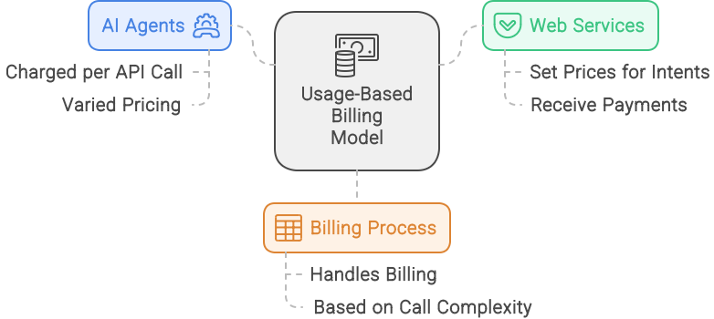

# UIM Protocol: A Standardized Approach to AI-Agent and Web Service Interactions

## Getting started

1. Get familiar with the concepts and motivations behind the UIM protocol below.
2. Dive into the [protocol specification section](unified-intent-mediator-api-specification.md) to understand the detailed framework proposal.
3. Explore the [implementation guide](unified-intent-mediator-implementation-guide.md) to learn how to implement the UIM protocol in your projects.

## TLDR

The [protocol specification section](unified-intent-mediator-api-specification.md) of the Unified Intent Mediator (UIM) details the comprehensive framework proposal for seamless, secure, and scalable interactions between AI agents and web services. This section outlines how the UIM protocol standardizes key processes, including service registration, intent management, and execution, to ensure consistent and reliable interaction between AI agents and web services. It also highlights the key innovations that make the UIM protocol a catalyst for the evolution of AI-agent and web service interactions.

Key innovations in this specification include:

- **Policy Adherence Token (PAT) System**: Introduces a digitally signed token that simplifies policy enforcement by encapsulating permissions, obligations, and billing information. This system not only streamlines compliance checks but also automates billing, making interactions more efficient and reducing administrative overhead.
  
- **Leveraging DNS TXT Records and/or `agents.txt` for Discovery**: Provides a unique approach to API endpoint discovery by utilizing DNS TXT records and an `agents.txt` file. This method allows AI agents to quickly find API endpoints, understand rate limits, verify terms, and authenticate securely, all using familiar internet protocols.
  
- **Integration with Open Digital Rights Language (ODRL)**: The UIM protocol integrates ODRL to manage permissions, prohibitions, and obligations, ensuring that AI agents and web services operate under clear and enforceable rules. This integration promotes trust and transparency in interactions while allowing for automated enforcement of complex usage policies.

- **API endpoints** for service registration, intent management, and execution, enabling AI agents to discover, understand, and interact with web services in a standardized and secure manner. These endpoints are designed to be RESTful, scalable, and easy to integrate with existing systems.

## TLDR for the Concept Section

The concept section below explains the foundational elements of the UIM protocol, focusing on key concepts like “intents,” “metadata,” and the “execute method.” It highlights the protocol’s role in enabling seamless and efficient interactions between AI agents and web services, resolving issues like inconsistent data extraction and high latency. The section also discusses the monetization opportunities that the UIM protocol creates for web services by providing structured, discoverable, and executable intents.

## Concept Abstract

The Unified Intent Mediator (UIM) protocol addresses the critical challenge of standardizing interactions between AI agents and web services. By providing a consistent, secure, and scalable interface, UIM replaces inefficient methods such as web scraping and simulated user actions. This protocol enhances reliability, improves efficiency, and simplifies the development process for AI-driven applications. This white paper outlines the UIM protocol’s key features, implementation details, and future potential, positioning it as a foundational technology for the next generation of AI-agent and web service integrations.

By enabling services to expose their capabilities as structured intents and allowing AI agents to seamlessly discover and execute these intents, UIM offers a scalable solution that enhances automation, improves user experience, and opens new monetization avenues for service providers. Whether optimizing e-commerce transactions or automating complex workflows, UIM sets a new standard for AI-driven web service integration.

## Introduction

As artificial intelligence (AI) continues to evolve, the need for efficient and seamless interactions between AI agents and web services has become more critical than ever. Traditionally, AI agents have struggled to interface with web services, often resorting to cumbersome methods like web scraping and simulated browser actions. These approaches are fraught with inefficiencies—ranging from inconsistent data extraction to high latency and frequent errors—leading to a subpar user experience and increased operational costs.

The Unified Intent Mediator (UIM) protocol addresses these challenges by introducing a standardized and secure method for AI agents to interact directly with web services. Instead of simulating user actions, UIM allows services to expose their capabilities as well-defined intents, which AI agents can discover and execute seamlessly. This not only simplifies the integration process but also enhances the reliability, speed, and functionality of AI-driven applications.

In this white paper, we will explore the limitations of current AI-agent interaction methods, introduce the UIM protocol, and demonstrate how it can transform AI-web service integration by improving efficiency, security, and scalability. We will also discuss potential monetization strategies, implementation details, and future directions for expanding the protocol’s capabilities.

### Current Inefficiencies in AI-Agent Interactions with Web Services

Despite the advancements in AI technology, the methods AI agents use to interact with web services remain surprisingly rudimentary. These approaches, rooted in practices like web scraping and simulated browser interactions, are not only inefficient but also fraught with significant limitations. Below, we dissect the core issues that plague current AI-agent interactions.


1. **Web Scraping Challenges**  
   - **Inconsistency in Data Extraction:** Web scraping involves parsing HTML content, which can change unpredictably. Even minor changes in a web page’s structure can break the scraping logic, leading to frequent data extraction failures. This requires constant maintenance and updating of scripts, diverting resources from more strategic tasks.  
   - **Legal and Ethical Issues:** Scraping often violates the terms of service of web services, leading to potential legal consequences. Additionally, it is often perceived as unethical, as it bypasses intended use-cases and imposes undue load on servers, potentially harming the service’s performance and reputation.  
2. **Simulated Browser Interactions**  
   - **Performance Overhead:** Simulating user actions like clicking buttons or filling forms is resource-intensive, resulting in significant computational overhead and slower response times. This approach not only degrades the user experience but also limits the scalability of AI-driven processes.  
   - **Error-Prone Processes:** Browser simulations are vulnerable to dynamic content, pop-ups, and CAPTCHA challenges, which frequently interrupt automated processes. This susceptibility to errors leads to incomplete or failed tasks, reducing reliability.  
3. **Lack of Standardization**  
   - **Varied API Designs:** Web services can often expose public APIs with diverse design paradigms, making uniform interaction across multiple services a complex and time-consuming task. The absence of standardized protocols forces developers to create custom integrations for each service, increasing development time and complexity.  
   - **Inconsistent Data Formats:** Different services return data in various formats (e.g., XML, JSON, HTML), requiring AI agents to implement multiple parsers. This not only complicates data handling but also increases the potential for errors during processing.  
4. **Limited Access to Deep Functionality**  
   - **Surface-Level Interactions:** Traditional methods are typically confined to basic data retrieval and simple transactions. Accessing more sophisticated functionalities, such as personalized services or complex transactions, is often buried under layers of navigation and authentication, making it difficult for AI agents to perform advanced tasks.  
   - **Restricted Capabilities:** Many web services limit the capabilities of their public APIs, offering only a subset of their full functionality. As a result, AI agents are unable to fully leverage these services, restricting the scope of automation and advanced interactions.  
5. **Security and Compliance Challenges**  
   - **Complex Authentication Mechanisms:** Handling modern authentication protocols like OAuth2.0 or two-factor authentication programmatically is challenging and can introduce security vulnerabilities if not implemented correctly.  
   - **Data Privacy Concerns:** Direct interaction methods like scraping often do not comply with data protection regulations such as GDPR or CCPA. Ensuring compliance under these conditions is difficult, posing significant risks related to user privacy and data security.

These inefficiencies underscore the pressing need for a more robust, standardized, and secure protocol for AI-agent interactions with web services. The Unified Intent Mediator (UIM) is designed specifically to address these challenges, providing a solution that not only resolves these issues but also enhances the overall functionality and user experience in AI-driven agentic applications.

## Motivation for the Unified Intent Mediator (UIM)

The shortcomings in current AI-agent interactions with web services highlight an urgent need for a more structured, reliable, and scalable solution. The Unified Intent Mediator (UIM) protocol emerges as a direct response to these challenges, offering a transformative approach to how AI agents and web services communicate and operate.


1. **Structured Interaction**  
   - **Standardization Across Services:** UIM introduces a standardized protocol for AI-agent interactions, replacing the patchwork of web scraping and simulated browser actions with a consistent, well-defined interface. By enabling web services to expose their functionalities as specific, structured intents, UIM ensures that AI agents can interact uniformly across different platforms, significantly reducing development complexity and maintenance overhead.  
   - **Eliminating the Need for Scraping and Simulations:** With UIM, AI agents interact directly with services via standardized intents, bypassing the need for unreliable and resource-intensive methods like scraping and simulation. This direct approach enhances reliability and reduces latency, improving the overall efficiency of AI-driven tasks.  
2. **Enhanced Security**  
   - **Robust Authentication Mechanisms:** UIM incorporates secure authentication protocols,  ensuring that only authorized AI agents can access and execute intents. This approach not only secures interactions but also simplifies the process of managing authentication, reducing the risk of vulnerabilities.  
   - **Encrypted Communications:** All data exchanges between AI agents and web services via UIM are encrypted, safeguarding sensitive information from potential interception or tampering. This emphasis on security builds trust in the system and ensures compliance with data protection regulations.  
3. **Standardization and Interoperability**  
   - **Unified Interface for AI Agents:** By adhering to a common set of standards, UIM promotes interoperability across a wide range of web services. This eliminates the need for custom integrations, enabling AI agents to seamlessly interact with multiple services using a consistent interface.  
   - **Simplified Integration Process:** The UIM protocol simplifies the integration process for both AI agents and web services, reducing the time and effort required to deploy new functionalities. This standardization accelerates development and fosters a more cohesive ecosystem of AI-driven applications.  
4. **Automation and Integration**  
   - **Enabling Advanced Automation:** UIM unlocks new possibilities for automation by allowing AI agents to programmatically access a broad range of functionalities—from simple data retrieval to complex user account management tasks. This level of automation streamlines operations, reduces manual intervention, and enhances the overall productivity of agentic interactions.  
   - **Seamless Integration of Services:** UIM facilitates seamless integration between AI agents and web services, enabling the creation of more sophisticated and interconnected solutions. This ability to integrate and automate across platforms is critical for developing advanced AI-driven applications that require complex workflows.  
5. **Improved User Experience**  
   - **Faster, More Accurate Interactions:** By enabling direct and efficient communication between AI agents and web services, UIM dramatically improves the speed and accuracy of interactions. This leads to a superior user experience, where tasks are completed quickly and reliably, without the friction associated with traditional methods.  
   - **Enhanced Functionality:** Users benefit from the expanded capabilities that UIM provides, as AI agents can now perform a wider range of tasks with greater precision. Whether it’s automating routine tasks or managing complex transactions, the improved functionality translates to a more satisfying and seamless user experience.  
6. **Sustainable Monetization Model**  
   - **Revenue Opportunities for Service Providers:** UIM suggests a sustainable monetization model that aims to facilitate transactions between AI agents and web services. Service providers can monetize their capabilities by charging for access to their intents, creating new revenue streams and incentivizing participation in the UIM ecosystem. This also ensures that copyrighted content is protected and compensated fairly.
   - **Flexible Monetization Strategies:** Whether through transaction fees, subscription models, or usage-based billing, UIM provides multiple pathways for monetization, allowing service providers to choose the strategy that best suits their business model. This flexibility ensures that the protocol can adapt to different market needs and continue to grow.

The Unified Intent Mediator (UIM) protocol is more than just a solution to current inefficiencies—it is a comprehensive platform that redefines how AI agents interact with web services. By standardizing interactions, enhancing security, and providing a sustainable monetization model, UIM paves the way for more efficient, reliable, and scalable AI-driven applications. As the demand for intelligent automation continues to rise, UIM is poised to become the cornerstone of next-generation AI-web service integrations.

## Key Concepts


### Intents

**Layman’s Overview**
Imagine you’re using a virtual assistant to complete tasks for you online. You might ask it to find a product, check the weather, or schedule a meeting. Each of these tasks represents an “intent” — an action that you want the assistant to perform. In the context of the UIM protocol, an “intent” is a predefined action or workflow that an AI agent (like your virtual assistant) can execute on a web service. These intents are like shortcuts that tell the AI exactly what to do, ensuring that the task is completed correctly and efficiently.

**Example in Everyday Life:**  
Think of intents as buttons on a remote control. Each button has a specific function—one for turning on the TV, another for changing the channel, and so on. The remote control (AI agent) uses these buttons (intents) to interact with the TV (web service) without you needing to know how the TV actually works inside.

In the Unified Intent Mediator (UIM) API, an intent represents a specific action that an AI agent can perform on a web service. Intents encapsulate a range of tasks such as fetching content, making transactions, or interacting with user accounts. These actions are standardized to ensure consistency across different services. By defining clear intents, web services can expose their functionalities in a way that is easily accessible and understandable to AI agents. For example, an e-commerce site might have intents like SearchProducts, GetProductDetails, and PlaceOrder.

**Examples of Intents:**

- **SearchProducts**: Allows AI agents to search for products based on keywords, categories, price ranges, and other filters.  
- **GetProductDetails**: Fetches detailed information about a specific product using its unique identifier.  
- **PlaceOrder**: Facilitates the transaction process for purchasing items, including payment and shipping details.  
- **CheckAccountBalance**: Retrieves the current balance of a user’s account in a banking service.  
- **BookAppointment**: Schedules an appointment with a healthcare provider or service professional.

Other intent examples can be found [here](intent_examples.md) for inspiration.

### Metadata and Parameters

**Layman’s Overview:**
Metadata is like the label on a file folder. It doesn’t tell you the full content inside, but it gives you key information about what’s there—such as the title, date, and author—so you can quickly understand and organize it. In the UIM protocol, metadata provides important details about each intent, such as what it does, what inputs it needs, and how it should be used. This information helps AI agents decide which intents to use and how to use them correcly.

**Example in Everyday Life:**  
Imagine you’re organizing a bookshelf. The metadata would be like the labels on each book—title, author, genre. These labels help you quickly find the book you’re looking for without having to open every single one.

Each intent in the UIM is accompanied by descriptive metadata and parameters that specify the required inputs for execution. Metadata provides descriptive information about each intent, such as its name, description, and the context in which it is used. By standardizing metadata, the UIM protocol ensures that AI agents can easily discover and understand the capabilities of various web services. This standardization reduces ambiguity and enhances interoperability, allowing AI agents to interact with multiple services seamlessly.

**Components of Metadata:**

- **Name**: A unique identifier for the intent provided by a service.  
- **Description**: A brief explanation of what the intent does.  
- **Category**: The category or type of action (e.g., e-commerce, finance, healthcare).

Parameters are the inputs required to execute an intent. Standardizing parameters involves defining the expected data types, required fields, and optional fields for each intent. This standardization ensures that AI agents provide the necessary information in the correct format, facilitating accurate and efficient execution of intents.

**Example Parameters for SearchProducts Intent:**

- **query** (string): The search term entered by the user.  
- **category** (string): The product category to filter results.  
- **price_range** (string): The price range to filter results.  
- **sort_by** (string): The criteria for sorting results (e.g., relevance, price, popularity).

### The Execute Method

The execute method is a critical component of the UIM protocol, responsible for executing the defined intents and returning structured responses. It ensures that AI agents can interact with web services efficiently, handling input validation, execution, response formatting, and error handling.


- **Input Validation:** The execute method must begin by validating the input parameters to ensure they meet the required criteria. This step prevents errors and ensures that the execution proceeds smoothly.  
  - Example: For the SearchProducts intent, the execute method checks that the query parameter is provided and that optional parameters are in the correct format.  
- **Execution:** Once the inputs are validated, the execute method executes the intent by interacting with the web service’s provided API endpoint(s). This step may involve making the actual API calls, handling throttling mechanisms, lookup potential cached data, handling retries, etc.  
  - Example: The execute method sends a request to the e-commerce service’s product search API with the validated parameters.  
- **Response Formatting:** After executing the intent, the execute method must format the response into a structured format that the AI agent can easily interpret. This step ensures consistency in the responses provided by different web services.  
  - Example: The e-commerce service returns a list of products matching the search criteria, which the execute method formats into a standardized JSON response.  
- **Error Handling:** The execute method must include robust error handling to manage any issues that arise during execution. This step ensures that AI agents receive meaningful error messages and can handle failures gracefully.  
  - Example: If the product search API returns an error (e.g., invalid parameters, service unavailable), the execute method captures the error, formats it into a readable message, and includes suggestions for resolving the issue to the AI Agent response.

## Seamless Integration

Seamless integration is a core goal of the UIM protocol, designed to provide a more streamlined and efficient user experience compared to traditional methods of AI-agent interaction with web services.


- **Direct Interaction:** By enabling AI agents to interact directly with web services through standardized intents and actions, the UIM protocol eliminates the need for navigating through web pages or simulating user actions. This direct interaction reduces latency and enhances the speed and reliability of task execution.  
  - Example: An AI agent tasked with booking a hotel room can directly interact with multiple hotel booking services using the SearchForRoom intent, providing necessary details like dates, room type, and other booking information, without having to navigate through each service’s website.  
- **Improved User Experience:** Seamless integration significantly improves the user experience by providing faster and more accurate responses. Users benefit from the efficiency and reliability of AI agents that can perform complex tasks effortlessly.  
  - Example: A user asks their AI agent to find and purchase a specific book. The AI agent uses the PurchaseItem intent to interact with various online bookstores, finds the best price, completes the purchase, and provides the user with a confirmation — all potentially within seconds.  
- **Scalability:** The UIM protocol’s standardized approach allows for easy scalability. Web services can expose new intents and actions as their capabilities expand, and AI agents can leverage these new functionalities without requiring significant modifications beyond the initial protocol implementation.  
  - Example: As a streaming service adds new features like personalized recommendations or curated playlists, it can expose these capabilities as new intents (e.g., GetRecommendations, CreatePlaylist). AI agents can seamlessly discover these new intents and add them into their portfolio of tools automatically.  
- **Consistency Across Services:** By adhering to a common set of standards, the UIM protocol ensures consistent behavior and responses across different web services. This consistency simplifies the development of AI agents and enhances their ability to provide reliable and predictable outcomes.  
  - Example: An AI agent designed to manage social media posts can use the PostContent intent across multiple platforms (e.g., Facebook, Twitter, Instagram) with a consistent set of parameters and expected responses, simplifying the management of multi-platform content.

## Discoverability

Discoverability is a crucial aspect of the Unified Intent Mediator protocol, ensuring that AI agents can efficiently find and utilize the available intents provided by various web services. The UIM incorporates several features to enhance the discoverability of intents and actions, making it easier for AI agents to locate and execute their desired functionalities.


### Intent Catalog

An intent catalog serves as a centralized repository where all registered intents and their associated metadata are stored. Such a catalog is critical for enabling AI agents to discover and interact with available services. The UIM protocol provides a standardized format for intent registration, ensuring that all intents are consistently structured and easily discoverable. Implementation of an intent catalog should follow the UIM protocol’s specifications to ensure compatibility and interoperability with AI agents and also support advanced search functionality, allowing AI agents to find intents based on keywords, categories, and other relevant parameters.

**API Endpoints**: An intent catalog should expose RESTful API endpoints to allow for the registration, updating, and discovery of intents. This enables web services to easily register their intents and allows AI agents to discover and interact with them.

### Search Functionality

To facilitate efficient discovery, the UIM protocol recommends implementing a robust search functionality that allows AI agents to find intents based on keywords, categories, and other relevant parameters. This search functionality should support advanced features like keyword matching, filtering, and sorting to provide AI agents with the most relevant results.

- **Search Indexing**: All intents and their metadata are indexed to support fast and efficient searches. This indexing includes fields such as intent name, description, parameters, tags, and service names.  
- **Query Language**: The search functionality supports a rich query language that enables complex search queries. AI agents can filter intents by specific criteria, such as required parameters, service provider, or intent category.
- **Ranking and Relevance**: Search results are ranked based on relevance, using algorithms that take into account keyword matching, usage frequency, and user ratings. This ensures that the most pertinent intents are presented to AI agents first.

### Intent Tags

Tags play a crucial role in improving the discoverability of intents by categorizing them into meaningful groups.

- **Tagging System**: Each intent can be associated with multiple tags that describe its functionality, application domain, and other relevant attributes. For example, an e-commerce intent might have tags like shopping, product search, and retail.  
- **Tag Management**: Web services can define and manage their tags during the intent registration process. The UIM protocol also supports community-driven tagging, where frequently used tags are suggested to improve standardization.  
- **Tag-Based Search**: AI agents can use tags to refine their searches and quickly find intents that match specific categories or use cases.

### Documentation and Examples

Comprehensive documentation and examples should be automatically generated for each intent to ensure that AI agents can understand and effectively utilize them.

Each registered intent should include detailed documentation that covers the following:

- **Intent Name**: A descriptive and unique name for the intent.  
- **Description**: A clear explanation of what the intent does, including its purpose and expected outcomes.  
- **Parameters**: Detailed information about the parameters required to execute the intent, including names, types, whether they are required or optional, and valid values or formats.  
- **Endpoint**: The API endpoint that the AI agent needs to call to execute the intent.  
- **Examples**: Example requests and responses to demonstrate how the intent can be used in practice.

#### Example of an Intent Documentation

``` json
{
  "intent_uid": "ecommercePlatform:searchProducts:v1",
  "intent_name": "SearchProducts",
  "description": "Search for products based on given criteria",
  "parameters": [
    {
      "name": "query", 
      "type": "string", 
      "required": true, 
      "description": "The search term"
    },
    {
      "name": "category", 
      "type": "string", 
      "required": false, 
      "description": "Product category"
    },
    {
      "name": "price_range", 
      "type": "string", 
      "required": false, 
      "description": "Price range in the format 'min-max'"
    },
    {
      "name": "sort_by", 
      "type": "string", 
      "required": false, 
      "description": "Sort criteria (e.g., popularity, price)"
    }
  ],
  "endpoint": "https://api.ecommerce.com/api/products/search",
  "examples": {
    "request": {
      "method": "GET",
      "url": "https://api.ecommerce.com/api/products/search",
      "params": {
        "query": "laptops",
        "category": "electronics",
        "price_range": "1000-2000",
        "sort_by": "popularity"
      }
    },
    "response": {
      "status": "success",
      "data": [
        {
          "product_id": "123",
          "name": "Gaming Laptop",
          "price": 1500,
          "category": "electronics"
        }
      ]
    }
  },
  "tags": ["shopping", "product search", "retail"]
}
```

### Supporting Natural Language Queries for Intent Discoverability by AI Agents

In addition to ordinary intent discovery search, the Unified Intent Mediator (UIM) protocol proposes to enhance the discoverability of intents by integrating natural language processing (NLP) capabilities. This feature empowers AI agents to interpret and utilize natural language queries, making it easier to identify and execute the appropriate actions required to fulfill user requests. By supporting natural language queries, the UIM protocol significantly simplifies the interaction process between AI agents and web services.

#### Enhancing AI Agents with Natural Language Understanding

The integration of natural language interpretation into an UIM protocol enabled intent catalog allows AI agents to understand and process user instructions expressed in everyday language. This capability is essential for creating more intuitive and efficient interactions. This flexibility in query structure allows AI Agents to pass the original user’s request directly to an UIM discovery API, and through dynamic query translation the system translates the natural language queries into structured search requests that the intent catalog can process. This translation ensures that AI agents can seamlessly access and execute relevant intents.

This capability provides two valuable benefits:

1. **Improved Discoverability:** AI agents can quickly and accurately find the relevant intents by interpreting natural language queries. This capability reduces the time and effort required to identify the appropriate actions, enhancing overall efficiency.  
2. **Enhanced Accuracy:** The NLP engine’s ability to understand context and nuances in language ensures that AI agents can select the most relevant intents and parameters, leading to more precise and effective actions.


The discoverability of intents within the Unified Intent Mediator protocol is a critical factor for its success. By implementing a robust intent catalog, advanced search functionality, and a comprehensive tagging system, UIM protocol enablers can ensure that AI agents can easily find and utilize the appropriate intents. Detailed documentation and practical examples further support the effective use of these intents, enhancing the overall usability and efficiency of AI-agent interactions with web services within the ecosystem provided by this protocol.

## Solving the Monetization Problem

Monetizing interactions between AI agents and web services is a complex challenge. Each of these monetization strategies offers a different approach to solving the challenge of automating and monetizing interactions between AI agents and web services. Implementing a mediator platform with transaction fees or a usage-based billing model could provide immediate solutions. Alternatively, exploring blockchain-based smart contracts could offer a more decentralized and transparent approach. Partnering with major web services and offering revenue-sharing models could also drive adoption and ensure sustained revenue streams. Below are several strategies that service providers and developers could consider when implementing the Unified Intent Mediator (UIM) protocol:

### Mediator Platform with Transaction Fees

**Idea**: Establish a centralized platform that acts as a mediator between AI agents and web services. This platform would handle all interactions, including discovery, authentication, and execution of intents. It would charge AI agents for access and distribute payments to the web services based on usage.

**How It Works**:

- AI agents pay a subscription fee or per-transaction fee to use the platform.  
- Web services register their intents and actions within the platform. Alternatively, the mediation platform could automatically discover and index intents and actions using the UIM protocol.
- The platform tracks usage and allocates payments to web services based on the number and type of intents executed.


**Real-World Example**:

- **App Store Models**: Apple’s App Store and Google Play operate similarly, taking a percentage of the revenue generated from app purchases and in-app transactions.

### Usage-Based Billing with API Monetization

**Idea**: Implement a usage-based billing model where AI agents are charged based on the number of API calls they make. Web services set prices for their intents and actions, and handles the billing.

**How It Works**:

- AI agents are billed for each API call they make, with prices varying based on the complexity and resource requirements of the intent.  
- Web services receive payments based on the number of calls to their APIs.



**Real-World Example**:

- **Cloud Services**: Amazon Web Services (AWS) and Microsoft Azure use a pay-as-you-go model, charging based on resource usage (compute, storage, etc.).

### Subscription Model with Tiered Pricing

**Idea**: Offer subscription plans for AI agent platforms with tiered pricing based on usage limits, access to premium intents, and additional features. Web services can earn a share of the subscription revenue based on the usage of their intents.

**How It Works**:

- AI agents choose a subscription plan that fits their needs (e.g., basic, standard, premium).  
- Each plan includes a set number of API calls or access to certain features.  
- Web services are compensated based on the usage of their intents by subscribers.


**Real-World Example**:

- **SaaS Platforms**: Software-as-a-Service platforms like Salesforce and Netflix offer tiered subscription plans with different levels of access and usage limits.

### Blockchain-Based Smart Contracts

**Idea**: Use blockchain technology to create smart contracts that automatically handle payments between AI agents and web services. This decentralized approach ensures transparency and trust.

**How It Works**:

- AI agents and web services utilizes a common protocol based on blockchain.  
- Each interaction is recorded on the blockchain, and payments are executed via smart contracts.  
- Payments are distributed automatically based on predefined rules and conditions.


**Real-World Example**:

- **Ethereum**: The Ethereum blockchain supports smart contracts, enabling automated transactions based on predefined conditions.

### Revenue Sharing Partnerships

**Idea**: Form strategic partnerships between major web services and AI agent providers. Revenue generated from these interactions is shared between the platform and the web services. This approach can drive adoption and ensure sustained revenue streams.

**How It Works**:

- AI Agent providers partner up with major web services to provide exclusive or premium intents - or the other way around.
- Revenue generated from these interactions is shared between the platform and the web services.


**Real-World Example**:

- **Affiliate Marketing**: Affiliate marketing programs (e.g., Amazon Associates) where partners earn commissions based on the sales they drive.

### Comparison Table of Monetization Strategies

| Monetization Strategy | Pros | Cons |
| :---- | :---- | :---- |
| **Mediator Platform with Transaction Fees** |  |  |
| \- Centralized control and management of interactions | \- Provides a unified platform for discovery, authentication, and execution | \- Dependency on the platform for all interactions |
| \- Simplifies the process for AI agents and web services | \- Enables consistent tracking and billing | \- Potential for high transaction fees, deterring some users |
| \- Potential for high revenue through transaction fees | \- Established model with proven success (e.g., App Store) | \- Centralization could lead to single points of failure |
| **Usage-Based Billing with API Monetization** |  |  |
| \- Revenue is proportional to actual usage | \- Flexible and scalable model | \- Unpredictable costs for AI agents |
| \- Encourages efficient use of resources | \- Clear cost structure based on resource consumption | \- Complex billing and tracking mechanisms required |
| \- Provides incentives for web services to optimize their APIs | \- Proven success in cloud services (e.g., AWS, Azure) | \- Potentially high costs for high-frequency users |
| **Subscription Model with Tiered Pricing** |  |  |
| \- Predictable revenue streams for agentic platforms and web services | \- Attracts different user segments through varied pricing tiers | \- Requires continuous addition of value to higher tiers |
| \- Simplifies budgeting for AI agents | \- Encourages loyalty and long-term usage | \- Balancing pricing and feature availability can be challenging |
| \- Can offer exclusive features in higher tiers | \- Proven success in SaaS platforms (e.g., Salesforce, Netflix) | \- Potentially less flexible for users with variable usage patterns |
| **Blockchain-Based Smart Contracts** |  |  |
| \- Decentralized and transparent transactions | \- Reduces the need for intermediaries | \- High initial setup and implementation costs |
| \- Automated and secure payment processing | \- Ensures trust through immutable records | \- Complexity in integrating blockchain with existing systems |
| \- Enables micro-transactions efficiently | \- Potential for innovative and fair revenue distribution | \- Volatility of cryptocurrency values |
| **Revenue Sharing Partnerships** |  |  |
| \- Aligns incentives between the agentic platforms and web services | \- Encourages collaboration and innovation | \- Dependence on the success of partner services |
| \- Can provide exclusive or premium content to AI agents | \- Proven success in affiliate marketing (e.g., Amazon Associates) | \- Requires negotiation and management of partnerships |
| \- Potential for high revenue through commissions | \- Can attract high-quality web services through revenue sharing | \- Potential complexity in tracking and distributing shared revenue |

These monetization strategies provide a range of options that stakeholders in the AI and web service ecosystem can explore. By aligning the UIM protocol with flexible, sustainable revenue models, service providers can ensure that their offerings remain viable while supporting the broader adoption of standardized, AI-driven interactions.

## Summary of Benefits


**Streamlined Interaction between AI Agents and Web Services**  
The UIM protocol eliminates the necessity for AI agents to simulate user actions through web page navigation. By allowing direct interaction with registered intents, AI agents can perform tasks more quickly and accurately. This reduces the complexity and overhead associated with traditional methods of interaction, leading to more efficient and reliable operations.

**Enhanced Functionality and Integration**  
The protocol allows web services to expose a wide range of functionalities as intents, which can be programmatically accessed by AI agents. This capability facilitates the creation of integrated, automated solutions, enhancing the potential for more complex and sophisticated interactions between these services. It enables AI agents to perform a broader array of tasks, from simple data retrieval to intricate transaction processing, thereby expanding their utility and effectiveness.

**New Revenue Streams for Service Providers**  
Service providers can monetize their capabilities by charging for access to or usage of their intents. This creates new revenue opportunities and incentivizes more services to participate in the protocol. By offering tiered pricing, subscription models, or pay-per-use options, service providers can tailor their monetization strategies to best suit their offerings and market demands.

**Improved Efficiency and User Experience**  
By streamlining the interaction process and reducing the time required to complete tasks, the UIM API significantly improves overall efficiency. This enhancement translates to a superior user experience, as AI agents can provide quicker and more reliable responses to user requests. Users benefit from the seamless and efficient execution of tasks, resulting in higher satisfaction and trust in AI-driven services like personal assistants and chatbots.

**Robust Security and Compliance**  
The UIM protocol incorporates robust security measures, including encrypted communications and secure authentication protocols like OAuth2.0. These measures ensure that interactions between AI agents and web services are protected against unauthorized access and data breaches. Additionally, the protocol is designed to comply with data protection regulations such as GDPR and CCPA, safeguarding user privacy and building trust in the system.

**Scalability and Flexibility**  
The modular design of the UIM protocol allows for easy scalability and flexibility. Web services can add new intents and functionalities as they evolve, and AI agents can adapt to these changes without requiring significant modifications. This scalability ensures that the protocol can grow with the increasing demands of AI-driven applications and the expanding capabilities of web services.

**Innovative and Future-Proof Solution**  
The UIM protocol is built with future advancements in mind. It supports the integration of emerging technologies such as blockchain for secure transactions and machine learning for enhanced intent recognition. This forward-thinking approach ensures that the protocol remains relevant and adaptable to technological advancements, positioning it as a cornerstone for future AI-agent and web service interactions.

## Final Thoughts

The adoption of the Unified Intent Mediator (UIM) protocol promises to revolutionize the way AI agents and web services interact, paving the way for a new era of intelligent, automated systems. By addressing the current inefficiencies in AI-agent communication and offering a robust, scalable, and secure solution, UIM positions itself as a critical infrastructure component for future digital innovation. As AI continues to evolve and integrate more deeply into various aspects of business and daily life, the UIM protocol will play a crucial role in ensuring that these interactions are efficient, secure, and capable of meeting the demands of tomorrow.

In conclusion, the UIM protocol is not just a technical solution — it is a strategic enabler that will unlock new possibilities in AI-driven automation and web service integration. Its successful implementation will depend on the collaborative efforts of developers, service providers, and industry leaders, all working together to build a more connected and intelligent future.

## **System Architecture of the UIM Protocol: A Detailed Evaluation**

The UIM protocol is designed to facilitate seamless communication and interaction between AI agents and web services. In this section, we will delve into the system architecture of the UIM protocol, comparing and contrasting two proposed approaches: the Man-in-the-Middle Approach with a Centralized Repository and the Decentralized Approach with AI Agents Crawling Web Services. By evaluating the architectural differences, benefits, and potential challenges of each approach, we can gain insights into the strengths and weaknesses of each design, ultimately informing the selection of the most suitable architecture for implementors of the UIM protocol.


### **1. Man-in-the-Middle Approach: Centralized Repository**

**Overview:**
In the centralized approach, a central system acts as an intermediary (man-in-the-middle) between AI agents and web services. This central repository collects, manages, and provides access to intent information registered by web services. AI agents interact with this repository to discover available intents and execute actions on web services via standardized endpoints.

**Key Architectural Components:**

- **Central Repository**: The core of this architecture, where web services register their intents. This repository contains metadata, parameters, and execution details for each intent.
- **Service Management Endpoints**: Web services use these endpoints to register, update, and manage their intents in the repository.
- **Discovery Endpoints**: AI agents use these endpoints to search for available intents, fetch detailed information, and identify which actions they can execute.
- **Execution Endpoint**: Facilitates the actual execution of an action by forwarding requests from AI agents to the appropriate web service based on registered intents.
- **Policy Adherence and Security Layer**: Manages authentication, authorization, and rate limiting, often using the Policy Adherence Token (PAT) system. It ensures compliance and secure interaction between AI agents and web services.


**Architecture Flow:**

1. **Web Service Registration**: Web services register their intents with the central repository using service management endpoints. Alternatively, the system can automatically discover and register intents using a crawling mechanism.
2. **Intent Discovery**: AI agents query the discovery endpoints to identify relevant intents based on user requests.
3. **Intent Details Retrieval**: Once an intent is identified, the agent fetches detailed execution parameters from the repository.
4. **Execution**: The AI agent submits a request to the execution endpoint, which forwards it to the appropriate web service.
5. **Response Handling**: The results are returned to the AI agent, which then processes and presents the output to the user.

**Benefits:**

- **Centralized Management**: A single point of management for all intents simplifies oversight, updates, and maintenance.
- **Consistent Data Structure**: Standardized intent formats and metadata facilitate easier integration and use by AI agents.
- **Enhanced Security**: Centralized control over access, authentication, and rate limiting helps enforce security and compliance measures.
- **Reliable Monetization**: A clear, controlled pathway for monetization, allowing the central system to manage payments and enforce billing policies.

**Challenges:**

- **Scalability**: As the number of registered web services and AI agents grows, the central system must handle significant data volumes and high transaction loads.
- **Single Point of Failure**: Any issues with the central repository can disrupt the entire system, impacting both AI agents and web services.
- **Data Privacy Concerns**: Central storage of intent information may raise concerns about data ownership and privacy for web services.

#### **2. Decentralized Approach: AI Agents Crawling Web Services**

**Overview:**
In the decentralized approach, AI agents themselves are responsible for discovering and collecting intent information directly from web services. This is achieved through crawling mechanisms that utilize DNS TXT records and/or `agents.txt` files hosted by web services. The intent information is stored locally by AI agents, allowing them to directly interact with web services without a centralized intermediary.

**Key Architectural Components:**

- **DNS TXT Records and `agents.txt` Files**: These files are hosted by web services to provide intent metadata, execution details, policies, rate limits, and authentication methods. They act as a self-descriptive interface for AI agents.
- **Crawling Mechanism**: AI agents periodically or on-demand crawl these resources to collect and update intent information from various web services.
- **Local Intent Repository**: Each AI agent maintains its own repository of intent information, allowing it to execute actions based on the data collected from web services.
- **Execution Endpoint**: AI agents directly call execution endpoints on web services to perform actions, authenticated using data collected during crawling (e.g., PATs, OAuth tokens).
- **Policy Compliance and Security Layer**: Similar to the centralized model, but managed locally by each AI agent using the information gathered from `agents.txt` and DNS records.


**Architecture Flow:**

1. **Crawling and Discovery**: AI agents crawl web services to gather available intents using DNS TXT records and `agents.txt` files.
2. **Intent Data Storage**: The gathered data is stored locally within the AI agent’s repository, creating a personalized database of actions.
3. **Execution**: When a user request matches a stored intent, the AI agent directly interacts with the corresponding web service to execute the action.
4. **Compliance and Security**: The AI agent adheres to rate limits, billing requirements, and authentication methods as outlined in the collected intent data.
5. **Response Handling**: Results from the execution are processed and returned to the user.

**Benefits:**

- **Scalability**: Decentralization avoids the bottlenecks of a central system, allowing scalability across millions of AI agents and web services.
- **No Single Point of Failure**: Since intent information is distributed, the system remains robust even if some agents or services encounter issues.
- **Privacy and Ownership**: Web services maintain control over their intent data, reducing concerns about data privacy and centralization.
- **Flexible and Adaptable**: AI agents can quickly adapt to new services or changes in existing ones without waiting for updates in a central repository.

**Challenges:**

- **Inconsistent Data**: Without centralized control, there may be variations in how web services present their intent data, leading to potential inconsistencies. Adherence to the UIM protocol can help mitigate this issue.
- **Higher Complexity for AI Agents**: Each agent must handle crawling, data parsing, security, and compliance on its own, increasing the complexity of individual agents.
- **Maintenance Overhead**: AI agents need to frequently crawl and update intent information to stay current, which can be resource-intensive.

### **Comparative Evaluation of Both Approaches**

1. **Centralized Repository (Man-in-the-Middle)**
   - **Pros**: Streamlined management, consistent data structure, enhanced security, clear monetization strategy.
   - **Cons**: Scalability issues, single point of failure, potential data privacy concerns.

2. **Decentralized Crawling by AI Agents**
   - **Pros**: Scalability, robust against failures, privacy-friendly, adaptable to changes.
   - **Cons**: Potential inconsistencies, complex management for AI agents, resource-intensive maintenance.

### **Strategic Recommendations:**

- **Use Centralized Approach**: If the primary goal is to maintain strict oversight, enforce security protocols, and ensure a standardized user experience across all AI agents and web services.
- **Adopt Decentralized Approach**: If scalability, resilience, and data privacy are paramount, particularly in environments where rapid adaptation and autonomy are critical.


By understanding these architectural nuances, stakeholders can better align the UIM protocol’s deployment strategy with their operational needs, ensuring efficient and effective integration between AI agents and web services.

## UIM Protocol Specification

Check out the proposed specification here: [Unified Intent Mediator Specification](unified-intent-mediator-api-specification.md). It goes into details about the suggested endpoints, data structures, security measures, billing, policy compliance, and more.

## Future Work and Expansion

The Unified Intent Mediator protocol represents a significant step forward in facilitating efficient and seamless interactions between AI agents and web services. However, there is substantial potential for further development and expansion. Future work could focus on several key areas to enhance the protocol's capabilities and drive wider adoption.

### Support for More Complex Interactions

As AI technology continues to advance, there will be a growing demand for the API to support more complex interactions. This could involve enabling multi-step processes, where AI agents can chain multiple intents together to complete sophisticated tasks (multi-tool and multi-step scenarios):

- **Multi-Step Intents:** Future iterations of the UIM protocol could include support for multi-step intents, where AI agents execute a sequence of actions as part of a single, cohesive operation. This would enable more complex workflows, such as initiating a transaction, verifying details, and completing the payment, all within one unified process.  
- **Context-Aware Interactions:** Enhancing the UIM protocol to support context-aware interactions would allow AI agents to adjust their behavior based on the current state or environment. For example, an AI agent could modify its requests based on user preferences, historical data, or real-time conditions.


**Examples of Complex Interactions:**

- **E-commerce**: An AI agent could handle the entire purchase process, from searching for a product, comparing prices across multiple platforms, selecting the best deal, and completing the checkout process, all in one seamless interaction.  
- **Healthcare**: An AI agent could book an appointment, retrieve medical records, and even arrange for prescription deliveries by interacting with multiple intents across different healthcare services or providers.
- **Finance**: An AI agent could manage a user’s entire investment portfolio, from analyzing market trends, selecting suitable stocks, and executing trades, all within a single interaction.  
- **Travel Planning**: An AI agent could plan an entire trip by booking flights, hotels, and rental cars, while also arranging for local tours and activities through a series of coordinated intents.

### Integration of Advanced AI Capabilities

To further enhance the functionality of the Unified Intent Mediator protocol, integrating advanced AI capabilities such as natural language processing (NLP), machine learning (ML), and predictive analytics would be highly beneficial.

**Advanced AI Capabilities:**

- **Natural Language Processing (NLP)**: Integrating NLP can allow AI agents to understand and process user intents expressed in natural language, making interactions more intuitive and user-friendly.  
- **Machine Learning (ML)**: ML algorithms can be used to predict user preferences and optimize interactions. For instance, an AI agent could learn a user’s shopping habits and proactively suggest products or services.  
- **Predictive Analytics**: By analyzing historical data, AI agents can anticipate user needs and offer proactive solutions. For example, an AI agent could predict when a user might need to reorder a product based on past purchasing patterns.


### Exploring Partnerships with Major Web Services and AI Platforms

Partnerships with major web services and AI platforms can significantly accelerate the adoption and innovation of the Unified Intent Mediator protocol. Collaborating with industry leaders can provide access to a broader range of services and enhance the protocol's capabilities and reach.

**Potential Partnerships:**

- **Industry Collaborations:** Forming strategic partnerships with key industry players can accelerate the adoption and expansion of the UIM protocol. These collaborations could involve co-developing standards, integrating UIM with existing platforms, or launching joint initiatives to promote the protocol’s benefits.  
- **Open Source Community Engagement:** Engaging with the open-source community can drive innovation and improvement within the UIM protocol. By encouraging contributions from developers worldwide, the protocol can evolve more rapidly and address a broader range of use cases.


### Development of a Developer Ecosystem

Creating a vibrant developer ecosystem around the Unified Intent Mediator protocol can foster innovation and drive the creation of new intents and services. By providing comprehensive documentation, SDKs, and developer tools, the protocol can attract a community of developers eager to build on the concept.

**Developer Ecosystem Initiatives:**

- **Comprehensive Documentation**: Offering detailed guides, tutorials, and API references to help developers understand and utilize the protocol effectively.  
- **Software Development Kits (SDKs)**: Providing SDKs for popular programming languages to streamline the development process and make it easier for developers to integrate their services.  
- **Developer Tools**: Creating tools for testing, debugging, and monitoring interactions can help developers build and maintain high-quality services.


### Expansion into New Domains

While the initial focus may be on well-established industries like e-commerce, healthcare, and finance, there is significant potential for expanding the Unified Intent Mediator protocol into new domains. Emerging sectors such as smart cities, IoT, and autonomous vehicles can greatly benefit from the protocol capabilities, but might have additional requriements and challenges. By exploring these new domains, the UIM protocol can continue to drive innovation and create new opportunities for seamless, efficient, and intelligent service integration.

**New Domains for Expansion:**

- **Smart Cities**: Integrating with smart city infrastructure to provide AI-driven services like intelligent traffic management, waste collection, and public safety monitoring.  
- **Internet of Things (IoT)**: Enabling AI agents to interact with IoT devices for home automation, industrial monitoring, and environmental sensing.  
- **Autonomous Vehicles**: Facilitating interactions between AI agents and autonomous vehicle systems for tasks like route planning, maintenance scheduling, and real-time traffic updates.

### Summary

The future work and expansion of the Unified Intent Mediator API hold immense potential to revolutionize AI-agent interactions with web services. By supporting more complex interactions, integrating advanced AI capabilities, exploring strategic partnerships, fostering a developer ecosystem, and expanding into new domains, the protocol can continue to drive innovation and create new opportunities for seamless, efficient, and intelligent service integration. The success of these future efforts will depend on collaboration, innovation, and a commitment to maintaining the protocol’s foundational principles of standardization, security, and scalability.


