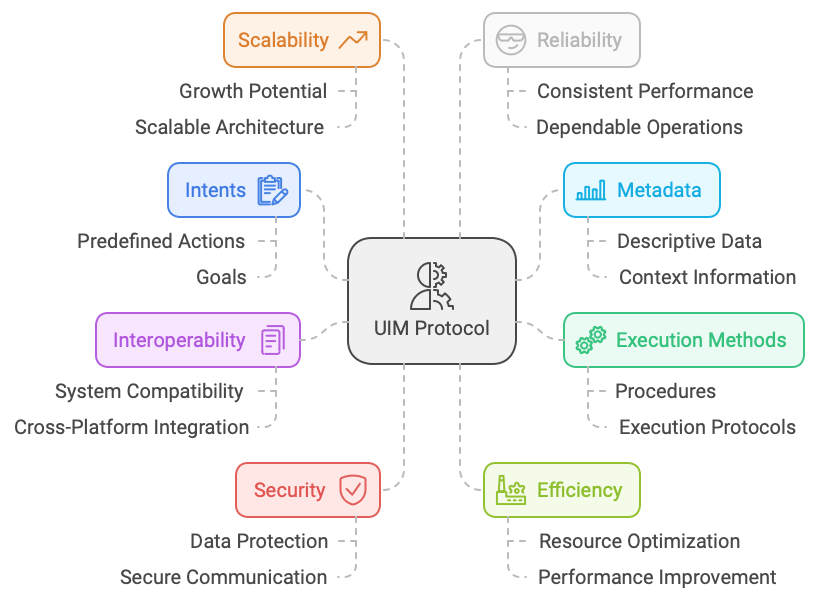

<div style="text-align: center;">
  
</div>

# Unified Intent Mediator (UIM) Protocol Specification

**Version:** 1.0  
**Date:** September 30, 2024

## Getting started

1. Get familiar with the [concepts and motivations](uim-concept.md) behind the UIM protocol or just read the specification below.
2. Dive into the [technical exploration](uim-technical-exploration.md) of the UIM protocol to understand and explore the details of the protocol.
3. Explore the [prototypes implementations](uim-prototypes-intro.md) to see the UIM protocol in action.

## Abstract

The Unified Intent Mediator (UIM) protocol defines a standardized framework for AI agents to interact with web services through well-defined intents, metadata, and execution methods. By introducing consistency and security in these interactions, UIM enhances efficiency, scalability, and reliability for AI-driven applications. This specification provides comprehensive guidelines for implementing the UIM protocol, ensuring interoperability, security, and compliance across different systems.

Key components include:

- **Intents**: Structured actions that web services can expose, defining specific tasks such as searching products, placing orders, or retrieving data. Each intent has a unique identifier, metadata, and required parameters.

- **Metadata and Parameters**: Each intent comes with metadata (name, description, category) and defined parameters, providing context and specific input requirements.

- **Policy Adherence Tokens (PATs)**: Digitally signed tokens issued by web services that encapsulate permissions, billing, and compliance rules, streamlining policy enforcement and automating billing.

- **Discovery and Execution APIs**: AI agents can query discovery APIs to find available intents and use execution APIs to perform actions. Execution involves validation, interaction with the service’s API, response formatting, and error handling.

- **DNS TXT Records and agents.json Files**: Innovative methods for endpoint discovery, allowing AI agents to find and authenticate API endpoints using familiar internet protocols.

- **Integration with Open Digital Rights Language (ODRL)**: Provides a structured approach to managing permissions, prohibitions, and obligations, ensuring clear and enforceable rules between AI agents and web services.

## Table of Contents

1. [Introduction](#1-introduction)
   - [1.1 Motivation](#11-motivation)
   - [1.2 Scope](#12-scope)
   - [1.3 Out of Scope](#13-out-of-scope)
2. [Terminology](#2-terminology)
3. [Key Concepts](#3-key-concepts)
   - [3.1 Intents](#31-intents)
   - [3.2 Metadata and Parameters](#32-metadata-and-parameters)
   - [3.3 The Execute Method](#33-the-execute-method)
   - [3.4 Policy Adherence Tokens (PATs)](#34-policy-adherence-tokens-pats)
   - [3.5 AI Agents](#35-ai-agents)
4. [System Architecture](#4-system-architecture)
   - [4.1 Centralized Architecture](#41-centralized-architecture)
   - [4.2 Decentralized Architecture](#42-decentralized-architecture)
   - [4.3 Hybrid Approach](#43-hybrid-approach)
5. [Core Components](#5-core-components)
   - [5.1 Intent Discovery and Execution Endpoints](#51-intent-discovery-and-execution-endpoints)
   - [5.2 Unique Intent Identifier (UID) Format](#52-unique-intent-identifier-uid-format)
   - [5.3 Intent Metadata](#53-intent-metadata)
   - [5.4 Discovery Through DNS TXT Records and `agents.json` Files](#54-discovery-through-dns-txt-records-and-agentsjson-files)
   - [5.5 Policy Adherence Tokens (PATs) and ODRL Integration](#55-policy-adherence-tokens-pats-and-odrl-integration)
   - [5.6 Incorporating Billing Information into PATs](#56-incorporating-billing-information-into-pats)
   - [5.7 Service Management APIs](#57-service-management-apis)
   - [5.8 Intent Management APIs](#58-intent-management-apis)
6. [General API Guidelines and Standards](#6-general-api-guidelines-and-standards)
   - [6.1 Pagination](#61-pagination)
   - [6.2 Security and Compliance](#62-security-and-compliance)
   - [6.3 Monitoring and Analytics](#63-monitoring-and-analytics)
   - [6.4 Scalability](#64-scalability)
   - [6.5 Error Management Strategy](#65-error-management-strategy)
7. [Practical Examples and Use Cases](#7-practical-examples-and-use-cases)
   - [7.1 E-commerce Platform Integration](#71-e-commerce-platform-integration)
   - [7.2 Real Estate Data Retrieval](#72-real-estate-data-retrieval)
8. [Security Considerations](#8-security-considerations)
9. [Privacy Considerations](#9-privacy-considerations)
10. [Appendix](#10-appendix)
    - [A. Standard Error Codes and Messages](#a-standard-error-codes-and-messages)
    - [B. Complete `agents.json` File Example](#b-complete-agentsjson-file-example)
    - [C. Sample ODRL Policy](#c-sample-odrl-policy)
    - [D. Sample PAT Structure](#d-sample-pat-structure)
    - [E. Sample API Requests and Responses](#e-sample-api-requests-and-responses)
    - [F. Visual Aids](#f-visual-aids)

## 1. Introduction



### 1.1 Motivation

As Artificial Intelligence (AI) technology advances, there is a growing need for efficient, standardized interactions between AI agents and web services. Traditional methods such as web scraping and simulated user interactions are inefficient, unreliable, and often non-compliant with legal and ethical standards.

#### Challenges in Current AI-Agent Interactions

1. **Web Scraping Issues**
   - **Inconsistency**: Unpredictable changes in HTML structures lead to data extraction failures.
   - **Legal and Ethical Concerns**: Potential violations of terms of service and data privacy laws.

2. **Simulated Browser Interactions**
   - **Performance Overhead**: High resource consumption affects scalability.
   - **Dynamic Content Handling**: Difficulty managing JavaScript-rendered content, pop-ups, and CAPTCHAs.

3. **Lack of Standardization**
   - **Diverse APIs**: Inconsistent API designs require custom integrations.
   - **Data Formats**: Multiple data formats necessitate different parsers.

4. **Limited Access to Deep Functionality**
   - **Restricted Features**: Inability to access advanced functionalities due to API limitations.
   - **Inefficient Automation**: Hinders the development of sophisticated AI capabilities.

5. **Security and Compliance Challenges**
   - **Complex Authentication**: Varied authentication mechanisms complicate integration.
   - **Regulatory Compliance**: Navigating data protection laws like GDPR is challenging.


### 1.2 Scope

The Unified Intent Mediator (UIM) protocol addresses these challenges by introducing a standardized, secure method for direct AI agent-web service interaction. This specification aims to:

- **Define the structure and format of intents.**
- **Establish mechanisms for discovery and execution of intents.**
- **Integrate Open Digital Rights Language (ODRL) for policy management.**
- **Utilize Policy Adherence Tokens (PATs) for secure interactions.**
- **Provide comprehensive guidelines for implementation, ensuring interoperability and compliance.**

### 1.3 Out of Scope

While the Unified Intent Mediator (UIM) Protocol Specification aims to provide a comprehensive framework for AI agents to interact with web services, certain aspects are intentionally excluded to maintain focus and clarity. The following elements are not within the scope of this specification:

- **Implementation Details of AI Agents and Web Services**: The specification does not dictate the internal architecture or programming paradigms (e.g., object-oriented, functional programming) that AI agents or web services should adopt. It does not prescribe specific programming languages, frameworks, or libraries to be used in implementing the protocol.
- **Specific Authentication and Authorization Mechanisms**: Details regarding how credentials are stored, rotated, or managed are beyond the scope of this document.
- **Legal and Regulatory Compliance Beyond Data Privacy**: The specification does not cover compliance with laws beyond data privacy regulations like GDPR and CCPA. It excludes areas such as export controls, accessibility laws, and sector-specific regulations (e.g., HIPAA for healthcare). Issues related to copyright, trademarks, or patents are not addressed.
- **User Interface and Experience Design**: The specification does not prescribe how users should interact with AI agents or how agents present information to users.
- **Business Models and Economic Considerations**: While incorporating billing information into PATs is discussed, the specification does not guide on how services should price their intents or services. The specifics of service-level agreements (SLAs), terms of service (ToS), or contractual obligations beyond what’s included in ODRL policies are not covered.
- **Security Threat Modeling and Mitigation Techniques**: While high-level security considerations are included, specific threat models, vulnerability assessments, or detailed mitigation strategies (e.g., against SQL injection, cross-site scripting) are not.
- **Detailed Workflow Implementations**: It does not delve into the specific business logic that should be implemented within intents. Detailed workflows or sequence diagrams for complex processes are not provided beyond high-level overviews.

## 2. Terminology

- **Intent**: An action that can be performed by a web service, including metadata and parameters required for execution.  
- **Parameters**: Inputs required by an intent to perform its action, including name, type, and whether they are required.  
- **Service**: A web service that publishes its capabilities (intents) using the UIM protocol.  
- **Endpoint**: The API endpoint where an intent can be executed.  
- **Metadata**: Descriptive information about an intent, including its name, description, and category.
- **Policy Adherence Token (PAT)**: A token issued by a web service to an AI agent, encapsulating permissions, usage limits, and billing agreements.
- **AI Agent**: An application or service that uses intents to interact with web services.
- **Discovery Endpoint**: The API endpoint where AI agents can query for available intents.
- **Execution Endpoint**: The API endpoint where AI agents can execute intents.
- **Policy Endpoint**: The API endpoint where AI agents can request PATs from web services.
- **Open Digital Rights Language (ODRL)**: A standardized language for expressing policies governing the usage of digital content and services.

## 3. Key Concepts

### 3.1 Intents

**Definition**: Intents are predefined actions that an AI agent can perform on a web service. They encapsulate specific tasks, including necessary parameters and execution details.

**Examples**:

- **SearchProducts**
- **GetProductDetails**
- **PlaceOrder**

#### Unique Intent Identifier (UID) Format

The UID ensures that AI agents can uniquely identify and call intents from different service providers.

**Format**:

```js
namespace:intent_name:version
```

- **namespace**: Typically the domain or unique identifier of the service provider.
- **intent_name**: A descriptive and unique name within the namespace.
- **version**: Indicates the version of the intent.

**Examples**:

- `ecommerce.com:SearchProducts:v1`
- `weather.com:GetForecast:v2`

### 3.2 Metadata and Parameters

Each intent includes:

- **Metadata**: Name, description, category, and tags.
- **Input Parameters**: Required to execute the intent.
- **Output Parameters**: Expected results from the intent execution.


**Example**:

```json
{
  "intent_uid": "ecommerce.com:SearchProducts:v1",
  "intent_name": "SearchProducts",
  "description": "Search for products based on criteria",
  "input_parameters": [
    {"name": "query", "type": "string", "required": true, "description": "Search term"},
    {"name": "category", "type": "string", "required": false, "description": "Product category"},
    {"name": "price_range", "type": "string", "required": false, "description": "Price range filter"},
    {"name": "sort_by", "type": "string", "required": false, "description": "Sorting criteria"}
  ],
  "output_parameters": [
    {"name": "products", "type": "array", "description": "List of products"},
    {"name": "total_results", "type": "integer", "description": "Total number of results"}
  ],
  "endpoint": "https://api.ecommerce.com/products/search",
  "tags": ["e-commerce", "search", "products"]
}
```

### 3.3 The Execute Method

Responsible for:

1. **Input Validation**: Ensuring all required parameters are present and correctly formatted.
2. **Authentication**: Verifying the AI agent's identity and PAT.
3. **Authorization**: Ensuring the AI agent has the necessary permissions as per the PAT and policies.
4. **Execution**: Performing the action defined by the intent.
5. **Response Formatting**: Standardizing the response for consistent interpretation by AI agents.
6. **Error Handling**: Managing exceptions and providing meaningful feedback.


### 3.4 Policy Adherence Tokens (PATs)

**Definition**: Digitally signed tokens that encapsulate permissions, usage limits, billing agreements, and compliance terms. They ensure secure and compliant interactions between AI agents and web services.

### 3.5 AI Agents

**Definition**: Applications or services that utilize intents to interact with web services.

**Responsibilities**:

- **Discovery**: Finding available intents and services.
- **Policy Agreement**: Requesting and managing PATs.
- **Execution**: Performing intents according to policies.


## 4. System Architecture

### 4.1 Centralized Architecture

#### Overview

A central repository manages:

- **Intent Registration**: Web services register their intents with the central repository.
- **Discovery**: AI agents discover intents via the central system.
- **Execution**: AI agents execute intents through the central system, which forwards requests to the appropriate web service.
- **Policy Management**: Centralized issuance and validation of PATs.

#### Workflow Description

1. **Service Registration**: Web services register their intents and policies with the central repository.
2. **Intent Discovery**: AI agents query the central repository to discover available intents.
3. **Policy Agreement**: AI agents obtain PATs from the central repository after agreeing to policies.
4. **Execution**: AI agents execute intents via the central repository.
5. **Response Handling**: The central repository forwards responses from web services to AI agents.


#### Pros and Cons

- **Pros**:
  - Simplified discovery and integration for AI agents.
  - Unified policy enforcement and compliance management.
- **Cons**:
  - Single point of failure.
  - Scalability challenges with increasing load.
  - Potential bottleneck affecting performance.

### 4.2 Decentralized Architecture

#### Overview

AI agents interact directly with web services without a central intermediary.

#### Workflow Description

1. **Discovery via DNS TXT and `agents.json`**: AI agents discover web services through DNS records and retrieve `agents.json` files.
2. **Policy Retrieval and Agreement**: AI agents obtain ODRL policies and request PATs directly from web services.
3. **Intent Execution**: AI agents execute intents directly with web services using the obtained PATs.
4. **Response Handling**: Web services respond directly to AI agents.


#### Pros and Cons

- **Pros**:
  - Enhanced scalability due to distributed interactions.
  - Greater control and autonomy for web services.
- **Cons**:
  - Increased complexity for AI agents managing diverse policies.
  - Potential inconsistencies in policy enforcement across services.

### 4.3 Hybrid Approach

#### Overview

Combines centralized discovery with decentralized execution and PAT issuance.

#### Workflow Description

1. **Centralized Discovery**: AI agents use the central repository to discover available intents and services.
2. **Decentralized Policy Agreement**: AI agents retrieve policies and obtain PATs directly from web services.
3. **Direct Execution**: AI agents execute intents directly with web services using the obtained PATs.
4. **Response Handling**: Web services respond directly to AI agents.


#### Pros and Cons

- **Pros**:
  - Efficient discovery through a centralized system.
  - Maintains autonomy and control for web services in execution and policy management.
- **Cons**:
  - Coordination complexity between central and decentralized components.
  - Diverse compliance requirements increase AI agent complexity.

## 5. Core Components

### 5.1 Intent Discovery and Execution Endpoints

#### Purpose

Enable AI agents to:

- **Discover** available intents.
- **Execute** intents securely.

#### Implementation

- **Centralized Context**: Unified discovery endpoint managed by the central repository.
- **Decentralized Context**: Each web service hosts its own discovery and execution endpoints.
- **Hybrid Context**: Centralized discovery with decentralized execution endpoints.

#### API Endpoints

1. **Intent Discovery**

   - **Endpoint**: `/api/intents/search`
   - **Method**: `GET`
   - **Parameters**:
     - `query`: Natural language search term.
     - `service_name`
     - `intent_name`
     - `uid`
     - `namespace`
     - `description`
     - `tags`

   **Example Request**:

   ```curl
   GET /api/intents/search?intent_name=SearchProducts
   ```

   **Example Response**:

   ```json
   {
     "intents": [
       {
         "service_name": "E-commerce Platform",
         "intent_name": "SearchProducts",
         "intent_uid": "ecommerce.com:SearchProducts:v1",
         "description": "Search for products based on criteria",
         "input_parameters": [
           {"name": "query", "type": "string", "required": true}
         ],
         "output_parameters": [
           {"name": "products", "type": "array", "description": "List of products"}
         ],
         "endpoint": "https://api.ecommerce.com/products/search",
         "tags": ["e-commerce", "search", "products"]
       }
     ]
   }
   ```

2. **Execute Intent**

   - **Endpoint**: `/api/intents/execute`
   - **Method**: `POST`
   - **Headers**:
     - `Authorization`: Bearer PAT-12345
     - `Content-Type`: application/json

   **Example Request**:

   ```json
   POST /api/intents/execute
   Authorization: Bearer PAT-12345
   Content-Type: application/json

   {
     "intent_uid": "ecommerce.com:SearchProducts:v1",
     "parameters": {
       "query": "laptops"
     }
   }
   ```

   **Example Response**:

   ```json
   {
     "products": [
       {
         "product_id": "123",
         "name": "Gaming Laptop",
         "price": 1500
       },
       {
         "product_id": "124",
         "name": "Ultrabook",
         "price": 1200
       }
     ],
     "total_results": 2
   }
   ```

### 5.2 Unique Intent Identifier (UID) Format

As detailed in [Section 3.1](#31-intents), the UID format is crucial for unique identification.

### 5.3 Intent Metadata

Metadata provides detailed information about an intent, helping AI agents understand how to interact with it.

**Fields**:

- `intent_uid`
- `intent_name`
- `description`
- `input_parameters`
- `output_parameters`
- `endpoint`
- `tags`
- `service_info`

### 5.4 Discovery Through DNS TXT Records and `agents.json` Files

#### Purpose

Facilitate service discovery in a decentralized architecture.

#### DNS TXT Records

Provide quick discovery of services and pointers to detailed information.

**Fields**:

1. **uim-agents-file**: URL of the `agents.json` file.
2. **uim-api-discovery**: URL of the API discovery endpoint.
3. **uim-policy-file**: URL of the ODRL policy file.

**Example Record**:

```txt
uim-agents-file=https://example.com/agents.json
uim-api-discovery=https://api.example.com/intents/search
uim-policy-file=https://example.com/uim-policy.json
```

#### `agents.json` Files

Contain detailed information about the service and available intents.

**Structure**:

- **service-info**
- **intents**
- **uim-public-key**
- **uim-policy-file**
- **uim-api-discovery**
- **uim-compliance**
- **uim-license**

**Complete `agents.json` File Example** is provided in [Appendix B](#b-complete-agentsjson-file-example).

### 5.5 Policy Adherence Tokens (PATs) and ODRL Integration

#### Purpose

Ensure secure, compliant interactions by encapsulating policies, permissions, and obligations.

#### ODRL Integration

Utilize the **Open Digital Rights Language (ODRL)** to define policies.

**Key Concepts**:

- **Policy**: Represents the agreement between AI agents and web services, detailing permissions, prohibitions, and obligations.
- **Permission**: Specifies allowed actions for AI agents.
- **Prohibition**: Specifies actions that AI agents are not allowed to perform.
- **Obligation**: Specifies actions that AI agents must perform under certain conditions.
- **Asset**: The resource or service the policy applies to.
- **Party**: The entities involved in the policy (e.g., AI agents and web services).

**Sample ODRL Policy** is provided in [Appendix C](#c-sample-odrl-policy).

#### PAT Issuance Workflow

1. **Policy Retrieval and Agreement**:
   - AI agent retrieves the ODRL policy from the specified endpoint.
   - AI agent digitally signs the policy using its private key and sends it to the web service alongside its public key to request a PAT.

2. **PAT Issuance**:
   - Web service verifies the AI agent's signature and agreement.
   - Web service issues a PAT, which includes the agreed policy details, permissions, obligations, and a validity period.
   - The PAT is digitally signed by the web service.

3. **Using PAT in Requests**:
   - AI agent includes the PAT in the `Authorization` header of each request.
   - Web service verifies the PAT's signature and validity before processing the request.

**PAT Structure**:

**Sample PAT** is provided in [Appendix D](#d-sample-pat-structure).

#### Including PAT in Requests

The AI agent includes the PAT in the `Authorization` header:

```txt
Authorization: Bearer PAT-12345
```

#### Verification Process

1. **Extract PAT**: Web service extracts the PAT from the request header.
2. **Verify Signature**: Web service verifies the PAT's signature using its public key.
3. **Check Validity**: Web service checks the PAT's validity period.
4. **Authorize Request**: Web service checks if the PAT permissions match the requested action.
5. **Process Request**: If valid, the web service processes the request; otherwise, it rejects it.

### 5.6 Incorporating Billing Information into PATs

#### Purpose

Simplifies transactions by including billing details within the PAT.

#### Workflow

1. **Billing Information Submission**: AI agent submits billing info during PAT request.
2. **PAT Issuance**: PAT includes billing details.
3. **Automated Billing**: Web service processes payments automatically as intents are executed.

**Benefits**:

- Streamlined process.
- Automated billing.
- Improved user experience.
- Enhanced compliance.

### 5.7 Service Management APIs

APIs that allow web services to manage their registration, including creating, updating, and deleting services.

#### Register Service

- **Endpoint**: `/api/services`
- **Method**: `POST`
- **Description**: Registers a new service.

**Request Body**:

```json
{
  "service_name": "E-commerce Platform",
  "service_url": "https://api.ecommerce.com",
  "description": "Provides e-commerce functionalities",
  "service_terms_of_service_url": "https://api.ecommerce.com/terms",
  "service_privacy_policy_url": "https://api.ecommerce.com/privacy",
  "service_logo_url": "https://api.ecommerce.com/logo.png"
}
```

#### Update Service

- **Endpoint**: `/api/services/{service_id}`
- **Method**: `PUT`
- **Description**: Updates an existing service.

#### Delete Service

- **Endpoint**: `/api/services/{service_id}`
- **Method**: `DELETE`
- **Description**: Deletes a registered service.

#### Retrieve Service

- **Endpoint**: `/api/services/{service_id}`
- **Method**: `GET`
- **Description**: Retrieves the details of a registered service.

### 5.8 Intent Management APIs

APIs for web services to manage their intents.

#### List All Intents for a Service

- **Endpoint**: `/api/services/{service_id}/intents`
- **Method**: `GET`
- **Description**: Lists all intents for a specific service.

#### Retrieve Intent Details

- **Endpoint**: `/api/intents/{intent_uid}`
- **Method**: `GET`
- **Description**: Retrieves the details of a specific intent.

#### Create Intent

- **Endpoint**: `/api/services/{service_id}/intents`
- **Method**: `POST`
- **Description**: Creates a new intent for a service.

**Request Body**:

```json
{
  "intent_uid": "ecommerce.com:GetProductDetails:v1",
  "intent_name": "GetProductDetails",
  "description": "Fetches detailed information about a specific product using its unique identifier",
  "input_parameters": [
    {"name": "product_id", "type": "string", "required": true}
  ],
  "output_parameters": [
    {"name": "product_details", "type": "object", "required": true}
  ],
  "endpoint": "https://api.ecommerce.com/products/details",
  "tags": ["e-commerce", "product", "details"]
}
```

#### Update Intent

- **Endpoint**: `/api/intents/{intent_uid}`
- **Method**: `PUT`
- **Description**: Updates the details of an existing intent.

#### Delete Intent

- **Endpoint**: `/api/intents/{intent_uid}`
- **Method**: `DELETE`
- **Description**: Deletes an existing intent.

## 6. General API Guidelines and Standards

### 6.1 Pagination

To handle large data sets, list endpoints support pagination.

#### Parameters

- **page**: Page number (default: 1).
- **page_size**: Items per page (default: 10).

**Example Request**:

```curl
GET /api/services/12345/intents?page=2&page_size=5
```

#### Response Headers

- **X-Total-Count**
- **X-Total-Pages**
- **X-Current-Page**
- **X-Page-Size**

### 6.2 Security and Compliance

- **Authentication**: Use OAuth 2.0 for secure authentication.
- **Encryption**: All communications MUST use HTTPS.
- **Compliance**: Adhere to regulations like GDPR and CCPA.
- **Data Protection**: Implement data encryption at rest and in transit.

### 6.3 Monitoring and Analytics

- **Real-time Monitoring**: Provide dashboards for API usage and performance.
- **Logging and Alerts**: Implement systems to track activity and respond to issues.
- **Audit Trails**: Maintain logs for compliance and troubleshooting.

### 6.4 Scalability

- **Caching**: Implement caching mechanisms for frequently accessed data.
- **Load Balancing**: Distribute traffic efficiently to handle high volumes.
- **Auto-scaling**: Utilize auto-scaling to adjust resources based on demand.

### 6.5 Error Management Strategy

#### Comprehensive Error Handling Approach

- **Layered Error Handling**:
  1. **Client-Side Errors (4xx)**: Issues with the client's request.
  2. **Server-Side Errors (5xx)**: Issues on the server side.
  3. **Protocol-Level Errors**: Specific to UIM protocol operations.

#### Standard Error Response Structure

```json
{
  "error": {
    "code": "ERROR_CODE",
    "message": "Descriptive error message.",
    "details": {
      "additional": "context-specific information"
    }
  }
}
```

**Detailed error codes and messages** are provided in [Appendix A](#a-standard-error-codes-and-messages).

#### Error Handling Guidelines

- **Consistent Structure**: Ensure all error responses follow the standard format.
- **Clear Messages**: Provide descriptive and actionable error messages.
- **Security Considerations**: Avoid exposing sensitive internal details.
- **Documentation**: Document all error codes and scenarios.

## 7. Practical Examples and Use Cases

### 7.1 E-commerce Platform Integration

**Scenario**: An AI shopping assistant helps users find products across multiple e-commerce platforms.

**Workflow**:

1. **Discovery**: The AI agent searches for the `SearchProducts` intent across registered e-commerce services.
2. **Policy Agreement**: The agent retrieves the ODRL policy and obtains a PAT from each service.
3. **Execution**: The agent executes the `SearchProducts` intent with user-provided criteria.
4. **Aggregation**: Results from multiple platforms are aggregated and presented to the user.
5. **Purchase**: The user selects a product, and the agent uses the `PlaceOrder` intent to complete the purchase.


**Benefits**:

- **User Convenience**: One-stop shop across multiple platforms.
- **Service Monetization**: E-commerce platforms gain additional sales channels.

### 7.2 Real Estate Data Retrieval

**Scenario**: A real estate analytics tool aggregates property data for market analysis.

**Workflow**:

1. **Discovery**: The AI agent discovers real estate services offering the `SearchProperty` intent.
2. **Policy Agreement**: The agent agrees to policies and obtains PATs.
3. **Data Retrieval**: Executes `SearchProperty` intents to gather property listings.
4. **Analysis**: Aggregates and analyzes data to provide market insights.
5. **Compliance**: Ensures data usage complies with service policies.


**Benefits**:

- **Comprehensive Data**: Access to diverse property listings.
- **Enhanced Analytics**: Improved market analysis capabilities.

## 8. Security Considerations

- **Authentication and Authorization**: AI agents MUST authenticate using secure methods like OAuth 2.0. Web services MUST verify PATs and ensure that AI agents have the necessary permissions.
- **Data Integrity**: All tokens and sensitive data SHOULD be digitally signed to prevent tampering.
- **Confidentiality**: Sensitive information, including billing details, MUST be encrypted and securely stored.
- **Replay Attacks**: PATs SHOULD include nonce values or timestamps to prevent replay attacks.
- **Input Validation**: Web services MUST validate all inputs to prevent injection attacks.

## 9. Privacy Considerations

- **Data Minimization**: AI agents and web services SHOULD minimize the collection and storage of personal data.
- **Compliance**: Adherence to regulations like GDPR and CCPA is REQUIRED where applicable.
- **User Consent**: When personal data is involved, explicit user consent MUST be obtained.
- **Transparency**: Privacy policies SHOULD be clearly communicated through the `service_privacy_policy_url`.
- **Anonymization**: Where possible, data SHOULD be anonymized to protect user identities.

## 10. Appendix

### A. Standard Error Codes and Messages

#### Client-Side Errors (4xx)

| Error Code             | Message                                                    | Description                                |
|------------------------|------------------------------------------------------------|--------------------------------------------|
| INVALID_PARAMETER      | "The parameter '{param}' is required."                     | Missing or invalid parameter.              |
| UNAUTHORIZED           | "Unauthorized access. Authentication is required."         | Missing or invalid authentication token.   |
| FORBIDDEN              | "Access to this resource is forbidden."                    | Insufficient permissions.                  |
| NOT_FOUND              | "The requested resource '{resource}' was not found."       | Resource not found.                        |
| METHOD_NOT_ALLOWED     | "The HTTP method '{method}' is not allowed for this endpoint." | Unsupported HTTP method.                   |
| CONFLICT               | "The request could not be completed due to a conflict."    | Resource conflict.                         |
| UNSUPPORTED_MEDIA_TYPE | "The media type '{type}' is not supported."                | Unsupported content type.                  |

#### Server-Side Errors (5xx)

| Error Code              | Message                                                   | Description                      |
|-------------------------|-----------------------------------------------------------|----------------------------------|
| INTERNAL_SERVER_ERROR   | "An unexpected error occurred on the server."             | Generic server error.            |
| SERVICE_UNAVAILABLE     | "The service is temporarily unavailable."                 | Server down or overloaded.       |
| GATEWAY_TIMEOUT         | "The server did not receive a timely response."           | Upstream server timeout.         |
| NOT_IMPLEMENTED         | "The requested functionality is not implemented."         | Feature not supported.           |

#### Protocol-Level Errors

| Error Code              | Message                                                   | Description                                |
|-------------------------|-----------------------------------------------------------|--------------------------------------------|
| INTENT_EXECUTION_FAILED | "The intent '{intent}' could not be executed."            | Execution failure due to various reasons.  |
| INTENT_NOT_SUPPORTED    | "The intent '{intent}' is not supported by this service." | Intent not recognized or supported.        |
| VERSION_CONFLICT        | "The intent version '{version}' is not supported."        | Version mismatch.                          |
| INTENT_DEPRECATED       | "The intent '{intent}' has been deprecated."              | Intent no longer available.                |

### B. Complete `agents.json` File Example

```json
{
  "service-info": {
    "name": "fakerealestate.com",
    "description": "Provides property listings and real estate data.",
    "service_url": "https://fakerealestate.com",
    "service_logo_url": "https://fakerealestate.com/logo.png",
    "service_terms_of_service_url": "https://fakerealestate.com/terms",
    "service_privacy_policy_url": "https://fakerealestate.com/privacy"
  },
  "intents": [
    {
      "intent_uid": "fakerealestate.com:SearchProperty:v1",
      "intent_name": "SearchProperty",
      "description": "Search properties based on criteria",
      "input_parameters": [
        {"name": "location", "type": "string", "required": true, "description": "City or ZIP code"},
        {"name": "min_price", "type": "integer", "required": false, "description": "Minimum price"},
        {"name": "max_price", "type": "integer", "required": false, "description": "Maximum price"},
        {"name": "property_type", "type": "string", "required": false, "description": "Type of property"}
      ],
      "output_parameters": [
        {"name": "properties", "type": "array", "description": "List of matching properties"},
        {"name": "total_results", "type": "integer", "description": "Total number of results"}
      ],
      "endpoint": "https://fakerealestate.com/api/execute/SearchProperty",
      "tags": ["real estate", "search"],
      "rate_limit": "1000/hour",
      "price": "0.01 USD"
    }
    // Additional intents can be added here
  ],
  "uim-public-key": "MIIBIjANBgkqhkiG9w0BAQEFAAOCAQ8AMIIBCgKCAQE...",
  "uim-policy-file": "https://fakerealestate.com/uim-policy.json",
  "uim-api-discovery": "https://fakerealestate.com/uim/intents/search",
  "uim-compliance": {
    "standards": ["ISO27001", "GDPR"],
    "regional-compliance": {
      "EU": "GDPR",
      "US-CA": "CCPA"
    },
    "notes": "Data is encrypted in transit and at rest."
  },
  "uim-license": "CC-BY-NC-SA-4.0"
}
```

### C. Sample ODRL Policy

```json
{
  "@context": "http://www.w3.org/ns/odrl.jsonld",
  "uid": "http://fakerealestate.com/policy/12345",
  "type": "Set",
  "permission": [
    {
      "target": "http://fakerealestate.com/api/intents",
      "action": "execute",
      "constraint": [
        {
          "leftOperand": "http://fakerealestate.com/vocab/rateLimit",
          "operator": "lte",
          "rightOperand": 1000,
          "unit": "http://fakerealestate.com/vocab/hour"
        }
      ],
      "duty": [
        {
          "action": "pay",
          "target": "http://fakerealestate.com/vocab/intentPrice",
          "amount": 0.01,
          "unit": "http://fakerealestate.com/vocab/USD"
        }
      ]
    }
  ],
  "prohibition": [
    {
      "target": "http://fakerealestate.com/api/intents",
      "action": "exceedRateLimit"
    }
  ],
  "obligation": [
    {
      "action": "signPayload",
      "assignee": "http://aiagent.com/agent/1",
      "target": "http://fakerealestate.com/vocab/payload",
      "constraint": [
        {
          "leftOperand": "http://fakerealestate.com/vocab/publicKey",
          "operator": "use",
          "rightOperand": "MIIBIjANBgkqh..."
        }
      ]
    }
  ],
  "party": [
    {
      "function": "assigner",
      "identifier": "http://fakerealestate.com"
    },
    {
      "function": "assignee",
      "identifier": "http://aiagent.com/agent/1"
    }
  ],
  "asset": "http://fakerealestate.com/api/intents"
}
```

### D. Sample PAT Structure

```json
{
  "pat": {
    "uid": "pat-12345",
    "issued_to": "ai-agent-1",
    "issued_by": "fakerealestate.com",
    "policy_reference": "http://fakerealestate.com/policy/12345",
    "permissions": ["execute:intent/SearchProperty"],
    "obligations": ["pay:0.01 USD per intent"],
    "billing_info": {
      "payment_method": "credit_card",
      "billing_address": "123 AI Street, Tech City",
      "currency": "USD"
    },
    "valid_from": "2024-01-01T00:00:00Z",
    "valid_to": "2024-12-31T23:59:59Z"
  },
  "signature": "Base64-encoded-digital-signature"
}
```

### E. Sample API Requests and Responses

#### Intent Discovery Request

```curl
GET /api/intents/search?intent_name=SearchProperty
```

#### Intent Discovery Response

```json
{
  "intents": [
    {
      "service_name": "Fake Real Estate",
      "intent_name": "SearchProperty",
      "intent_uid": "fakerealestate.com:SearchProperty:v1",
      "description": "Search properties based on criteria",
      "input_parameters": [
        {"name": "location", "type": "string", "required": true}
      ],
      "output_parameters": [
        {"name": "properties", "type": "array", "description": "List of properties"}
      ],
      "endpoint": "https://fakerealestate.com/api/execute/SearchProperty",
      "tags": ["real estate", "search"]
    }
  ]
}
```

#### Execute Intent Request

```json
POST /api/intents/execute
Authorization: Bearer PAT-12345
Content-Type: application/json

{
  "intent_uid": "fakerealestate.com:SearchProperty:v1",
  "parameters": {
    "location": "New York",
    "min_price": 500000,
    "max_price": 1000000
  }
}
```

#### Execute Intent Response

```json
{
  "properties": [
    {
      "property_id": "NYC123",
      "address": "123 Main St, New York, NY",
      "price": 750000,
      "property_type": "Apartment"
    },
    {
      "property_id": "NYC124",
      "address": "456 Broadway, New York, NY",
      "price": 850000,
      "property_type": "Condo"
    }
  ],
  "total_results": 2
}
```

### F. Visual Aids

#### High Level System Architecture Diagram

1. **Centralized Architecture**:

   - **AI Agent** interacts with the **Central Repository** for discovery, policy agreement, and execution.
   - **Central Repository** communicates with **Web Services** to forward execution requests and receive responses.
  

2. **Decentralized Architecture**:

   - **AI Agent** discovers **Web Services** via DNS TXT records and `agents.json` files.
   - **AI Agent** communicates directly with **Web Services** for policy agreement and intent execution.
  

3. **Hybrid Approach**:

   - **AI Agent** uses the **Central Repository** for intent discovery.
   - **AI Agent** interacts directly with **Web Services** for policy agreement and execution.
  

## End Notes

- *The examples and diagrams provided are for illustrative purposes. Implementers should tailor the protocol to their specific needs while adhering to the core principles outlined in this specification.*
- *The UIM is an open standard and welcomes contributions and feedback from the community. Please refer to the [contribution guidelines](CONTRIBUTING.md) for more information on how to get involved.*

## License

This project is licensed under the Apache 2.0 License - see the [LICENSE](LICENSE) file for details.
