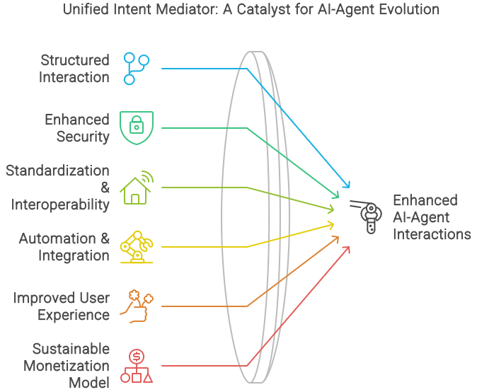
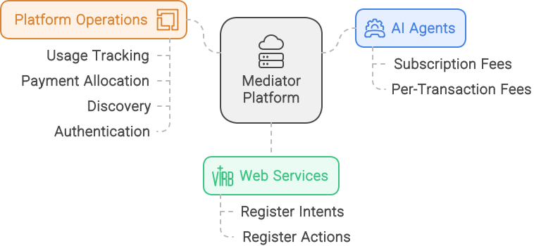
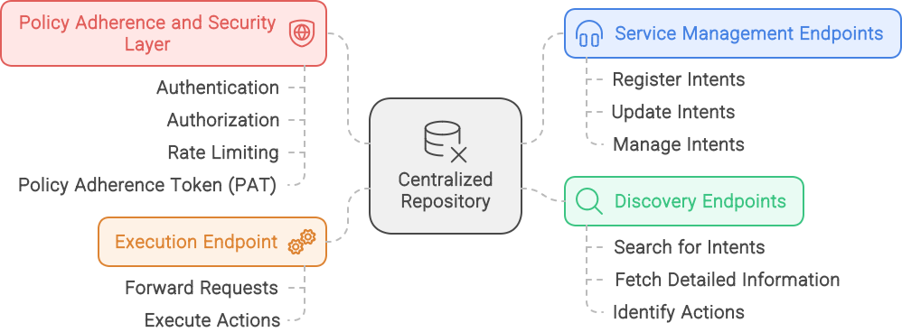
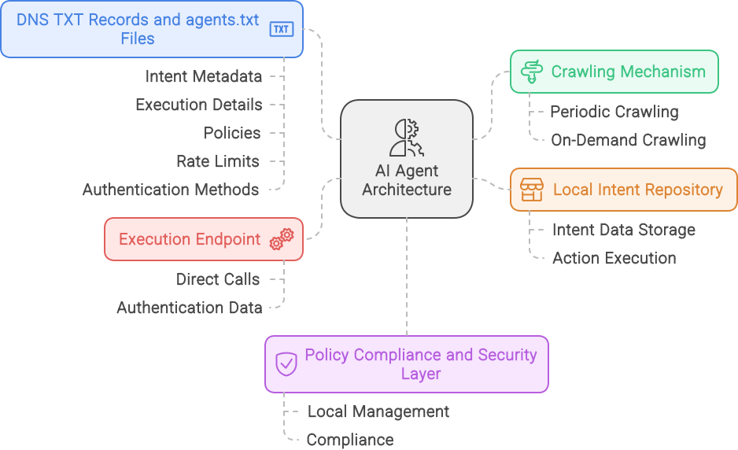
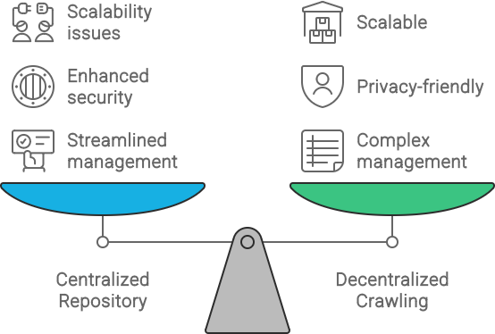
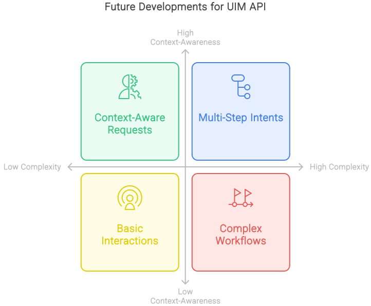
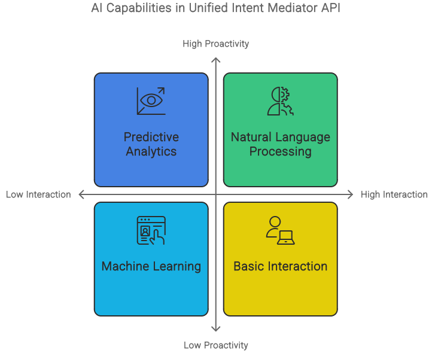
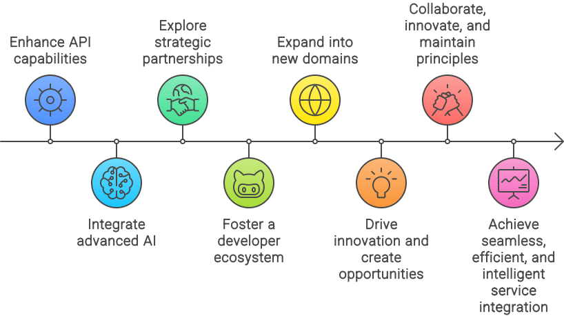

# Concepts behind the Unified Intent Mediator (UIM) Protocol

## TLDR

The concept section below explains the foundational elements of the UIM protocol, focusing on key concepts like “intents,” “metadata,” and the “execute method.” It highlights the protocol’s role in enabling seamless and efficient interactions between AI agents and web services, resolving issues like inconsistent data extraction and high latency. The section also discusses the monetization opportunities that the UIM protocol creates for web services by providing structured, discoverable, and executable intents.

## Concept Abstract

The Unified Intent Mediator (UIM) protocol addresses the critical need for standardized interactions between AI agents and web services. UIM replaces inefficient methods like web scraping and simulated user actions with a consistent, secure, and scalable interface. This protocol enhances reliability, improves efficiency, and simplifies development for AI-driven applications.

By enabling web services to expose capabilities as structured intents and allowing AI agents to seamlessly discover and execute these intents, UIM offers a scalable solution that:

- Enhances automation
- Improves user experience
- Opens new monetization avenues for service providers

UIM sets a new standard for AI-driven web service integration, from optimizing e-commerce transactions to automating complex workflows.

## Introduction

As AI technology advances, the need for efficient AI agent-web service interactions has become critical. Traditional methods like web scraping and simulated browser actions are inefficient, leading to:

- Inconsistent data extraction
- High latency
- Frequent errors
- Poor user experience
- Increased operational costs

The UIM protocol addresses these challenges by introducing a standardized, secure method for direct AI agent-web service interaction. Instead of simulating user actions, UIM allows services to expose capabilities as well-defined intents, which AI agents can discover and execute seamlessly.

### Current Inefficiencies in AI-Agent Interactions with Web Services

Despite AI advancements, current interaction methods remain rudimentary and problematic:

1. Web Scraping Challenges
   - Inconsistent data extraction due to unpredictable HTML changes
   - Legal and ethical issues, including terms of service violations

2. Simulated Browser Interactions
   - High performance overhead, degrading user experience
   - Vulnerability to dynamic content, pop-ups, and CAPTCHAs

3. Lack of Standardization
   - Diverse API designs requiring custom integrations
   - Inconsistent data formats necessitating multiple parsers

4. Limited Access to Deep Functionality
   - Restricted to basic data retrieval and simple transactions
   - Difficulty accessing advanced features due to API limitations

5. Security and Compliance Challenges
   - Complex authentication mechanisms
   - Data privacy concerns and regulatory compliance issues


### Motivation for the Unified Intent Mediator (UIM)

UIM addresses these challenges through:

1. Structured Interaction
   - Standardization across services
   - Direct service communication, eliminating scraping and simulations

2. Enhanced Security
   - Robust authentication mechanisms
   - Encrypted communications

3. Standardization and Interoperability
   - Unified interface for AI agents
   - Simplified integration process

4. Advanced Automation and Integration
   - Access to a broad range of functionalities
   - Seamless integration of complex workflows

5. Improved User Experience
   - Faster, more accurate interactions
   - Enhanced functionality and task precision

6. Sustainable Monetization Model
   - New revenue opportunities for service providers
   - Flexible monetization strategies

The UIM protocol redefines AI agent-web service interactions, paving the way for more efficient, reliable, and scalable AI-driven applications. As intelligent automation demand grows, UIM is positioned to become the cornerstone of next-generation AI-web service integrations.



## Key Concepts

The UIM protocol is built on three fundamental concepts: Intents, Metadata and Parameters, and the Execute Method. Each plays a crucial role in facilitating efficient communication between AI agents and web services.


### Intents

Intents are the core building blocks of the UIM protocol. They represent specific, predefined actions that an AI agent can perform on a web service. By standardizing these actions, UIM creates a common language for interaction, significantly reducing complexity and enhancing efficiency.

In practical terms, an intent is analogous to a function call in programming. It encapsulates a discrete task, complete with the necessary information to execute it. For example, an e-commerce platform might offer intents such as:

- SearchProducts: Enables product searches based on various criteria
- GetProductDetails: Retrieves detailed information about a specific product
- PlaceOrder: Initiates and processes a purchase transaction

Other intent examples can be found [here](intent_examples.md) for inspiration.

This standardization allows AI agents to interact uniformly across different services, streamlining development and improving reliability.

### Metadata and Parameters

Metadata and parameters provide the context and specifics needed to execute intents effectively. They serve as the blueprint for each intent, detailing its purpose and requirements.

Metadata typically includes:

- Name: A unique identifier for the intent
- Description: A concise explanation of the intent's function
- Category: The type of action (e.g., e-commerce, finance, healthcare)

Parameters specify the input required for the intent's execution. For a 'SearchProducts' intent, parameters might include:

- query (string): The search term
- category (string): The product category filter
- price_range (string): The price range filter
- sort_by (string): The sorting criteria

This structured approach ensures that AI agents can provide the necessary information in the correct format, facilitating accurate and efficient intent execution.

### The Execute Method

The execute method is the operational core of the UIM protocol. It manages the actual execution of intents, ensuring smooth interaction between AI agents and web services. The method operates in four key stages:

1. Input Validation: Verifies that all required parameters are present and correctly formatted
2. Execution: Interacts with the web service's API to perform the requested action
3. Response Formatting: Standardizes the web service's response for consistent interpretation by AI agents
4. Error Handling: Manages exceptions and provides meaningful feedback for error resolution


This systematic approach enhances reliability and simplifies troubleshooting, contributing to a more robust interaction framework.

## Seamless Integration and Discoverability in the UIM Protocol

The UIM protocol prioritizes seamless integration and efficient discoverability, offering significant improvements over traditional AI-agent interactions with web services.

### Seamless Integration


The UIM protocol facilitates seamless integration through:

1. **Direct Interaction**
   - Eliminates navigation through web pages or user action simulation
   - Reduces latency and enhances task execution speed and reliability
   - Example: AI agents can book hotel rooms across multiple services using a single SearchForRoom intent

2. **Improved User Experience**
   - Provides faster and more accurate responses
   - Enables AI agents to perform complex tasks efficiently
   - Example: An AI agent can find, purchase, and confirm a book order within seconds

3. **Scalability**
   - Allows easy addition of new intents as web service capabilities expand
   - AI agents can leverage new functionalities with minimal modifications
   - Example: Streaming services can add intents like GetRecommendations or CreatePlaylist, which AI agents can automatically discover and utilize

4. **Consistency Across Services**
   - Ensures uniform behavior and responses across different web services
   - Simplifies AI agent development and enhances reliability
   - Example: A social media management AI can use a consistent PostContent intent across multiple platforms

### Discoverability


The UIM protocol enhances intent discoverability through:

1. **Intent Catalog**
   - Centralized repository for all registered intents and metadata
   - Standardized format for intent registration
   - RESTful API endpoints for intent registration, updating, and discovery

2. **Advanced Search Functionality**
   - Robust search capabilities based on keywords, categories, and other parameters
   - Features include:
     - Search indexing of all intent metadata
     - Rich query language for complex searches
     - Relevance-based ranking of search results

3. **Intent Tagging System**
   - Categorizes intents into meaningful groups
   - Allows multiple tags per intent (e.g., shopping, product search, retail for e-commerce intents)
   - Supports both service-defined and community-driven tagging
   - Enables tag-based search refinement

4. **Comprehensive Documentation**
   - Automatically generated for each intent
   - Includes:
     - Intent name and description
     - Detailed parameter information
     - API endpoint details
     - Usage examples with sample requests and responses

#### Example of an Intent Documentation

``` json
{
  "intent_uid": "ecommercePlatform:searchProducts:v1",
  "intent_name": "SearchProducts",
  "description": "Search for products based on given criteria",
  "parameters": [
    {
      "name": "query", 
      "type": "string", 
      "required": true, 
      "description": "The search term"
    },
    {
      "name": "category", 
      "type": "string", 
      "required": false, 
      "description": "Product category"
    },
    {
      "name": "price_range", 
      "type": "string", 
      "required": false, 
      "description": "Price range in the format 'min-max'"
    },
    {
      "name": "sort_by", 
      "type": "string", 
      "required": false, 
      "description": "Sort criteria (e.g., popularity, price)"
    }
  ],
  "endpoint": "https://api.ecommerce.com/api/products/search",
  "examples": {
    "request": {
      "method": "GET",
      "url": "https://api.ecommerce.com/api/products/search",
      "params": {
        "query": "laptops",
        "category": "electronics",
        "price_range": "1000-2000",
        "sort_by": "popularity"
      }
    },
    "response": {
      "status": "success",
      "data": [
        {
          "product_id": "123",
          "name": "Gaming Laptop",
          "price": 1500,
          "category": "electronics"
        }
      ]
    }
  },
  "tags": ["shopping", "product search", "retail"]
}
```

### Natural Language Support for Intent Discovery in UIM

The UIM protocol enhances intent discoverability by incorporating natural language processing (NLP) capabilities. This feature allows AI agents to interpret and utilize natural language queries, simplifying the process of identifying and executing appropriate actions to fulfill user requests.

#### Natural Language Understanding for AI Agents

Integration of NLP into the UIM protocol's intent catalog enables AI agents to process user instructions expressed in everyday language. This capability is crucial for creating more intuitive and efficient interactions. Key features include:

1. **Flexible Query Structure**: AI agents can pass original user requests directly to a UIM discovery API.
2. **Dynamic Query Translation**: The system translates natural language queries into structured search requests for the intent catalog.


This approach offers two primary benefits:

1. **Improved Discoverability**
   - AI agents quickly and accurately find relevant intents by interpreting natural language queries.
   - Reduces time and effort required to identify appropriate actions.
   - Enhances overall efficiency of the discovery process.

2. **Enhanced Accuracy**
   - NLP engine understands context and language nuances.
   - Enables AI agents to select the most relevant intents and parameters.
   - Results in more precise and effective actions.

#### Implementation Components

To support natural language queries effectively, the UIM protocol incorporates:

1. **Robust Intent Catalog**: A comprehensive repository of all registered intents and their metadata.
2. **Advanced Search Functionality**: Supports complex queries and relevance-based ranking.
3. **Comprehensive Tagging System**: Categorizes intents for easier discovery.
4. **Detailed Documentation**: Provides clear examples and usage guidelines for each intent.

By implementing these features, the UIM protocol significantly enhances the discoverability and usability of intents. This approach ensures that AI agents can easily find, understand, and utilize appropriate intents, leading to more efficient and accurate interactions with web services.

The integration of natural language support in the UIM protocol represents a significant advancement in AI-web service interactions. It bridges the gap between human language and machine-readable instructions, paving the way for more intuitive and powerful AI-driven applications.

## Monetization Strategies for the UIM Protocol

The Unified Intent Mediator (UIM) protocol presents various opportunities for monetizing interactions between AI agents and web services. Here are five key strategies, each offering a unique approach to generating revenue while promoting adoption of the UIM protocol:

1. **Mediator Platform with Transaction Fees**
   - Concept: A centralized platform managing all interactions
   - Operation:
     - AI agents pay subscription or per-transaction fees
     - Web services register intents within the platform
     - Platform tracks usage and allocates payments
   - Example: Similar to App Store models (Apple, Google Play)
   

2. **Usage-Based Billing with API Monetization**
   - Concept: Charging based on API call volume
   - Operation:
     - AI agents billed per API call
     - Pricing varies with intent complexity
     - Web services paid based on API usage
   - Example: Cloud services like AWS, Azure
   

3. **Subscription Model with Tiered Pricing**
   - Concept: Tiered subscription plans for AI agents
   - Operation:
     - Plans offer varying usage limits and features
     - Web services compensated based on intent usage
   - Example: SaaS platforms like Salesforce, Netflix
   

4. **Blockchain-Based Smart Contracts**
   - Concept: Automated payments via blockchain technology
   - Operation:
     - Interactions recorded on blockchain
     - Smart contracts execute payments automatically
   - Example: Ethereum's smart contract capabilities
   

5. **Revenue Sharing Partnerships**
   - Concept: Strategic partnerships between web services and AI agent providers
   - Operation:
     - Partners offer exclusive or premium intents
     - Revenue shared between platform and web services
   - Example: Affiliate marketing programs like Amazon Associates
   

### Comparison Table of Monetization Strategies

| Monetization Strategy | Pros | Cons |
| :---- | :---- | :---- |
| **Mediator Platform with Transaction Fees** |  |  |
| \- Centralized control and management of interactions | \- Provides a unified platform for discovery, authentication, and execution | \- Dependency on the platform for all interactions |
| \- Simplifies the process for AI agents and web services | \- Enables consistent tracking and billing | \- Potential for high transaction fees, deterring some users |
| \- Potential for high revenue through transaction fees | \- Established model with proven success (e.g., App Store) | \- Centralization could lead to single points of failure |
| **Usage-Based Billing with API Monetization** |  |  |
| \- Revenue is proportional to actual usage | \- Flexible and scalable model | \- Unpredictable costs for AI agents |
| \- Encourages efficient use of resources | \- Clear cost structure based on resource consumption | \- Complex billing and tracking mechanisms required |
| \- Provides incentives for web services to optimize their APIs | \- Proven success in cloud services (e.g., AWS, Azure) | \- Potentially high costs for high-frequency users |
| **Subscription Model with Tiered Pricing** |  |  |
| \- Predictable revenue streams for agentic platforms and web services | \- Attracts different user segments through varied pricing tiers | \- Requires continuous addition of value to higher tiers |
| \- Simplifies budgeting for AI agents | \- Encourages loyalty and long-term usage | \- Balancing pricing and feature availability can be challenging |
| \- Can offer exclusive features in higher tiers | \- Proven success in SaaS platforms (e.g., Salesforce, Netflix) | \- Potentially less flexible for users with variable usage patterns |
| **Blockchain-Based Smart Contracts** |  |  |
| \- Decentralized and transparent transactions | \- Reduces the need for intermediaries | \- High initial setup and implementation costs |
| \- Automated and secure payment processing | \- Ensures trust through immutable records | \- Complexity in integrating blockchain with existing systems |
| \- Enables micro-transactions efficiently | \- Potential for innovative and fair revenue distribution | \- Volatility of cryptocurrency values |
| **Revenue Sharing Partnerships** |  |  |
| \- Aligns incentives between the agentic platforms and web services | \- Encourages collaboration and innovation | \- Dependence on the success of partner services |
| \- Can provide exclusive or premium content to AI agents | \- Proven success in affiliate marketing (e.g., Amazon Associates) | \- Requires negotiation and management of partnerships |
| \- Potential for high revenue through commissions | \- Can attract high-quality web services through revenue sharing | \- Potential complexity in tracking and distributing shared revenue |

Each strategy offers unique benefits and challenges. The choice depends on factors such as target market, technological capabilities, and business model preferences. By aligning the UIM protocol with these flexible, sustainable revenue models, service providers can ensure viability while promoting wider adoption of standardized AI-driven interactions.

## Summary of UIM Protocol Benefits

The Unified Intent Mediator (UIM) protocol offers numerous advantages that collectively transform AI-web service interactions:


1. **Streamlined Interaction**
   - Eliminates need for simulated user actions
   - Enables direct, efficient task execution via registered intents
   - Reduces complexity and overhead of traditional methods

2. **Enhanced Functionality and Integration**
   - Exposes wide range of web service functionalities as intents
   - Facilitates creation of complex, integrated automated solutions
   - Expands AI agents' capabilities from simple data retrieval to intricate transactions

3. **New Revenue Streams**
   - Allows service providers to monetize intent access/usage
   - Offers flexible pricing models (tiered, subscription, pay-per-use)
   - Incentivizes broader participation in the UIM ecosystem

4. **Improved Efficiency and User Experience**
   - Streamlines interaction process, reducing task completion time
   - Enables quicker, more reliable AI agent responses
   - Enhances user satisfaction and trust in AI-driven services

5. **Robust Security and Compliance**
   - Incorporates encrypted communications and secure authentication (e.g., OAuth2.0)
   - Designed to comply with data protection regulations (GDPR, CCPA)
   - Builds trust through enhanced data privacy and security measures

6. **Scalability and Flexibility**
   - Modular design allows easy addition of new intents and functionalities
   - Enables AI agents to adapt to changes with minimal modifications
   - Supports growth in line with evolving AI-driven application demands

7. **Innovative and Future-Proof Solution**
   - Built to integrate emerging technologies (e.g., blockchain, machine learning)
   - Ensures relevance and adaptability to future technological advancements
   - Positions UIM as a cornerstone for future AI-web service interactions

## Final Thoughts

The UIM protocol represents a paradigm shift in AI-web service communication, addressing current inefficiencies and offering a robust, scalable, and secure solution. As AI continues to evolve and permeate various aspects of business and daily life, UIM will play a crucial role in ensuring efficient, secure, and capable interactions.

The success of UIM depends on collaborative efforts from developers, service providers, and industry leaders. By working together, they can leverage this strategic enabler to unlock new possibilities in AI-driven automation and web service integration, building a more connected and intelligent future.

In essence, the UIM protocol is not merely a technical solution, but a catalyst for innovation in the AI and web service ecosystem, promising to revolutionize digital interactions and pave the way for more sophisticated, efficient, and user-friendly AI applications.

## **System Architecture of the UIM Protocol: A Detailed Evaluation**

The UIM protocol is designed to facilitate seamless communication and interaction between AI agents and web services. In this section, we will delve into the system architecture of the UIM protocol, comparing and contrasting two proposed approaches: the Man-in-the-Middle Approach with a Centralized Repository and the Decentralized Approach with AI Agents Crawling Web Services. By evaluating the architectural differences, benefits, and potential challenges of each approach, we can gain insights into the strengths and weaknesses of each design, ultimately informing the selection of the most suitable architecture for implementors of the UIM protocol.


### **1. Man-in-the-Middle Approach: Centralized Repository**

**Overview:**
In the centralized approach, a central system acts as an intermediary (man-in-the-middle) between AI agents and web services. This central repository collects, manages, and provides access to intent information registered by web services. AI agents interact with this repository to discover available intents and execute actions on web services via standardized endpoints.

**Key Architectural Components:**

- **Central Repository**: The core of this architecture, where web services register their intents. This repository contains metadata, parameters, and execution details for each intent.
- **Service Management Endpoints**: Web services use these endpoints to register, update, and manage their intents in the repository.
- **Discovery Endpoints**: AI agents use these endpoints to search for available intents, fetch detailed information, and identify which actions they can execute.
- **Execution Endpoint**: Facilitates the actual execution of an action by forwarding requests from AI agents to the appropriate web service based on registered intents.
- **Policy Adherence and Security Layer**: Manages authentication, authorization, and rate limiting, often using the Policy Adherence Token (PAT) system. It ensures compliance and secure interaction between AI agents and web services.



**Architecture Flow:**

1. **Web Service Registration**: Web services register their intents with the central repository using service management endpoints. Alternatively, the system can automatically discover and register intents using a crawling mechanism.
2. **Intent Discovery**: AI agents query the discovery endpoints to identify relevant intents based on user requests.
3. **Intent Details Retrieval**: Once an intent is identified, the agent fetches detailed execution parameters from the repository.
4. **Execution**: The AI agent submits a request to the execution endpoint, which forwards it to the appropriate web service.
5. **Response Handling**: The results are returned to the AI agent, which then processes and presents the output to the user.

**Benefits:**

- **Centralized Management**: A single point of management for all intents simplifies oversight, updates, and maintenance.
- **Consistent Data Structure**: Standardized intent formats and metadata facilitate easier integration and use by AI agents.
- **Enhanced Security**: Centralized control over access, authentication, and rate limiting helps enforce security and compliance measures.
- **Reliable Monetization**: A clear, controlled pathway for monetization, allowing the central system to manage payments and enforce billing policies.

**Challenges:**

- **Scalability**: As the number of registered web services and AI agents grows, the central system must handle significant data volumes and high transaction loads.
- **Single Point of Failure**: Any issues with the central repository can disrupt the entire system, impacting both AI agents and web services.
- **Data Privacy Concerns**: Central storage of intent information may raise concerns about data ownership and privacy for web services.

#### **2. Decentralized Approach: AI Agents Crawling Web Services**

**Overview:**
In the decentralized approach, AI agents themselves are responsible for discovering and collecting intent information directly from web services. This is achieved through crawling mechanisms that utilize DNS TXT records and/or `agents.json` files hosted by web services. The intent information is stored locally by AI agents, allowing them to directly interact with web services without a centralized intermediary.

**Key Architectural Components:**

- **DNS TXT Records and `agents.json` Files**: These files are hosted by web services to provide intent metadata, execution details, policies, rate limits, and authentication methods. They act as a self-descriptive interface for AI agents.
- **Crawling Mechanism**: AI agents periodically or on-demand crawl these resources to collect and update intent information from various web services.
- **Local Intent Repository**: Each AI agent maintains its own repository of intent information, allowing it to execute actions based on the data collected from web services.
- **Execution Endpoint**: AI agents directly call execution endpoints on web services to perform actions, authenticated using data collected during crawling (e.g., PATs, OAuth tokens).
- **Policy Compliance and Security Layer**: Similar to the centralized model, but managed locally by each AI agent using the information gathered from `agents.json` and DNS records.



**Architecture Flow:**

1. **Crawling and Discovery**: AI agents crawl web services to gather available intents using DNS TXT records and `agents.json` files.
2. **Intent Data Storage**: The gathered data is stored locally within the AI agent’s repository, creating a personalized database of actions.
3. **Execution**: When a user request matches a stored intent, the AI agent directly interacts with the corresponding web service to execute the action.
4. **Compliance and Security**: The AI agent adheres to rate limits, billing requirements, and authentication methods as outlined in the collected intent data.
5. **Response Handling**: Results from the execution are processed and returned to the user.

**Benefits:**

- **Scalability**: Decentralization avoids the bottlenecks of a central system, allowing scalability across millions of AI agents and web services.
- **No Single Point of Failure**: Since intent information is distributed, the system remains robust even if some agents or services encounter issues.
- **Privacy and Ownership**: Web services maintain control over their intent data, reducing concerns about data privacy and centralization.
- **Flexible and Adaptable**: AI agents can quickly adapt to new services or changes in existing ones without waiting for updates in a central repository.

**Challenges:**

- **Inconsistent Data**: Without centralized control, there may be variations in how web services present their intent data, leading to potential inconsistencies. Adherence to the UIM protocol can help mitigate this issue.
- **Higher Complexity for AI Agents**: Each agent must handle crawling, data parsing, security, and compliance on its own, increasing the complexity of individual agents.
- **Maintenance Overhead**: AI agents need to frequently crawl and update intent information to stay current, which can be resource-intensive.

### **Comparative Evaluation of Both Approaches**

1. **Centralized Repository (Man-in-the-Middle)**
   - **Pros**: Streamlined management, consistent data structure, enhanced security, clear monetization strategy.
   - **Cons**: Scalability issues, single point of failure, potential data privacy concerns.

2. **Decentralized Crawling by AI Agents**
   - **Pros**: Scalability, robust against failures, privacy-friendly, adaptable to changes.
   - **Cons**: Potential inconsistencies, complex management for AI agents, resource-intensive maintenance.

### **Strategic Recommendations:**

- **Use Centralized Approach**: If the primary goal is to maintain strict oversight, enforce security protocols, and ensure a standardized user experience across all AI agents and web services.
- **Adopt Decentralized Approach**: If scalability, resilience, and data privacy are paramount, particularly in environments where rapid adaptation and autonomy are critical.



By understanding these architectural nuances, stakeholders can better align the UIM protocol’s deployment strategy with their operational needs, ensuring efficient and effective integration between AI agents and web services.

## UIM Protocol Specification

Check out the proposed specification here: [Unified Intent Mediator Specification](unified-intent-mediator-api-specification.md). It goes into details about the suggested endpoints, data structures, security measures, billing, policy compliance, and more.

## Future Work and Expansion

The Unified Intent Mediator protocol represents a significant step forward in facilitating efficient and seamless interactions between AI agents and web services. However, there is substantial potential for further development and expansion. Future work could focus on several key areas to enhance the protocol's capabilities and drive wider adoption.

### Support for More Complex Interactions

As AI technology continues to advance, there will be a growing demand for the API to support more complex interactions. This could involve enabling multi-step processes, where AI agents can chain multiple intents together to complete sophisticated tasks (multi-tool and multi-step scenarios):

- **Multi-Step Intents:** Future iterations of the UIM protocol could include support for multi-step intents, where AI agents execute a sequence of actions as part of a single, cohesive operation. This would enable more complex workflows, such as initiating a transaction, verifying details, and completing the payment, all within one unified process.  
- **Context-Aware Interactions:** Enhancing the UIM protocol to support context-aware interactions would allow AI agents to adjust their behavior based on the current state or environment. For example, an AI agent could modify its requests based on user preferences, historical data, or real-time conditions.



**Examples of Complex Interactions:**

- **E-commerce**: An AI agent could handle the entire purchase process, from searching for a product, comparing prices across multiple platforms, selecting the best deal, and completing the checkout process, all in one seamless interaction.  
- **Healthcare**: An AI agent could book an appointment, retrieve medical records, and even arrange for prescription deliveries by interacting with multiple intents across different healthcare services or providers.
- **Finance**: An AI agent could manage a user’s entire investment portfolio, from analyzing market trends, selecting suitable stocks, and executing trades, all within a single interaction.  
- **Travel Planning**: An AI agent could plan an entire trip by booking flights, hotels, and rental cars, while also arranging for local tours and activities through a series of coordinated intents.

### Integration of Advanced AI Capabilities

To further enhance the functionality of the Unified Intent Mediator protocol, integrating advanced AI capabilities such as natural language processing (NLP), machine learning (ML), and predictive analytics would be highly beneficial.

**Advanced AI Capabilities:**

- **Natural Language Processing (NLP)**: Integrating NLP can allow AI agents to understand and process user intents expressed in natural language, making interactions more intuitive and user-friendly.  
- **Machine Learning (ML)**: ML algorithms can be used to predict user preferences and optimize interactions. For instance, an AI agent could learn a user’s shopping habits and proactively suggest products or services.  
- **Predictive Analytics**: By analyzing historical data, AI agents can anticipate user needs and offer proactive solutions. For example, an AI agent could predict when a user might need to reorder a product based on past purchasing patterns.



### Exploring Partnerships with Major Web Services and AI Platforms

Partnerships with major web services and AI platforms can significantly accelerate the adoption and innovation of the Unified Intent Mediator protocol. Collaborating with industry leaders can provide access to a broader range of services and enhance the protocol's capabilities and reach.

**Potential Partnerships:**

- **Industry Collaborations:** Forming strategic partnerships with key industry players can accelerate the adoption and expansion of the UIM protocol. These collaborations could involve co-developing standards, integrating UIM with existing platforms, or launching joint initiatives to promote the protocol’s benefits.  
- **Open Source Community Engagement:** Engaging with the open-source community can drive innovation and improvement within the UIM protocol. By encouraging contributions from developers worldwide, the protocol can evolve more rapidly and address a broader range of use cases.


### Development of a Developer Ecosystem

Creating a vibrant developer ecosystem around the Unified Intent Mediator protocol can foster innovation and drive the creation of new intents and services. By providing comprehensive documentation, SDKs, and developer tools, the protocol can attract a community of developers eager to build on the concept.

**Developer Ecosystem Initiatives:**

- **Comprehensive Documentation**: Offering detailed guides, tutorials, and API references to help developers understand and utilize the protocol effectively.  
- **Software Development Kits (SDKs)**: Providing SDKs for popular programming languages to streamline the development process and make it easier for developers to integrate their services.  
- **Developer Tools**: Creating tools for testing, debugging, and monitoring interactions can help developers build and maintain high-quality services.


### Expansion into New Domains

While the initial focus may be on well-established industries like e-commerce, healthcare, and finance, there is significant potential for expanding the Unified Intent Mediator protocol into new domains. Emerging sectors such as smart cities, IoT, and autonomous vehicles can greatly benefit from the protocol capabilities, but might have additional requriements and challenges. By exploring these new domains, the UIM protocol can continue to drive innovation and create new opportunities for seamless, efficient, and intelligent service integration.

**New Domains for Expansion:**

- **Smart Cities**: Integrating with smart city infrastructure to provide AI-driven services like intelligent traffic management, waste collection, and public safety monitoring.  
- **Internet of Things (IoT)**: Enabling AI agents to interact with IoT devices for home automation, industrial monitoring, and environmental sensing.  
- **Autonomous Vehicles**: Facilitating interactions between AI agents and autonomous vehicle systems for tasks like route planning, maintenance scheduling, and real-time traffic updates.

### Summary

The future work and expansion of the Unified Intent Mediator API hold immense potential to revolutionize AI-agent interactions with web services. By supporting more complex interactions, integrating advanced AI capabilities, exploring strategic partnerships, fostering a developer ecosystem, and expanding into new domains, the protocol can continue to drive innovation and create new opportunities for seamless, efficient, and intelligent service integration. The success of these future efforts will depend on collaboration, innovation, and a commitment to maintaining the protocol’s foundational principles of standardization, security, and scalability.


