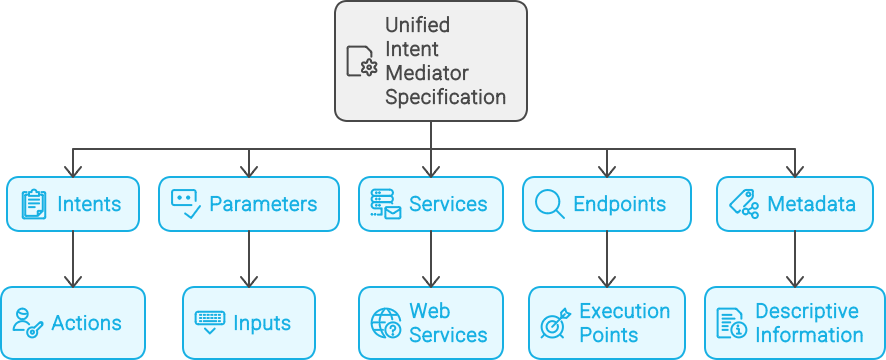
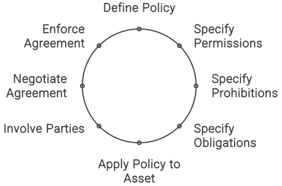
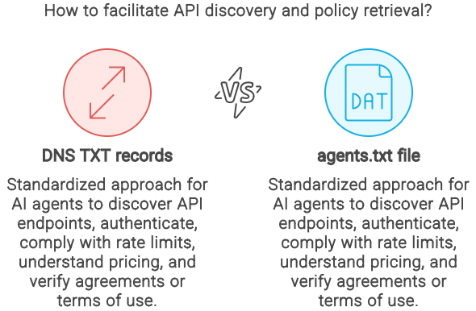
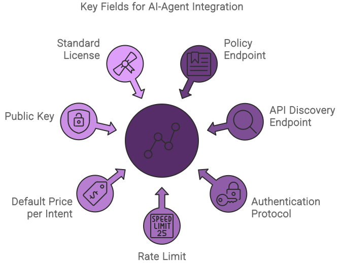
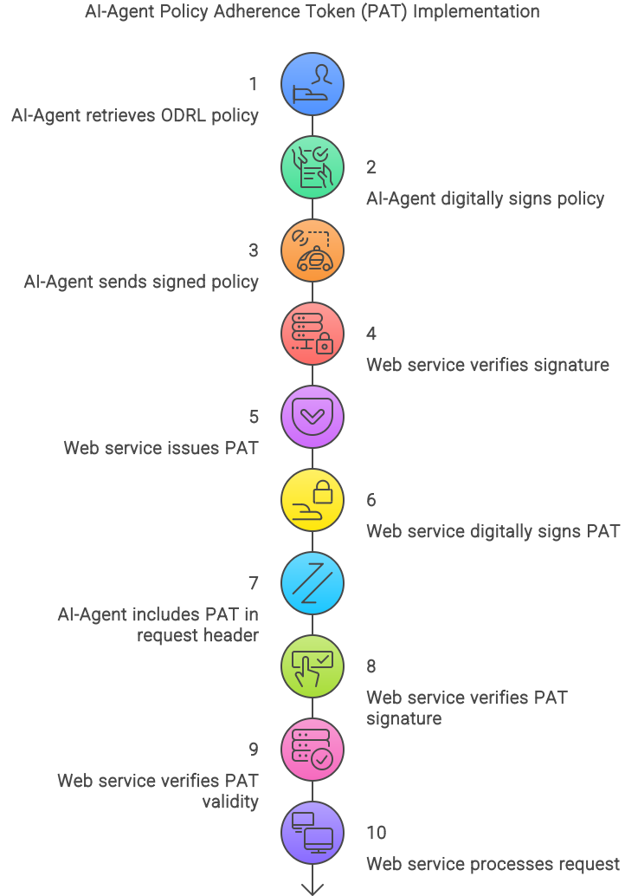
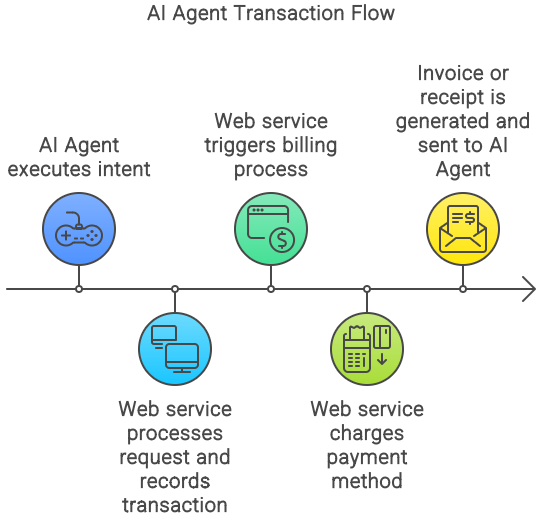
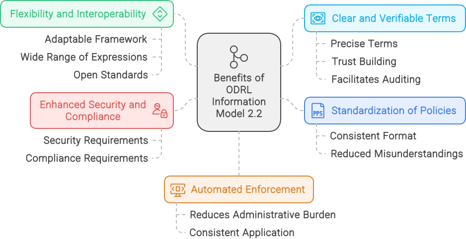
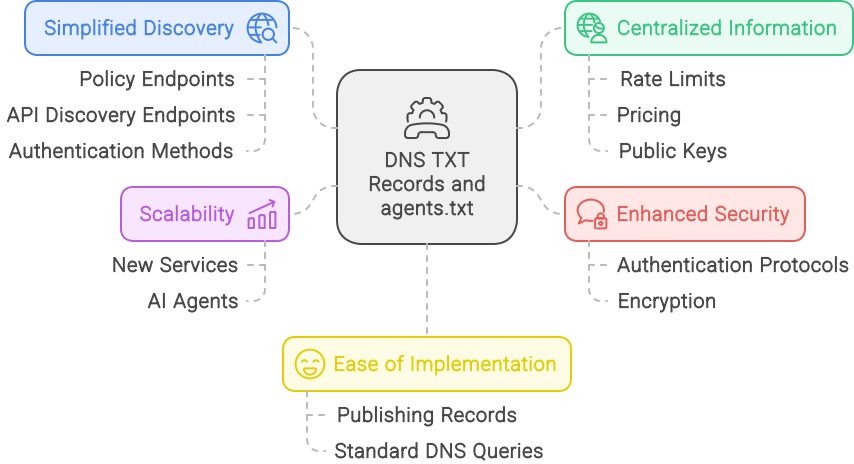

# Unified Intent Mediator API Specification

The Unified Intent Mediator (UIM) specification provides a standardized protocol for seamless and secure interactions between AI agents and web services. By following this specification, developers can create interoperable solutions that enhance functionality, efficiency, and user experience. Through community collaboration and continuous improvement, the UIM aims to become the industry standard for AI-driven web service interactions.



## 1. Core Vocabulary

* **Intent**: An action that can be performed by a web service, including metadata and parameters required for execution.  
* **Parameters**: Inputs required by an intent to perform its action, including name, type, and whether they are required.  
* **Service**: A web service that registers its capabilities (intents) with the UIM.  
* **Endpoint**: The API endpoint where an intent can be executed.  
* **Metadata**: Descriptive information about an intent, including its name, description, and category.

## 2. Service Management Endpoints

### 2.1 Register Service

* **Endpoint**: /api/services  
* **Method**: POST  
* **Description**: Registers a new service along with its intents and actions.  
* **Parameters**:  
  * service_name (string, required): The name of the service.  
  * service_url (string, required): The URL of the service.  
  * description (string, required): A brief description of the service.

**Example Request:**

```json
{
  "service_name": "E-commerce Platform",
  "service_url": "https://api.ecommerce.com",
  "description": "Provides e-commerce functionalities",
}
```

### 2.2 Update Service

* **Endpoint**: /api/services/{service_id}  
* **Method**: PUT  
* **Description**: Updates the details of an existing service.  
* **Parameters**: Same as Register Service.

### 2.3 Delete Service

* **Endpoint**: /api/services/{service_id}  
* **Method**: DELETE  
* **Description**: Deletes a registered service.  
* **Parameters**:  
  * service_id (string)

**Example Request:**

```http
DELETE /api/services/12345
```

### 2.4 Retrieve Service

* **Endpoint**: /api/services/{service_id}  
* **Method**: GET  
* **Description**: Retrieves the details of a registered service.  
* **Parameters**: None

**Example Request:**

```http
GET /api/services/12345
```

**Example Response:**

```json
{
  "service_id": "12345",
  "service_name": "E-commerce Platform",
  "service_url": "https://api.ecommerce.com",
  "description": "Provides e-commerce functionalities",
  "intents": [
    {
      "intent_name": "SearchProducts",
      "description": "Search for products based on given criteria",
      "parameters": [
        {"name": "query", "type": "string", "required": true},
        {"name": "category", "type": "string", "required": false},
        {"name": "price_range", "type": "string", "required": false},
        {"name": "sort_by", "type": "string", "required": false}
      ],
      "endpoint": "https://api.ecommerce.com/products/search"
    }
  ]
}
```

## 3. Intent Management Endpoints

### 3.1 List All Intents for a Service

* **Endpoint**: /api/services/{service_id}/intents  
* **Method**: GET  
* **Description**: Lists all intents for a specific service.  
* **Parameters**: None.

**Example Request:**

```http
GET /api/services/12345/intents
```

**Example Response:**

```json
{
  "intents": [
    {
      "intent_id": "67890",
      "intent_name": "SearchProducts",
      "description": "Search for products based on given criteria",
      "tags": ["shopping", "product search", "retail"],

      "parameters": [
        {"name": "query", "type": "string", "required": true},
        {"name": "category", "type": "string", "required": false},
        {"name": "price_range", "type": "string", "required": false},
        {"name": "sort_by", "type": "string", "required": false}
      ],
      "endpoint": "https://api.ecommerce.com/products/search"
    },
    {
      "intent_uid": "ecommercePlatform:GetProductDetails:v1",
      "intent_name": "GetProductDetails",
      "description": "Fetches detailed information about a specific product using its unique identifier",
      "tags": ["shopping", "product details", "retail"],
      "parameters": [
        {"name": "product_id", "type": "string", "required": true}
      ],
      "endpoint": "https://api.ecommerce.com/products/details"
    }
  ]
}
```

### 3.2 Retrieve Intent Details

* **Endpoint**: /api/intents/{intent_id}  
* **Method**: GET  
* **Description**: Retrieves the details of a specific intent.  
* **Parameters**: None.

**Example Request:**

```http
GET /api/intents/67890
```

**Example Response:**

```json
{
  "intent_id": "67890",
  "service_name": "E-commerce Platform",
  "intent_name": "SearchProducts",
  "description": "Search for products based on given criteria",
  "tags": ["shopping", "product search", "retail"],
  "parameters": [
    {"name": "query", "type": "string", "required": true},
    {"name": "category", "type": "string", "required": false},
    {"name": "price_range", "type": "string", "required": false},
    {"name": "sort_by", "type": "string", "required": false}
  ],
  "endpoint": "https://api.ecommerce.com/products/search"
}
```

### 3.3 Create Intent

* **Endpoint**: /api/services/{service_id}/intents  
* **Method**: POST  
* **Description**: Creates a new intent for a specific service.  
* **Parameters**:  
  * intent_name (string, required): The name of the intent.  
  * description (string, required): A brief description of what the intent does.  
  * parameters (array of objects, required): An array of parameters required by the intent.  
    * Each parameter object includes:  
      * name (string, required): The name of the parameter.  
      * type (string, required): The data type of the parameter (e.g., string, integer).  
      * required (boolean, required): Indicates if the parameter is required.  
  * endpoint (string, required): The endpoint URL for executing the intent.

**Example Request:**

```json
POST /api/services/12345/intents
{
  "intent_name": "GetProductDetails",
  "description": "Fetches detailed information about a specific product using its unique identifier",
  "parameters": [
    {"name": "product_id", "type": "string", "required": true}
  ],
  "endpoint": "https://api.ecommerce.com/products/details"
}
```

### 3.4 Update Intent

* **Endpoint**: /api/intents/{intent_id}  
* **Method**: PUT  
* **Description**: Updates the details of an existing intent.  
* **Parameters**: Same as Create Intent.

**Example Request:**

```json
PUT /api/intents/67890
{
  "intent_name": "SearchProducts",
  "description": "Search for products based on given criteria",
  "parameters": [
    {"name": "query", "type": "string", "required": true},
    {"name": "category", "type": "string", "required": false},
    {"name": "price_range", "type": "string", "required": false},
    {"name": "sort_by", "type": "string", "required": false}
  ],
  "endpoint": "https://api.ecommerce.com/products/search"
}
```

### 3.5 Delete Intent

* **Endpoint**: /api/intents/{intent_id}  
* **Method**: DELETE  
* **Description**: Deletes an existing intent.  
* **Parameters**:  
  * service_id (string)

**Example Request:**

```http
DELETE /api/intents/67890
```

## 4. Discovery and Execution Endpoints

In order to ensure that AI agents can effectively call intents from different service providers, even if the intents are similar, it is important to establish a robust and standardized method for identifying each intent. Here are some best practices for identifying and managing intents across various service providers:

### 4.1 Unique Intent Identifier (UID) Format

#### 4.1.1 Unique Intent Identifier (UID)

Assign a globally unique identifier to each intent. This UID is a combination of a namespace (typically the service provider's domain) and a unique intent name.

**Format**: namespace:intentName  
**Example**: ecommercePlatform:searchProducts

#### 4.1.2 Versioning

Incorporate versioning into the intent identifiers to manage updates and backward compatibility.

**Format**: namespace:intentName:version  
**Example**: ecommercePlatform:searchProducts:v1

#### 4.1.3 Intent Metadata

Provide comprehensive metadata for each intent, including a description, parameters, and usage examples. Metadata should also include the UID and version for easy reference.

**Example**:

```json
{
  "intent_uid": "ecommercePlatform:searchProducts:v1",
  "description": "Search for products based on given criteria",
  "parameters": [
    {"name": "query", "type": "string", "required": true},
    {"name": "category", "type": "string", "required": false},
    {"name": "price_range", "type": "string", "required": false},
    {"name": "sort_by", "type": "string", "required": false}
  ],
  "endpoint": "https://api.ecommerce.com/products/search"
}
```

#### 4.1.4 Namespace Management

Use namespaces to distinguish between different service providers. The namespace is typically the domain or a unique identifier for the service provider.

**Examples**:

```json
ecommercePlatform:searchProducts  
bankingPlatform:transferFunds
```

### 4.2 Search Intents

* **Endpoint**: /api/intents/search  
* **Method**: GET  
* **Description**: Searches for available intents based on given criteria.  
* **Parameters**:  
  * query (string, optional): The natural language query or search term.  
  * service_name (string, optional): The name of a service.  
  * intent_name (string, optional): The name of an intent.  
  * uid (string, optional): The unique identifier of an intent.  
  * namespace (string, optional): The namespace of a service.  
  * description (string, optional): The description of an intent.  
  * tags (string, optional): A comma separated list of tags.

**Example Request:**

```http
GET /api/intents/search?query=product search
```

**Example Response:**

```json
{
  "intents": [
    {
      "service_name": "E-commerce Platform",
      "intent_name": "SearchProducts",
      "intent_uid": "ecommercePlatform:searchProducts:v1"
      "description": "Search for products based on given criteria",
      "parameters": [
        {"name": "query", "type": "string", "required": true},
        {"name": "category", "type": "string", "required": false},
        {"name": "price_range", "type": "string", "required": false},
        {"name": "sort_by", "type": "string", "required": false}
      ],
      "endpoint": "https://api.ecommerce.com/products/search"
    }
  ]
}
```

#### 4.2.1 Discovery and Lookup Endpoints

The discovery mechanisms allow AI agents to search for and retrieve intent details based on the UID, namespace, or other metadata. The discovery process is efficient and supports various search criteria.

**Example**:  
**Search by UID**: /api/intents/search?uid=ecommercePlatform:searchProducts:v1  
**Search by Namespace**: /api/intents/search?namespace=ecommercePlatform  
**Search by Description**: /api/intents/search?description=search products

**Example request:**

```http
GET /api/intents/search?uid=ecommercePlatform:searchProducts:v1
````

**Example Response:**

```json
{
  "intent_uid": "ecommercePlatform:searchProducts:v1",
  "description": "Search for products based on given criteria",
  "tags": ["shopping", "product search", "retail"],
  "service_name": "E-commerce Platform",
  "endpoint": "https://api.ecommerce.com/products/search",
  "parameters": [
    {"name": "query", "type": "string", "required": true},
    {"name": "category", "type": "string", "required": false},
    {"name": "price_range", "type": "string", "required": false},
    {"name": "sort_by", "type": "string", "required": false}
  ]
}
```

### 4.3 Execute Intent

* **Endpoint**: /api/intents/execute  
* **Method**: POST  
* **Description**: Executes a specified intent on a registered service.  
* **Parameters**:  
  * intent_uid (string, required): The identifier for the intent  
  * parameters (object, required): The parameters required to execute the intent.

**Example Request:**

```json
POST /api/intents/execute
{
  "intent_uid": "ecommercePlatform:searchProducts:v1",
  "parameters": {
    "query": "laptops",
    "category": "electronics",
    "price_range": "1000-2000",
    "sort_by": "popularity"
  }
}
```

**Example Response:**

```json
{
  "status": "success",
  "data": [
    {
      "product_id": "123",
      "name": "Gaming Laptop",
      "price": 1500,
      "category": "electronics"
    }
  ]
}
```

## 5. Pagination for List Endpoints

To handle large sets of data efficiently and improve performance, it's essential to implement pagination for list endpoints. Pagination allows clients to request specific subsets of data, making it easier to manage and process responses. Here, we'll define the pagination parameters, explain how they are used, and provide examples.

### 5.1 Pagination Parameters

1. **page**: The page number to retrieve (integer, optional, default: 1).  
2. **page_size**: The number of items to include on each page (integer, optional, default: 10).

### 5.2 HTTP Headers for Pagination

In addition to the pagination parameters, the API will include pagination-related headers in the response to provide clients with information about the total number of items and pages available.

1. **X-Total-Count**: The total number of items available.  
2. **X-Total-Pages**: The total number of pages available.  
3. **X-Current-Page**: The current page number.  
4. **X-Page-Size**: The number of items per page.

### 5.3 Example of Pagination in List Endpoints

Let's illustrate how pagination works with the "List All Intents for a Service" endpoint.

#### 5.3.1 Endpoint: List All Intents for a Service

* **Endpoint**: /api/services/{service_id}/intents  
* **Method**: GET  
* **Description**: Lists all intents for a specific service with pagination support.

**Request Parameters**:

* page (integer, optional): The page number to retrieve (default: 1).  
* page_size (integer, optional): The number of items per page (default: 10).

**Example Request**:

```http
GET /api/services/12345/intents?page=2\&page_size=5
```

**Example Response Headers**:

```http
X-Total-Count: 20 
X-Total-Pages: 4 
X-Current-Page: 2 
X-Page-Size: 5
```

**Example Response Body**:

```json
{
  "intents": [
    {
      "intent_id": "67891",
      "intent_name": "GetProductDetails",
      "description": "Fetches detailed information about a specific product using its unique identifier",
      "tags": ["shopping", "product details", "retail"],
      "parameters": [
        {"name": "product_id", "type": "string", "required": true}
      ],
      "endpoint": "https://api.ecommerce.com/products/details"
    },
    {
      "intent_id": "67892",
      "intent_name": "AddToCart",
      "description": "Adds a specified product to the user's shopping cart",
      "tags": ["shopping", "cart", "retail"],
      "parameters": [
        {"name": "product_id", "type": "string", "required": true},
        {"name": "quantity", "type": "integer", "required": true}
      ],
      "endpoint": "https://api.ecommerce.com/cart/add"
    },
    {
      "intent_id": "67893",
      "intent_name": "Checkout",
      "description": "Processes the checkout for the current shopping cart",
      "tags": ["shopping", "checkout", "retail"],
      "parameters": [
        {"name": "payment_method", "type": "string", "required": true},
        {"name": "shipping_address", "type": "string", "required": true}
      ],
      "endpoint": "https://api.ecommerce.com/cart/checkout"
    },
    {
      "intent_id": "67894",
      "intent_name": "SearchOrders",
      "description": "Searches for orders based on specified criteria",
      "tags": ["orders", "search", "retail"],
      "parameters": [
        {"name": "order_id", "type": "string", "required": false},
        {"name": "date_range", "type": "string", "required": false},
        {"name": "status", "type": "string", "required": false}
      ],
      "endpoint": "https://api.ecommerce.com/orders/search"
    },
    {
      "intent_id": "67895",
      "intent_name": "GetOrderDetails",
      "description": "Fetches detailed information about a specific order",
      "tags": ["orders", "details", "retail"],
      "parameters": [
        {"name": "order_id", "type": "string", "required": true}
      ],
      "endpoint": "https://api.ecommerce.com/orders/details"
    }
  ]
}
```

## 6. Leveraging ODRL and DNS for Efficient AI-Agent Interactions

### 6.1 Overview

The [Open Digital Rights Language (ODRL) Information Model 2.2](https://www.w3.org/TR/odrl-model/) provides a robust framework for defining and managing permissions, prohibitions, and obligations. Integrating ODRL with the UIM protocol allows for a standardized and transparent approach to negotiating and enforcing agreements between AI agents and web services. This integration enhances the security, compliance, and efficiency of interactions. Additionally, leveraging DNS TXT records and an agents.txt file provides a streamlined method for AI agents to discover API endpoints, authenticate, adhere to rate limits, understand pricing, and verify agreements.

### 6.2 Integrating ODRL with UIM {#6.2-integrating-odrl-with-uim}



#### 6.2.1 Key Concepts

* **Policy**: Represents the agreement between AI agents and web services, detailing permissions, prohibitions, and obligations.  
* **Permission**: Specifies allowed actions for AI agents.  
* **Prohibition**: Specifies actions that AI agents are not allowed to perform.  
* **Obligation**: Specifies actions that AI agents must perform under certain conditions.  
* **Asset**: The resource or service the policy applies to.  
* **Party**: The entities involved in the policy (e.g., AI agents and web services).

#### 6.2.2 Example ODRL Policy for UIM

```json
{
  "@context": "http://www.w3.org/ns/odrl.jsonld",
  "uid": "http://example.com/policy/12345",
  "type": "Set",
  "profile": "http://example.com/profile/odrl-uim",
  "permission": [
    {
      "target": "http://example.com/api/intents",
      "action": "execute",
      "constraint": [
        {
          "leftOperand": "http://example.com/vocab/rateLimit",
          "operator": "lte",
          "rightOperand": 1000,
          "unit": "http://example.com/vocab/hour"
        }
      ],
      "duty": [
        {
          "action": "pay",
          "target": "http://example.com/vocab/intentPrice",
          "amount": 0.01,
          "unit": "http://example.com/vocab/USD"
        }
      ]
    }
  ],
  "prohibition": [
    {
      "target": "http://example.com/api/intents",
      "action": "exceedRateLimit"
    }
  ],
  "obligation": [
    {
      "action": "signPayload",
      "assignee": "http://example.com/ai-agent/1",
      "target": "http://example.com/vocab/payload",
      "constraint": [
        {
          "leftOperand": "http://example.com/vocab/publicKey",
          "operator": "use",
          "rightOperand": "MIIBIjANBgkqh..."
        }
      ]
    }
  ],
  "party": [
    {
      "function": "assigner",
      "identifier": "http://example.com/web-service/1"
    },
    {
      "function": "assignee",
      "identifier": "http://example.com/ai-agent/1"
    }
  ],
  "asset": "http://example.com/api/intents"
}
```

#### 6.2.3 Fields and Definitions

* **uid**: Unique identifier for the policy.  
* **type**: Type of policy (Set).  
* **profile**: Profile defining the context of the policy (specific to UIM integration).  
* **permission**: Allowed actions for AI agents, such as executing intents within specified constraints (rate limits, payment).  
* **prohibition**: Actions AI agents are not allowed to perform, such as exceeding rate limits.  
* **obligation**: Actions AI agents must perform, such as signing payloads using the specified public key.  
* **party**: Entities involved in the policy (assigner and assignee).  
* **asset**: The resource or service the policy applies to (intents API).

### 6.3 Using DNS TXT Records and agents.txt

To facilitate the discovery of API endpoints and policies, we propose using DNS TXT records and an agents.txt file (inspired by the robots.txt standard). These methods provide a standardized approach for AI agents to retrieve necessary information for AI agents to discover API endpoints, authenticate, comply with rate limits, understand pricing, and verify agreements or terms of use.



#### 6.3.1 DNS TXT Record Fields

1. **Policy Endpoint**  
   1. **Field Name**: uim-policy-endpoint  
   2. **Description**: URL endpoint where AI agents can retrieve the ODRL policy.  
   3. **Example**: uim-policy-endpoint=[https://example.com/policy/12345](https://example.com/policy/12345)  
2. **API Discovery Endpoint**  
   1. **Field Name**: uim-api-discovery  
   2. **Description**: URL endpoint where AI agents can retrieve the web service intents catalog.  
   3. **Example**: uim-api-discovery=[https://example.com/api/discovery](https://example.com/api/discovery)
3. **Authentication Protocol**  
   1. **Field Name**: uim-auth-protocol  
   2. **Description**: Authentication method required to interact with the web service.  
   3. **Example**: uim-auth-protocol=OAuth2.0  
4. **Rate Limit**  
   1. **Field Name**: uim-rate-limit  
   2. **Description**: Maximum number of requests allowed per time unit.  
   3. **Example**: uim-rate-limit=1000/hour  
5. **Default Price per Intent Executed**  
   1. **Field Name**: uim-intent-price  
   2. **Description**: Cost for executing each intent.  
   3. **Example**: uim-intent-price=0.01 USD  
6. **Web Service’s Public Key**  
   1. **Field Name**: uim-public-key  
   2. **Description**: Public key used for signing and encrypting payloads.  
   3. **Example**: uim-public-key=MIIBIjANBgkqh...  
7. **Standard License**  
   1. **Field Name**: uim-license  
   2. **Description**: License under which the web service operates, inspired by Creative Commons. *NOTE: May be obsolete if a policy endpoint exists and covers the license.*  
   3. **Example**: uim-license=CC-BY-NC-SA-4.0

#### 6.3.2 The agents.txt File Fields

```txt
User-agent: *
UIM-Policy-Endpoint: https://example.com/policy/12345
UIM-API-Discovery: https://example.com/api/discovery
UIM-Auth-Protocol: OAuth2.0
UIM-Rate-Limit: 1000/hour
UIM-Intent-Price: 0.01 USD
UIM-Public-Key: MIIBIjANBgkqh...
UIM-License: CC-BY-NC-SA-4.0
UIM-Contact: admin@example.com
```

## 

### 6.4 Method for AI-Agent Policy Adherence

To streamline the process of AI-Agent policy adherence while maintaining security and flexibility, we can introduce a **Policy Adherence Token (PAT)** system. This system offers a balanced approach to ensuring AI-Agent compliance with web service policies. By encapsulating the agreed policies and permissions in a digitally signed token, it simplifies the verification process while maintaining strong security and flexibility.

#### 6.4.1 Policy Adherence Token (PAT) System

##### 6.4.1.1 Concept

* Web services issue a Policy Adherence Token (PAT) to AI-Agents upon successful agreement to policies.  
* The PAT encapsulates the agreed policies, permissions, and obligations in a digitally signed token.  
* AI-Agents include the PAT in their payloads, simplifying verification and enforcement.



##### **6.4.1.2 Steps to Implement PAT**

1. **Policy Retrieval and Agreement**:  
   1. AI-Agent retrieves the ODRL policy from the specified endpoint.  
   2. AI-Agent digitally signs the policy using its private key and sends it to the web service.  
2. **PAT Issuance**:  
   1. Web service verifies the AI-Agent’s signature and agreement.  
   2. Web service issues a PAT, which includes the agreed policy details, permissions, and a validity period.  
   3. PAT is digitally signed by the web service to ensure integrity and authenticity.  
3. **Using PAT in Requests**:  
   1. AI-Agent includes the PAT in the header of each request.  
   2. Web service verifies the PAT’s signature and validity before processing the request.

##### **6.4.1.3 Example PAT Structure**

```json
{
  "pat": {
    "uid": "pat-12345",
    "issued_to": "ai-agent-1",
    "issued_by": "web-service-1",
    "policy_reference": "http://example.com/policy/12345",
    "permissions": [
      "execute:intent/searchProducts",
      "rate_limit:1000/hour"
    ],
    "obligations": [
      "pay:0.01 USD per intent"
    ],
    "valid_from": "2024-01-01T00:00:00Z",
    "valid_to": "2024-12-31T23:59:59Z"
  },
  "signature": "Base64-encoded-digital-signature"
}
```

##### **6.4.1.4 Example Request with PAT**

```http
POST /api/intents/execute HTTP/1.1
Host: api.ecommerce.com
Authorization: Bearer PAT-12345
Content-Type: application/json
```

##### **6.4.1.5 Verification Process**

1. Web service extracts the PAT from the request header.  
2. Web service verifies the PAT’s signature and validity.  
3. Web service checks if the PAT permissions match the requested action.  
4. If valid, the web service processes the request; otherwise, it rejects it.

#### 6.4.2 Pros and Cons of PAT System

**Pros**:

* Simplifies the verification process with a single token.  
* Reduces the need for frequent policy retrieval and agreement.  
* Maintains strong security with digital signatures.  
* Flexibility in managing permissions and obligations through the PAT.

**Cons**:

* Initial complexity in setting up the PAT issuance and verification process.  
* Requires secure storage and management of PATs.  
* Tokens need to be periodically renewed, adding some operational overhead.

### 6.5 Enhanced PAT System with Billing Information

Incorporating billing information into the PAT during the agreement and issuance phase is a powerful enhancement to the UIM protocol. It simplifies the transaction process, enables automated billing, and ensures that all necessary information is securely handled and readily available when needed. This approach not only improves the efficiency of interactions between AI Agents and web services but also enhances the overall trust and security of the UIM ecosystem. Let’s dive a bit deeper…

#### 6.5.1 Incorporating Billing Information During PAT Issuance

When AI Agents agree to a web service's policy and request a PAT, they can include their billing information as part of the agreement process. This information can be securely transmitted and stored as part of the PAT, ensuring that the web service has all necessary details for billing purposes.

##### 6.5.1.1 Steps to Implement

1. **Policy Retrieval:** The AI Agent retrieves the ODRL policy from the web service.  
2. **Billing Information Submission:** Along with agreeing to the policy, the AI Agent submits billing information (e.g., payment method, billing address, preferred currency).  
3. **PAT Issuance:** The web service issues a PAT that includes the AI Agent's billing information, along with the agreed-upon permissions, rate limits, and obligations.  
4. **Secure Storage:** The billing information is securely stored within the PAT or associated with the PAT in the web service’s system.

##### 6.5.1.2 Example Request

```json
{
  "agent_id": "ai-agent-1",
  "policy_reference": "http://example.com/policy/12345",
  "billing_info": {
    "payment_method": "credit_card",
    "billing_address": "123 AI Street, Tech City",
    "currency": "USD"
  },
  "signature": "Base64-encoded-signature"
}
```

##### 6.5.1.3 Example PAT Structure

```json
{
  "pat": {
    "uid": "pat-12345",
    "issued_to": "ai-agent-1",
    "issued_by": "web-service-1",
    "policy_reference": "http://example.com/policy/12345",
    "permissions": [
      "execute:intent/searchProducts",
      "rate_limit:1000/hour"
    ],
    "obligations": [
      "pay:0.01 USD per intent"
    ],
    "billing_info": {
      "payment_method": "credit_card",
      "billing_address": "123 AI Street, Tech City",
      "currency": "USD"
    },
    "valid_from": "2024-01-01T00:00:00Z",
    "valid_to": "2024-12-31T23:59:59Z"
  },
  "signature": "Base64-encoded-digital-signature"
}
```

#### 6.5.2 Automatic Billing Based on PAT

With billing information included in the PAT, the web service can automatically process payments as intents are executed. The web service’s transaction system can use the billing information to charge the AI Agent for each transaction without additional input.

##### 6.5.2.1 How It Works

* **Transaction Execution:** When the AI Agent executes an intent, the web service processes the request and records the transaction.  
* **Billing Automation:** The web service automatically charges the AI Agent using the payment method specified in the PAT, based on the transaction details (e.g., number of API calls, rate per call).  
* **Invoice Generation:** An invoice or receipt is generated and sent to the AI Agent for record-keeping.



##### 6.5.2.2 Example Transaction Flow

1. **Intent Execution:** AI Agent sends a request to execute an intent.  
2. **Billing Trigger:** The web service processes the request and triggers the billing process using the PAT’s billing information.  
3. **Payment Processing:** The web service charges the AI Agent’s payment method.  
4. **Receipt Issuance:** The web service issues a receipt to the AI Agent.

#### 6.5.3 Security and Privacy Considerations

To ensure the security and privacy of billing information, the following measures should be implemented:

* **Encryption:** All billing information should be encrypted both at rest and in transit to protect against unauthorized access.  
* **Tokenization:** Payment methods (e.g., credit card details) can be tokenized, reducing the risk of exposure.  
* **Access Control:** Only authorized systems and personnel should have access to the billing information, and this access should be logged and monitored.  
* **Compliance:** Ensure compliance with relevant regulations (e.g., GDPR, PCI-DSS) to protect the privacy and security of billing information.

#### 6.5.4 Benefits of Including Billing Information in PATs

1. **Streamlined Process:** By including billing information in the PAT, the transaction process is streamlined, reducing the need for repeated information submission and minimizing friction.  
2. **Automated Billing:** Automating the billing process ensures timely and accurate payments, improving cash flow for web services and reducing administrative overhead for AI Agents.  
3. **Improved User Experience:** AI Agents can execute intents seamlessly without needing to repeatedly provide billing details, leading to a smoother user experience.  
4. **Enhanced Compliance:** Including billing information within the PAT structure ensures that all transactions are compliant with agreed-upon policies and obligations, reducing the risk of disputes.


### 6.6 Benefits of Using ODRL and DNS for Efficient AI-Agent Interactions {#6.6-benefits-of-using-odrl-and-dns-for-efficient-ai-agent-interactions}

By combining the robust policy framework provided by ODRL with the streamlined discovery mechanisms of DNS TXT records and agents.txt files, the UIM protocol offers a powerful solution for managing AI-agent interactions with web services. This approach ensures clear, verifiable, and enforceable policies, enhances security and compliance, simplifies discovery and integration, and supports scalability and ease of implementation.



#### 6.6.1 Benefits of Using the Open Digital Rights Language (ODRL) Information Model 2.2

**1. Standardization of Policies:**  
ODRL provides a standardized way to define permissions, prohibitions, and obligations. This standardization ensures that all policies are expressed in a consistent format, making it easier for AI agents to interpret and comply with them. This uniformity reduces the likelihood of misunderstandings or misconfigurations that could lead to non-compliance.

**2. Flexibility and Interoperability:**  
ODRL’s flexible framework allows it to be adapted to various use cases and requirements. It supports a wide range of policy expressions, from simple permissions to complex conditions and constraints. This flexibility ensures that the UIM protocol can accommodate diverse web services and AI agent interactions. Additionally, ODRL’s adherence to open standards promotes interoperability between different systems and platforms.

**3. Clear and Verifiable Terms:**  
By defining policies in ODRL, web services can provide clear, precise, and verifiable terms of service. This transparency helps build trust between AI agents and web services, as both parties have a clear understanding of their rights and obligations. Verifiable policies also facilitate auditing and compliance checks, ensuring that all interactions adhere to agreed-upon terms.

**4. Enhanced Security and Compliance:**  
ODRL allows the definition of detailed security and compliance requirements, such as rate limits, payment obligations, and data handling practices. By enforcing these requirements programmatically, web services can ensure that AI agents adhere to their policies, reducing the risk of abuse or non-compliance.

**5. Automated Enforcement:**  
ODRL policies can be enforced automatically by the UIM protocol. This automation reduces the administrative burden on web services, as they do not need to manually monitor and enforce compliance. Automated enforcement also ensures that policies are applied consistently and promptly.



#### 6.6.2 Leveraging DNS TXT Records and agents.txt for AI-Agent Interactions

**1. Simplified Discovery:**  
DNS TXT records and the agents.txt file provide a straightforward method for AI agents to discover web service endpoints and retrieve necessary information. By querying these records, AI agents can easily find policy endpoints, API discovery endpoints, and authentication methods. This simplicity streamlines the initial setup process for AI agents.

**2. Centralized Information:**  
Using DNS TXT records and agents.txt, web services can centralize all necessary information for AI agents. This centralized approach ensures that AI agents can quickly access all relevant details, such as rate limits, pricing, and public keys, in one place. Centralized information reduces the need for multiple queries and simplifies the interaction process.

**3. Enhanced Security:**  
DNS TXT records can include information about authentication protocols and public keys, enabling secure communication between AI agents and web services. By providing this information upfront, web services can ensure that AI agents use the correct authentication methods and encrypt sensitive data appropriately.

**4. Scalability:**  
The use of DNS TXT records and agents.txt files scales well with the number of web services and AI agents. As more web services adopt this method, AI agents can easily discover and interact with new services without requiring significant changes to their implementation. This scalability supports the growth of the UIM protocol and the broader ecosystem of AI-agent interactions.

**5. Ease of Implementation:**  
Implementing DNS TXT records and agents.txt files is straightforward and leverages existing internet infrastructure. Web services can easily publish these records, and AI agents can use standard DNS queries to retrieve them. This ease of implementation lowers the barrier to entry for web services and encourages widespread adoption.

## 7. Security and Compliance

### 7.1 Authentication

Use OAuth2.0 for secure API authentication, ensuring that only authorized AI agents can access and execute intents.

### 7.2 Encryption

Ensure all communications are encrypted using HTTPS, protecting data from interception and tampering.

### 7.3 Compliance

Adhere to data protection regulations, such as GDPR, ensuring that all data handling practices are compliant with legal requirements.

## 8. Monitoring and Analytics

### 8.1 Real-time Monitoring

Provide a dashboard for monitoring API usage and performance, offering insights into how the Unified Intent Mediator API is being used.

### 8.2 Logging and Alerts

Implement logging and alerting systems to track unusual activity and ensure quick response to potential issues.

## 9. Scalability

### 9.1 Caching Mechanisms

Implement caching mechanisms to handle frequently accessed data, improving response times and reducing load on servers.

### 9.2 Load Balancing

Use load balancers to distribute traffic efficiently, ensuring that the Unified Intent Mediator API can handle high volumes of requests without performance degradation.

## 10. Error Management Strategy for the UIM Protocol

Error management is crucial for ensuring the robustness and reliability of the UIM protocol. By standardizing error codes, messages, and response handling across different layers, we can make it easier for developers to diagnose issues and build resilient systems. Below is a comprehensive approach to error management, followed by a detailed appendix of standard error codes and their meanings.

### 10.1 Error Management Across Protocol Layers

#### 10.1.1 Layer 1: Client-Side Errors (4xx Codes)

* **Description**: Errors that occur due to issues with the request made by the client (e.g., AI agents).  
* **Typical Issues**:  
  * Invalid input parameters.  
  * Unauthorized access.  
  * Resource not found.  
  * Method not allowed.  
* **Handling Strategy**:  
  * Validate all inputs before processing the request.  
  * Provide clear, actionable error messages to the client.  
  * Ensure that error responses are consistent across all endpoints.

**Example Response:**

```json
 {
   "error": {
     "code": "INVALID_PARAMETER",
     "message": "The parameter 'query' is required.",
     "details": null
   }
 }
```

#### 10.1.2 Layer 2: Server-Side Errors (5xx Codes)

* **Description**: Errors that occur due to issues on the server side, which may be due to system failures, unavailable services, or unhandled exceptions.  
* **Typical Issues**:  
  * Internal server errors.  
  * Service unavailable.  
  * Timeout.  
* **Handling Strategy**:  
  * Implement robust error logging and monitoring on the server side to quickly identify and address issues.  
  * Return meaningful error messages that do not expose internal details but provide enough information for troubleshooting.  
  * Implement retry logic where applicable, especially for temporary issues like timeouts.

**Example Response**:

```json
{
   "error": {
     "code": "INTERNAL_SERVER_ERROR",
     "message": "An unexpected error occurred on the server. Please try again later.",
     "details": null
   }
 }
```

#### 10.1.3 Layer 3: Protocol-Level Errors

* **Description**: Errors related to the operation of the UIM protocol itself, such as issues with intent execution, discovery, or API misuse.  
* **Typical Issues**:  
  * Invalid intent execution.  
  * Conflicts in intent versions.  
  * Unsupported operations.  
* **Handling Strategy**:  
  * Standardize responses for protocol-level errors, ensuring that all services using the UIM protocol handle these errors uniformly.  
  * Provide detailed documentation on these errors, including how to avoid or resolve them.

**Example Response**:

```json
{
   "error": {
     "code": "INTENT_EXECUTION_FAILED",
     "message": "The intent 'GetProductDetails' could not be executed due to missing required parameters.",
     "details": {
       "intent": "GetProductDetails",
       "missing_parameters": ["product_id"]
     }
   }
 }
```

### 10.2 Standard Error Codes and Messages

Below is an appendix dedicated to standard error codes, their meanings, and recommended response structures.

#### 10.2.1 Appendix: Standard Error Codes and Their Meanings

##### 10.2.1.1 Client-Side Errors (4xx)

| Error Code | Message | Description | Example Scenario |
| :---- | :---- | :---- | :---- |
| INVALID_PARAMETER | "The parameter '{param}' is required." | The request is missing a required parameter or contains an invalid parameter. | A required field such as query in a search intent is not provided. |
| UNAUTHORIZED | "Unauthorized access. Authentication is required." | The request is not authenticated or the authentication token is invalid or expired. | The AI agent attempts to access a service without providing a valid OAuth2.0 token. |
| FORBIDDEN | "Access to this resource is forbidden." | The client is authenticated but does not have the necessary permissions to access the resource. | An AI agent tries to execute an intent that it does not have permission to use. |
| NOT_FOUND | "The requested resource '{resource}' was not found." | The specified resource or endpoint could not be found on the server. | The AI agent requests an intent or service that does not exist. |
| METHOD_NOT_ALLOWED | "The HTTP method '{method}' is not allowed for this endpoint." | The client attempted to use an HTTP method that is not supported by the endpoint. | Sending a POST request to an endpoint that only supports GET. |
| CONFLICT | "The request could not be completed due to a conflict." | The request could not be processed because of a conflict in the current state of the resource. | Attempting to register an intent that already exists under a different version. |
| UNSUPPORTED_MEDIA_TYPE | "The media type '{type}' is not supported." | The server does not support the media type of the request payload. | The client sends a request with an unsupported content type, such as text/xml instead of application/json. |

##### 10.2.1.2 Server-Side Errors (5xx)

| Error Code | Message | Description | Example Scenario |
| :---- | :---- | :---- | :---- |
| INTERNAL_SERVER_ERROR | "An unexpected error occurred on the server. Please try again later." | A generic error message when the server encounters an unexpected condition. | The server encounters a null pointer exception or other unhandled error. |
| SERVICE_UNAVAILABLE | "The service is temporarily unavailable. Please try again later." | The server is currently unable to handle the request due to maintenance or overload. | The server is down for maintenance, or a service dependency is unavailable. |
| GATEWAY_TIMEOUT | "The server did not receive a timely response from the upstream server." | The server, while acting as a gateway, did not receive a response from an upstream server in time. | A request to an external API exceeds the timeout limit. |
| NOT_IMPLEMENTED | "The requested functionality is not implemented." | The server does not support the functionality required to fulfill the request. | The AI agent attempts to use an intent that is not yet supported by the service. |

##### 10.2.1.3 Protocol-Level Errors

| Error Code | Message | Description | Example Scenario |
| :---- | :---- | :---- | :---- |
| INTENT_EXECUTION_FAILED | "The intent '{intent}' could not be executed due to {reason}." | The execution of an intent fails due to invalid input, missing parameters, or other issues. | An AI agent tries to execute GetProductDetails but fails because the required product_id is missing. |
| INTENT_NOT_SUPPORTED | "The intent '{intent}' is not supported by this service." | The requested intent is not recognized or supported by the target service. | An AI agent requests an intent that has been deprecated or is not implemented by the service. |
| VERSION_CONFLICT | "The intent version '{version}' is not supported." | There is a conflict between the requested version of the intent and the version supported by the service. | An AI agent attempts to execute version v1 of an intent when only v2 is supported. |
| INTENT_DEPRECATED | "The intent '{intent}' has been deprecated and is no longer supported." | The intent has been deprecated and is no longer available for use. | The AI agent calls a deprecated intent that has been removed in the latest version of the protocol. |

### 10.3 Guidelines for Handling Errors

**Consistent Response Structure**: All error responses should follow a consistent JSON structure to make parsing and error handling easier for AI agents.

```json
{
  "error": {
    "code": "ERROR_CODE",
    "message": "Descriptive error message.",
    "details": {
      "additional": "context-specific information"
    }
  }
}
```

* **Detailed Messages**: Error messages should be descriptive enough to guide developers in resolving the issue, but not so detailed as to expose sensitive information.  
* **Error Logging and Monitoring**: Services implementing the UIM protocol should log all errors with sufficient detail (e.g., timestamps, request details, stack traces for server-side errors) to facilitate troubleshooting.  
* **User-Friendly Messages**: When errors are related to user actions, ensure that messages are clear and actionable, helping users correct their input or understand the issue.  
* **Deprecation Warnings**: When deprecating an intent or feature, provide warnings in the response to guide users towards alternatives before the feature is removed in a future release.
