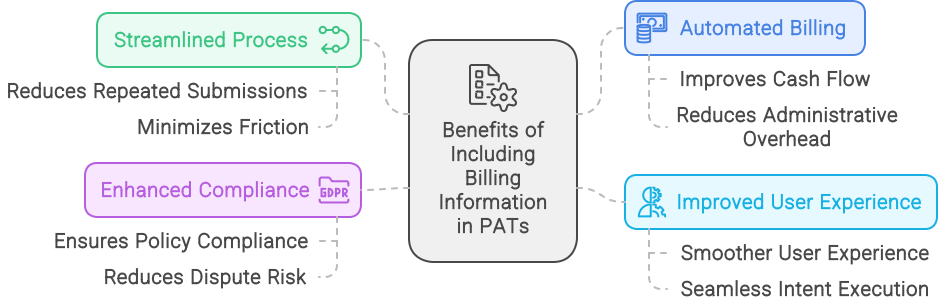

# Unified Intent Mediator API Specification

The Unified Intent Mediator (UIM) specification provides a standardized protocol for seamless and secure interactions between AI agents and web services. By following this specification, developers can create interoperable solutions that enhance functionality, efficiency, and user experience. Through community collaboration and continuous improvement, the UIM aims to become the industry standard for AI-driven web service interactions.


**Core Vocabulary**:

* **Intent**: An action that can be performed by a web service, including metadata and parameters required for execution.  
* **Parameters**: Inputs required by an intent to perform its action, including name, type, and whether they are required.  
* **Service**: A web service that publishes its capabilities (intents) using the UIM protocol.  
* **Endpoint**: The API endpoint where an intent can be executed.  
* **Metadata**: Descriptive information about an intent, including its name, description, and category.
* **Policy Adherence Token (PAT)**: A token issued by a web service to an AI agent, encapsulating permissions, usage limits, and billing agreements.
* **AI Agent**: An application or service that uses intents to interact with web services.
* **Discovery Endpoint**: The API endpoint where AI agents can query for available intents.
* **Execution Endpoint**: The API endpoint where AI agents can execute intents.
* **Policy Endpoint**: The API endpoint where AI agents can request PATs from web services.

In the concept section of the [README](README.md), we dove into the Unified Intent Mediator (UIM) architecture based on these two proposed approaches:

1. **Man-in-the-Middle Approach (Centralized Repository)**
2. **Decentralized Approach (AI Agents Crawling Web Services)**

In this section, we will explore the API endpoints and components that enable these approaches and the underlying data structures that support them.

## 1. Introduction and Overview of Each Approach

### **1.1 Centralized Architecture (Man-in-the-Middle Approach)**

#### **1.1.1 Overview of Centralized Architecture**

The Centralized Architecture, also known as the Man-in-the-Middle Approach, serves as an intermediary system that manages all interactions between AI agents and web services. This model centralizes the registration, discovery, execution, and policy management of intents, offering a streamlined and unified platform that simplifies integrations and ensures consistency across all interactions. By acting as a central hub, this architecture provides a controlled environment where security, compliance, and scalability can be closely managed.

#### **1.1.2 Key Features of Centralized Architecture**

* **Unified Management**: A single repository controls the discovery and execution of intents, providing a consistent interface for AI agents and web services.
* **Streamlined Compliance**: Centralized management of Policy Adherence Tokens (PATs) ensures uniform application of security and billing rules, simplifying compliance for all parties involved.
* **Simplified Integration**: Web services register their intents once with the central system, making them easily discoverable by AI agents without the need for multiple, separate integrations.

#### **1.1.3 Workflow of Centralized Approach**

The centralized approach involves a structured workflow where web services and AI agents interact through a controlled, managed platform. Below is the typical process:

1. **Service Registration**:
   * **Intent Submission**: Web services submit their available intents, including descriptions, parameters, and execution details, to the central repository through the Service Management APIs.
   * **Intent Management**: Web services can update, modify, or remove their intents via the same management APIs, ensuring that the central repository always contains the latest, most accurate information.

2. **Intent Discovery**:
   * **Discovery APIs**: AI agents query the central repository’s Discovery APIs to search for available intents based on their needs. The central system handles all requests and responses, reducing the need for AI agents to interact directly with each individual web service.
   * **Standardized Output**: The discovery results are presented in a standardized format, making it easy for AI agents to understand and act on the available intents.

3. **Policy Adherence and Security**:
   * **Centralized PAT Management**: The central system issues PATs to AI agents after verifying compliance with the service’s policies. These tokens encapsulate permissions, usage limits, and billing agreements, ensuring that only authorized interactions occur.
   * **Unified Compliance Framework**: This centralized PAT management simplifies compliance by applying consistent security protocols across all interactions, reducing the burden on individual web services.

4. **Execution of Intents**:
   * **Execution APIs**: Once an intent is discovered, the AI agent uses the Execution APIs provided by the central repository to perform the desired actions. The central system coordinates the request, forwards it to the appropriate web service, and manages the execution flow.
   * **Monitoring and Logging**: The central system monitors all executed intents, maintaining logs for auditing, performance analysis, and troubleshooting.

5. **Error Handling and Adaptation**:
   * **Centralized Error Management**: The central system provides standardized error codes and recovery protocols, ensuring that AI agents can handle failures consistently and efficiently.
   * **Fallback and Retries**: If an intent fails to execute, the central system can offer alternative intents or suggest retries, enhancing the overall resilience of the interaction.

#### **1.1.4 Integration of Core Components in Centralized Architecture**

1. **Central Repository**:
   * **Purpose**: Acts as the main hub for all intent data, storing information from multiple web services in a single, accessible location. This repository ensures that AI agents have a streamlined path to discovering and executing intents.
   * **Implementation**: Web services register their intents through APIs, which automatically update the central repository. The repository maintains a comprehensive index of all available actions, categorized and searchable for ease of use.

2. **Service Management APIs**:
   * **Purpose**: These APIs facilitate the registration, updating, and removal of intents by web services. They ensure that the central repository always contains current data, providing a reliable resource for AI agents.
   * **Implementation**: Web services interact with these APIs to manage their intents, including setting parameters, defining execution rules, and specifying compliance requirements.

3. **Discovery and Execution APIs**:
   * **Purpose**: These APIs enable AI agents to find available intents and perform actions based on the information in the central repository. They standardize the interaction process, making it easy for AI agents to access a wide range of services through a single interface.
   * **Implementation**: AI agents query the Discovery API to search for intents and use the Execution API to initiate actions. The central system manages these interactions, ensuring they adhere to service-specific rules and security protocols.

4. **Centralized PAT Management**:
   * **Purpose**: The centralized PAT system manages the issuance, validation, and enforcement of Policy Adherence Tokens, ensuring secure and compliant interactions between AI agents and web services.
   * **Implementation**: The central repository generates PATs based on predefined service agreements, automatically enforcing policies during intent execution. This approach simplifies security management and provides a uniform framework for all transactions.

#### **1.1.5 Use Cases, Trade-offs, and Best Practices**

**Use Cases**:

* **Financial Services**: Ideal for industries requiring strict compliance and security, such as banking, where a unified approach simplifies oversight and reduces risks.
* **E-commerce Platforms**: Provides a standardized method for product searches, inventory management, and automated transactions, enhancing the efficiency of AI-driven interactions.
* **Customer Service Automation**: Streamlines the integration of multiple support services, allowing AI agents to access a broad range of helpdesk intents from a single point of contact.

**Trade-offs**:

* **Single Point of Failure**: If the central repository encounters issues, all interactions are affected, posing a risk to system reliability.
* **Scalability Concerns**: As the number of web services and AI agents grows, the central system may struggle to manage high volumes of requests efficiently.
* **Limited Autonomy**: Web services must adhere to the central repository’s rules and policies, limiting their autonomy and control over interactions.
* **Higher Onboarding Complexity for Web Services**: Web services must integrate with the central repository, which may require additional development and maintenance resources.
* **Data Privacy**: Centralized storage of intent data can raise concerns about data ownership, security, and privacy, especially in industries dealing with sensitive information.

**Best Practices**:

* **Implement Redundancy and Load Balancing**: To mitigate the risk of downtime, incorporate failover mechanisms and distribute workloads across multiple nodes.
* **Regular Security Audits**: Conduct periodic security reviews of the PAT management system to ensure that compliance and access controls remain robust.
* **Optimize API Performance**: Continuously monitor and optimize the performance of Discovery and Execution APIs to handle high traffic and ensure smooth interactions.

### **1.2 Decentralized Architecture (Direct Crawling by AI Agents)**

#### **1.2.1 Overview of Decentralized Architecture**

The Decentralized Architecture empowers AI agents to autonomously discover, interact with, and execute actions on web services without relying on a centralized intermediary. Each web service independently manages its own intents, publishing relevant information through DNS TXT records and `agents.json` files. This model allows web services to maintain full control over their data, compliance policies, and access protocols, while AI agents dynamically gather and utilize these intents in real time.

#### **1.2.2 Key Features of Decentralized Architecture**

* **Direct Interaction**: AI agents interact directly with web services, discovering and executing intents without the need for a central repository.
* **Scalability and Resilience**: By distributing the workload across individual web services, the architecture naturally scales to accommodate large numbers of interactions, reducing the risk of a single point of failure.
* **Privacy and Autonomy**: Web services retain control over their data and interaction policies, enhancing privacy and allowing for more customized interactions.
  
#### **1.2.3 Workflow of Decentralized Approach**

The decentralized approach follows a distinct workflow where AI agents independently discover and execute intents. Below is the typical process:

1. **Crawling and Discovery**:
   * **DNS TXT Records and `agents.json`**: Each web service publishes information about its available intents, discovery endpoints, and policy adherence requirements using DNS TXT records and `agents.json` files.
   * **AI Agent Crawling**: AI agents autonomously crawl these records to identify discovery endpoints and other relevant details. This crawling process is ongoing and dynamic, enabling agents to always have up-to-date information about available intents.

2. **Intent Retrieval**:
   * **Querying Discovery APIs**: Once the AI agent has identified a discovery endpoint from the `agents.json` file, it queries the endpoint to retrieve the list of available intents. This query can specify filters or keywords to refine the search based on the user’s needs.
   * **Parameter Collection**: The AI agent collects information about each intent, including required parameters, expected responses, rate limits, and any associated costs.

3. **Policy Adherence and Security**:
   * **Decentralized PAT Management**: Each web service manages its own Policy Adherence Tokens (PATs), which are issued to AI agents based on their compliance with specified policies. This step ensures that only authorized agents can execute intents, maintaining a secure interaction environment.
   * **Token Request**: AI agents must request a PAT from the web service’s policy endpoint, specifying the intents they intend to use and adhering to the service’s access rules.

4. **Execution of Intents**:
   * **Direct Execution**: With the required PAT and intent information, AI agents send execution requests directly to the web service’s endpoint. The requests include all necessary parameters and security tokens.
   * **Response Handling**: The web service processes the request, validates the PAT, and returns the desired results or actions. AI agents then parse and present the results to the end-user.

5. **Error Handling and Adaptation**:
   * **Dynamic Adaptation**: If an intent is unavailable or a service denies a request, AI agents can dynamically adapt by querying other available services or adjusting their parameters. This flexibility enhances the resilience and effectiveness of AI agents operating in decentralized environments.

#### **1.2.4 Integration of Core Components in Decentralized Architecture**

1. **DNS TXT Records and `agents.json` Files**:
   * **Purpose**: These files serve as self-publishing mechanisms for web services to expose information about their intents, discovery endpoints, security protocols, and rate limits.
   * **Implementation**: Web services include specific DNS TXT records that link to the `agents.json` file. This file contains structured details on available intents and the rules for interacting with the service.

2. **Intent Discovery APIs**:
   * **Purpose**: These APIs are hosted by individual web services and provide AI agents with a way to query and retrieve intent data. Each service can customize its discovery API, offering intents tailored to its capabilities and user needs.
   * **Implementation**: AI agents access these APIs by reading URLs specified in the `agents.json` file, allowing them to perform searches for specific intents or actions.

3. **Decentralized PAT Management**:
   * **Purpose**: Decentralized PATs ensure secure, compliant access to web service intents. Each service issues its own tokens based on predefined policies, giving them control over who can execute their intents.
   * **Implementation**: AI agents must request PATs by contacting the policy endpoint outlined in the `agents.json` file, providing details about their intended actions and complying with the service’s specific requirements.

#### **1.2.5 Use Cases, Trade-offs, and Best Practices**

**Use Cases**:

* **Privacy and Security**: Use cases where maintaining control over data and interactions is critical, such as healthcare, finance, and personal assistants.
* **IoT and Smart Environments**: Ideal for managing numerous devices and services in a distributed network where autonomy and direct communication are essential.
* **Decentralized Finance (DeFi)**: Facilitates secure, direct interaction with financial services, maintaining privacy and compliance without relying on centralized intermediaries.

**Trade-offs**:

* **Consistency Challenges**: Each service manages its own rules and data, which can lead to inconsistencies in how intents are defined and executed.
* **Higher Onboarding Complexity for AI Agents**: Requires agents to handle diverse sets of discovery and policy adherence rules, increasing the complexity of initial setup and maintenance.

**Best Practices**:

* **Standardize `agents.json` Formats**: Encouraging uniformity in how web services define their intents and policies can reduce onboarding friction for AI agents.
* **Regular Crawling and Updating**: AI agents should frequently crawl services to maintain up-to-date knowledge of available intents and changes to policies or endpoints.
* **Automated Error Recovery**: Implement robust error-handling mechanisms to allow AI agents to adapt dynamically when encountering unavailable or restricted intents.

### **1.3 Hybrid Approach: Centralized Discovery with Decentralized Execution and PAT Issuance**

This hybrid approach combines centralized discovery with decentralized execution and decentralized Policy Adherence Token (PAT) issuance, drawing parallels with how search engines like Google operate. In this model, the centralized discovery system provides AI agents with a standardized and comprehensive way to discover available intents across multiple web services, similar to how search engines crawl and index web content using `robots.txt`. However, the actual execution of intents is handled directly between the AI agents and web services, maintaining the autonomy and scalability benefits of decentralized interactions.

#### **1.3.1 Concept Overview**

* **Centralized Discovery**: A central system aggregates intent information from multiple web services. Web services publish their intents using `agents.json` files or register through service management endpoints, making these intents discoverable to AI agents through a unified discovery interface.
* **Decentralized Execution**: After discovering intents, AI agents execute actions directly by interacting with the specific web service’s execution endpoints. This decentralized execution maintains the service’s control over how intents are performed, allowing for customized security and performance management.
* **Decentralized PAT Issuance**: Each web service independently manages its own PAT issuance, ensuring that security, compliance, and billing policies are locally enforced. This allows web services to define and enforce their own rules, even as they participate in a broader, centrally-discovered ecosystem.

#### **1.3.2 Similarities to Search Engines (e.g., Google)**

* **Crawling and Indexing**: Similar to how search engines like Google use `robots.txt` to discover and index web content, AI agents rely on `agents.json` files or centralized service management endpoints to find and index available intents. The centralized discovery system acts like Google’s search index, providing a comprehensive and up-to-date view of available actions across multiple services.
  
* **Relevant Responses**: When users perform a search, search engines query their index to provide the most relevant results. In this hybrid approach, AI agents use the centralized discovery to find relevant intents that align with user requests. The centralized system does not execute these intents but instead acts as a guide to direct AI agents toward the appropriate service endpoints.

* **Direct Interaction for Execution**: While search engines direct users to relevant web pages, AI agents in this hybrid model directly interact with the web service’s execution endpoint, bypassing the centralized discovery system. This decentralized execution maintains the autonomy and control of each web service, allowing them to handle execution specifics such as rate limits, data processing, and compliance directly.

#### **1.3.3 Detailed Workflow**

1. **Centralized Discovery**:
   * **Intent Publishing**: Web services publish their available intents via `agents.json` files hosted on their domains or register them through centralized service management APIs. This data is aggregated into a centralized discovery index that AI agents can query.
   * **Crawling and Indexing**: The central discovery system periodically crawls web services, reading `agents.json` files and indexing the intents available. This process is similar to how search engines continually crawl and update their indexes based on new or updated content.
   * **Querying Discovery**: AI agents query the central discovery system to find intents relevant to the user’s request. This interaction is streamlined, with the centralized system providing a consolidated view of available actions.

2. **Decentralized Execution**:
   * **Direct Service Interaction**: Once an AI agent identifies an appropriate intent, it bypasses the central system and sends execution requests directly to the web service’s execution endpoint. This preserves the direct relationship between the AI agent and the service, allowing for real-time interaction and minimizing centralized bottlenecks.
   * **Localized Execution Rules**: Each web service independently manages its execution rules, including parameter validation, rate limits, and error handling. This autonomy allows web services to optimize their operations based on specific needs without needing to conform to a centralized execution standard.

3. **Decentralized PAT Issuance**:
   * **Independent PAT Management**: Web services independently issue and validate PATs, which are required for AI agents to execute intents. The PAT encapsulates permissions, usage constraints, and billing terms tailored to each service’s policies.
   * **Compliance and Security**: The decentralized PAT management system ensures that only authorized AI agents can execute intents. Each web service defines its security standards, ensuring that compliance and data privacy are enforced locally.

#### **1.3.4 Advantages of This Hybrid Approach**

* **Enhanced Discovery with Local Execution Control**: Centralized discovery simplifies the search process for AI agents, making it easier to find relevant intents across multiple services. At the same time, decentralized execution preserves the autonomy of web services, allowing them to manage how their intents are used.
  
* **Scalable and Resilient**: By decoupling discovery from execution, this approach reduces the processing load on the central system and distributes it across web services, enhancing overall scalability and resilience.

* **Flexible Compliance**: Decentralized PAT issuance allows each web service to enforce its own compliance and security protocols, adapting to specific regulatory requirements and minimizing centralized security risks.

* **Reduced Latency**: Direct execution between AI agents and web services minimizes latency compared to a fully centralized execution model, improving response times and user experience.

#### **1.3.5 Disadvantages and Challenges**

* **Coordination Complexity**: Maintaining consistency between the centralized discovery index and the decentralized execution points can be challenging. Frequent updates and synchronization mechanisms are needed to ensure that the discovery system reflects the latest available intents.

* **Diverse Compliance Requirements**: AI agents must navigate varying compliance rules across different services due to decentralized PAT issuance, which can complicate implementation and require sophisticated token management strategies.

* **Potential Data Silos**: Since each service manages its own execution and PAT system, data generated from interactions can become siloed, making it harder to gather comprehensive analytics across the ecosystem.
* **Increased Onboarding Complexity for Web Services**: Web services must manage both centralized discovery and decentralized execution, which can increase the complexity of onboarding and maintenance compared to a fully centralized model.

This hybrid approach leverages the best of both worlds, using centralized discovery to simplify intent identification while maintaining decentralized execution and compliance to empower web services. It mirrors the efficiency of search engine models while providing the flexibility needed for secure and scalable AI-agent interactions.

Based on the previous feedback regarding the structure and logical flow of the document, the **Appendix: Core Component Descriptions** section needs to be reordered to reflect the real-world sequence of how AI agents interact with web services. Here’s the revised approach that aligns with the natural usage flow: starting with discovery and execution, followed by service management, and finally detailing intent management. This reordering provides a clear narrative from the AI agent’s perspective, improving coherence and usability.

## 2. Core Components of the UIM Protocol

This section provides a comprehensive description of the core components of the UIM protocol, explaining their purpose, implementation, variations between approaches, relevant API endpoints, and the underlying data structures that support them. The components are presented in a sequence that mirrors the typical interaction flow of AI agents with web services: discovery and execution, followed by service management, and intent management.

### 2.1 Discovery and Execution Endpoints

#### 2.1.1 Purpose

Discovery and execution endpoints form the first point of interaction for AI agents, enabling them to identify and perform actions (intents) offered by web services. These endpoints streamline the process of discovering what services are available and executing those services in a secure and compliant manner.

#### 2.1.2 Implementation  

* **Centralized Context**: The discovery endpoint is centrally managed, offering a unified interface where AI agents can search for intents across multiple services. Execution is handled by forwarding requests to the appropriate web service.
* **Decentralized Context**: Each web service independently hosts its own discovery and execution endpoints. AI agents query these endpoints directly based on data found in `agents.json` files or DNS TXT records.
* **Hybrid Context**: The discovery endpoint is centrally managed, but execution is handled by AI-agents directly interacting with web services. This approach combines the benefits of both centralized and decentralized contexts.

#### 2.1.3 Unique Intent Identifier (UID) Format

In order to ensure that AI agents can effectively call intents from different service providers, even if the intents are similar, it is important to establish a robust and standardized method for identifying each intent across various service providers. The UIM protocol defines a Unique Intent Format for this purpose. The UID is a string that uniquely identifies an intent, consisting of the following components:

* **namespace**: Use namespaces to distinguish between different service providers. The namespace is typically the domain or a unique identifier for the service provider.
* **intent name**: Use intent names to distinguish between different intents offered by the same service provider. The intent name should be descriptive and unique within the namespace.
* **version number**: To accommodate changes and updates to intents, the UID format includes a version number. The version number is appended to the UID, separated by a colon. This allows for backward compatibility and efficient management of updates.

The UID format is as follows: `namespace:intentName:version`

**Examples**:

* `ecommercePlatform:searchProducts:v1`
* `weather.com:getForecast:v2`

#### 2.1.4 Intent Metadata

Intent metadata provides additional information about the intent, such as its purpose, input parameters and their types, output parameters and their types, and the execution endpoint. This metadata is used by AI agents to understand how to interact with the intent and make informed decisions about its suitability for a given task. The UIM protocol defines a standard format for intent metadata, which is used by both centralized and decentralized discovery endpoints. The metadata is typically provided in JSON format.

The following fields are included in the metadata:

* **intent_uid**: The unique identifier for the intent, following the UID format.
* **description**: A brief description of the intent's purpose and functionality.
* **input_parameters**: A list of input parameters required by the intent, including their names, types, and descriptions. These parameters are used by AI agents to construct the execution request.
* **output_parameters**: A list of output parameters returned by the intent, including their names, types, and descriptions. These parameters are used by AI agents to interpret the execution response.
* **endpoint**: The URL of the execution endpoint for the intent. This endpoint is used by AI agents to send execution requests.
* **tags**: A list of tags that describe the intent, making it easier to search and categorize. These tags are used by AI agents to filter and identify relevant intents.
* **service_name**: The name of the service that provides the intent.
* **service_description**: A brief description of the service that provides the intent. This field is optional.
* **service_url**: The URL of the service that provides the intent. This field is optional.
* **service_logo_url**: The URL of the service's logo. This field is optional.
* **service_terms_of_service_url**: The URL of the service's terms of service. This field is optional.
* **service_privacy_policy_url**: The URL of the service's privacy policy. This field is optional.

#### 2.1.5 Intent Discovery

* **Endpoint**: /api/intents/search  
* **Method**: GET  
* **Description**: Searches for available intents based on given criteria.  
* **Parameters**:  
  * query (string, optional): The natural language query or search term.  
  * service_name (string, optional): The name of a service.  
  * intent_name (string, optional): The name of an intent.  
  * uid (string, optional): The unique identifier of an intent.  
  * namespace (string, optional): The namespace of a service.  
  * description (string, optional): The description of an intent.  
  * tags (string, optional): A comma separated list of tags.

**Example Request:**

```http
GET /api/intents/search?intent_name=SearchProducts
```

**Example Response:**

```json
{
  "intents": [
    {
      "service_name": "E-commerce Platform",
      "intent_name": "SearchProducts",
      "intent_uid": "ecommerce.com:searchProducts:v1",
      "description": "Search for products based on given criteria",
      "input_parameters": [
        {"name": "query", "type": "string", "required": true},
        {"name": "category", "type": "string", "required": false},
        {"name": "price_range", "type": "string", "required": false},
        {"name": "sort_by", "type": "string", "required": false}
      ],
      "output_parameters": [
        {"name": "products", "type": "array", "required": true},
        {"name": "total_results", "type": "integer", "required": true}
      ],
      "endpoint": "https://api.ecommerce.com/products/search",
      "tags": ["e-commerce", "search", "products"]
    }
  ]
}
```

The discovery mechanisms allow AI agents to search for and retrieve intent details based on the UID, namespace, or other metadata.

**Examples**:  
**Search by UID**: /api/intents/search?uid=ecommercePlatform:searchProducts:v1  
**Search by Namespace**: /api/intents/search?namespace=ecommercePlatform  
**Search by Description**: /api/intents/search?description=search products

#### 2.1.6 Execute Intent

* **Endpoint**: /api/intents/execute  
* **Method**: POST  
* **Description**: Executes an intent based on the provided input parameters.
* **Parameters**:  
  * intent_uid (string, required): The identifier for the intent  
  * parameters (object, required): The parameters required to execute the intent.

**Example Request:**

```json
POST /api/intents/execute
{
  "intent_uid": "ecommercePlatform:searchProducts:v1",
  "parameters": {
    "query": "laptops",
    "category": "electronics",
    "price_range": "1000-2000",
    "sort_by": "popularity"
  }
}
```

**Example Response:**

```json
{
  "total_results": 1,
  "products": [
    {
      "product_id": "123",
      "name": "Gaming Laptop",
      "price": 1500,
      "category": "electronics"
    }
  ]
}
```

### 2.3 Discovery Through DNS TXT Records and agents.json Files

1. **DNS TXT Records**:
   * **Purpose**: DNS TXT records act as a preliminary layer of discovery, allowing AI agents to quickly identify which services are available and where to find detailed service descriptions or discovery endpoints.
   * **Functionality**: These records provide a lightweight mechanism to point AI agents to `agents.json` files or directly to discovery APIs. They integrate seamlessly with existing DNS infrastructure, making them an efficient and scalable way to manage high-level discovery information.
   * **Benefits**:
     * **Quick Service Identification**: Enables fast, infrastructure-level recognition of available services without requiring direct crawling of each domain.
     * **Scalability**: Scales well across large numbers of services, leveraging the robust DNS architecture already in place.

2. **`agents.json` Files**:
   * **Purpose**: These files provide a structured and detailed format for web services to publish their capabilities, discovery endpoints, compliance requirements, and execution rules.
   * **Functionality**: `agents.json` files are directly accessible by AI agents and contain comprehensive service information, such as available intents, rate limits, and specific API details.
   * **Benefits**:
     * **Rich Data Presentation**: Offers detailed descriptions of intents and operational rules that go beyond the capabilities of DNS TXT records.
     * **Flexibility and Control**: Allows services to independently update their discovery information without altering DNS configurations.

#### 2.3.1 Using Both Methods for Comprehensive Discovery

By combining both DNS TXT records and `agents.json` files, the UIM protocol can provide a comprehensive and efficient discovery process:

* **Efficient Layered Discovery**: DNS TXT records provide the initial point of contact, guiding AI agents to the right services without heavy overhead. Once identified, agents can then retrieve detailed service information from `agents.json` files.
* **Enhanced Redundancy and Flexibility**: This dual approach ensures that even if one layer is temporarily inaccessible (e.g., due to DNS issues), the other can still facilitate discovery.

#### 2.3.2 Implications of Omitting DNS TXT Records

**1. Simplification of Implementation**:  
Omitting DNS TXT records can simplify implementation, especially for smaller services or those that prefer to avoid the complexities of DNS management. By relying solely on `agents.json` files, services can directly control their discovery process without needing to configure or maintain DNS records.

**2. Potential Losses**:

* **Slower Discovery Process**: Without DNS TXT records, AI agents must directly crawl domains to locate `agents.json` files, which can be slower and less efficient, especially if services are not consistently structured or if file locations are non-standard.
* **Scalability Limitations**: DNS TXT records allow for a scalable, distributed approach to service discovery. Without them, the protocol relies entirely on HTTP crawling, which may not scale as efficiently for large ecosystems.
* **Increased Crawl Load**: Directly accessing `agents.json` files without the initial filtering step provided by DNS TXT records can increase the number of requests made by AI agents, potentially leading to higher server loads and slower performance.

**3. Impact on Reliability and Fault Tolerance**:

* **Reduced Fault Tolerance**: DNS TXT records provide an additional layer of fault tolerance by decentralizing the initial discovery step. If this layer is removed, the protocol’s reliance on web server availability increases, potentially reducing overall reliability during network or service disruptions.

**4. Compromised Usability for AI Agents**:

* **Higher Latency**: Direct crawling may lead to increased latency as agents must independently discover `agents.json` files without the initial guidance that DNS provides. This can slow down the overall process of intent discovery and execution.

For a comprehensive and efficient discovery process, using both DNS TXT records and `agents.json` files is recommended. This layered approach optimizes initial service identification and provides rich, detailed service descriptions in `agents.json` files. Omitting DNS TXT records can simplify implementations but at the cost of slower, less scalable discovery with increased load on service endpoints and reduced fault tolerance.

#### 2.3.3 Purpose

DNS TXT records provide fast, infrastructure-level discovery, guiding AI agents to the key URLs they need to begin more detailed exploration, while `agents.json` files provide a standardized, human-readable format for web services to publish intent information, discovery endpoints, execution rules, and compliance protocols. These mechanisms are critical components in the decentralized architecture, offering a flexible and scalable way for services to expose their capabilities.

#### 2.3.4 Implementation

* **Decentralized Context**: Web services create and maintain DNS TXT records that specify the location of their `agents.json` files. This enables AI agents to discover the service’s available intents dynamically, without a central intermediary. Each web service hosts an `agents.json` file at a known location (typically the root of their domain), detailing all available intents and necessary compliance information. AI agents crawl these files to gather relevant data about how to interact with the service.
* **Centralized Context**: Typically not used in a centralized setup, as the discovery is managed by the central repository directly.
* **Hybrid Context**: While discovery is centralized, DNS TXT records and `agents.json` files still play a role in helping AI agents quickly identify services that publish their intents, which is then crawled and indexed by a centralized discovery system. This approach maintains the dynamic nature of decentralized discovery while integrating the streamlined search capabilities of centralized models.

#### 2.3.5 DNS TXT Record Fields

1. **Location of `agents.json` File**
   * **Field Name**: `uim-agents-file`
   * **Description**: Specifies the URL of the `agents.json` file, which contains detailed information about the web service’s capabilities, compliance requirements, and endpoints.
   * **Rationale**: Directs AI agents to the `agents.json` file, which holds the structured and detailed data needed for in-depth interaction with the service.
   * **Example**:  
     `uim-agents-file=https://example.com/agents.json`

2. **API Discovery Endpoint**
   * **Field Name**: `uim-api-discovery`
   * **Description**: Provides a direct URL to the API discovery endpoint, where AI agents can access the web service’s intents catalog.
   * **Rationale**: Essential for immediate discovery of service intents and their associated details, this endpoint serves as the gateway for interaction initiation.
   * **Example**:  
     `uim-api-discovery=https://api.example.com/intents/search`

3. **ODRL Policy File**
   * **Field Name**: `uim-policy-file`
   * **Description**: URL pointing to the service’s policy or compliance endpoint where ODRL policies or other compliance information can be accessed.
   * **Rationale**: Helps AI agents quickly locate compliance requirements, enabling early validation of operational rules.
   * **Example**:  
     `uim-policy-file=https://example.com/uim-policy.json`

#### 2.3.6 `agents.json` File Specification

Here's a detailed description and documentation of each field in the `agents.json` JSON structure, outlining the purpose and intended use within the UIM protocol.

**`service-info`**:
This section provides basic metadata about the service, including its name, status, and links to relevant resources.

* **`name`**:
  * **Description**: The name of the service providing the intents.
  * **Example**: `"fakerealestate.com"`
  
* **`description`**:
  * **Description**: A brief description of the service and what it offers.
  * **Example**: `"A fictional service providing property listings and real estate data."`

* **`service_url`**:
  * **Description**: The main URL of the service, providing a direct link to the homepage or central access point.
  * **Example**: `"https://fakerealestate.com"`

* **`service_logo_url`**:
  * **Description**: URL of the service's logo, which can be used for display purposes by AI agents or third-party applications.
  * **Example**: `"https://fakerealestate.com/logo.png"`

* **`service_terms_of_service_url`**:
  * **Description**: Link to the terms of service page, outlining the legal use and conditions of the service.
  * **Example**: `"https://fakerealestate.com/terms"`

* **`service_privacy_policy_url`**:
  * **Description**: URL of the service’s privacy policy, detailing how user data is collected, used, and protected.
  * **Example**: `"https://fakerealestate.com/privacy"`

**`intents`**:
This array contains detailed descriptions of each intent provided by the service, including execution parameters and endpoint information.

* **`intent_uid`**:
  * **Description**: A unique identifier for the intent, formatted as `service:intent_name:version`, ensuring each intent can be uniquely referenced.
  * **Example**: `"fakerealestate.com:searchProperty:v1"`

* **`intent_name`**:
  * **Description**: The name of the intent, representing its core function.
  * **Example**: `"SearchProperty"`

* **`description`**:
  * **Description**: A brief explanation of what the intent does and its purpose.
  * **Example**: `"Searches properties based on location, price range, and property type."`

* **`input_parameters`**:
  * **Description**: A list of parameters required for the intent to execute, detailing each parameter's name, type, whether it is required, and a description.
  * **Example**:

    ```json
    [
      {"name": "location", "type": "string", "required": true, "description": "Location to search properties in."}
    ]
    ```

* **`output_parameters`**:
  * **Description**: A list of output parameters returned by the intent, including their names, types, and descriptions to help AI agents interpret the response.
  * **Example**:

    ```json
    [
      {"name": "properties", "type": "array", "description": "List of properties matching the search criteria."}
    ]
    ```

* **`endpoint`**:
  * **Description**: The URL of the execution endpoint for the intent, where AI agents send requests to execute the intent.
  * **Example**: `"https://fakerealestate.com/api/execute/SearchProperty"`

* **`tags`**:
  * **Description**: A list of tags that describe the intent, aiding in search and categorization.
  * **Example**: `["real estate", "search", "property"]`

* **`rate_limit`**:
  * **Description**: The maximum number of requests allowed per time unit, which helps AI agents manage their interactions with the service.
  * **Example**: `"1000/hour"`

* **`price`**:
  * **Description**: The cost associated with executing the intent, providing transparency on usage fees.
  * **Example**: `"0.01 USD"`

**`uim-public-key`**:

* **Description**: The public key used by the service for signing and verifying payloads, ensuring secure interactions.
* **Example**: `"MIIBIjANBgkqhkiG9w0BAQEFAAOCAQ8AMIIBCgKCAQEA..."`

**`uim-policy-file`**:

* **Description**: URL to a file containing the service's policy rules or ODRL-compliant policies, providing detailed compliance information.
* **Example**: `"https://fakerealestate.com/uim-policy.json"`

**`uim-api-discovery`**:

* **Description**: The URL for the discovery API, allowing AI agents to query and retrieve available intents.
* **Example**: `"https://fakerealestate.com/uim/intents/search"`

**`uim-compliance`**:
This section outlines the compliance standards and regional regulations the service adheres to.

* **`standards`**:
  * **Description**: A list of recognized standards the service complies with, such as data security or privacy standards.
  * **Example**: `["ISO27001", "GDPR"]`

* **`regional-compliance`**:
  * **Description**: Specific compliance standards applicable to certain regions, allowing AI agents to assess regional regulatory requirements.
  * **Example**:

    ```json
    {
      "EU": "GDPR",
      "US-CA": "CCPA"
    }
    ```

* **`notes`**:
  * **Description**: Additional notes on compliance practices, such as data encryption methods or security protocols.
  * **Example**: `"Data is encrypted in transit and at rest."`

**`uim-license`**

* **Description**: The license under which the service operates, providing information on the terms of use and permissions. Inspired by Creative Commons. *NOTE: May be obsolete if a policy endpoint exists and covers the license.*
* **Example**: `"CC-BY-NC-SA-4.0"`

#### 2.3.7 Example `agents.json` File

```json
{
  "service-info": {
    "name": "fakerealestate.com",
    "description": "A fictional service providing property listings and real estate data.",
    "service_url": "https://fakerealestate.com",
    "service_logo_url": "https://fakerealestate.com/logo.png",
    "service_terms_of_service_url": "https://fakerealestate.com/terms",
    "service_privacy_policy_url": "https://fakerealestate.com/privacy"
  },
  "intents": [
    {
      "intent_uid": "fakerealestate.com:searchProperty:v1",
      "intent_name": "SearchProperty",
      "description": "Searches properties based on location, price range, and property type.",
      "input_parameters": [
        {"name": "location", "type": "string", "required": true, "description": "Location to search properties in."},
        {"name": "min_price", "type": "integer", "required": false, "description": "Minimum price range."},
        {"name": "max_price", "type": "integer", "required": false, "description": "Maximum price range."},
        {"name": "property_type", "type": "string", "required": false, "description": "Type of property (e.g., apartment, house)."}
      ],
      "output_parameters": [
        {"name": "properties", "type": "array", "description": "List of properties matching the search criteria."},
        {"name": "total_results", "type": "integer", "description": "Total number of results found."}
      ],
      "endpoint": "https://fakerealestate.com/api/execute/SearchProperty",
      "tags": ["real estate", "search", "property"],
      "rate_limit": "1000/hour",
      "price": "0.01 USD"
    },
    {
      "intent_uid": "fakerealestate.com:getPropertyDetails:v1",
      "intent_name": "GetPropertyDetails",
      "description": "Fetches detailed information for a specific property based on property ID.",
      "input_parameters": [
        {"name": "property_id", "type": "string", "required": true, "description": "Unique identifier of the property."}
      ],
      "output_parameters": [
        {"name": "property_details", "type": "object", "description": "Detailed information about the property."}
      ],
      "endpoint": "https://fakerealestate.com/api/execute/GetPropertyDetails",
      "tags": ["real estate", "details", "property"],
      "rate_limit": "1000/hour",
      "price": "0.01 USD"
    }
  ],
  "uim-public-key": "MIIBIjANBgkqhkiG9w0BAQEFAAOCAQ8AMIIBCgKCAQEA...",
  "uim-policy-file": "https://fakerealestate.com/uim-policy.json",
  "uim-api-discovery": "https://fakerealestate.com/uim/intents/search",
  "uim-compliance": {
    "standards": ["ISO27001", "GDPR"],
    "regional-compliance": {
      "EU": "GDPR",
      "US-CA": "CCPA"
    },
    "notes": "Data is encrypted in transit and at rest."
  },
  "uim-license": "CC-BY-NC-SA-4.0"
}
```

### 2.4 Benefits of Using ODRL and DNS for Efficient AI-Agent Interactions

By combining the robust policy framework provided by ODRL with the streamlined discovery mechanisms of DNS TXT records and agents.json files, the UIM protocol offers a powerful solution for managing AI-agent interactions with web services. This approach ensures clear, verifiable, and enforceable policies, enhances security and compliance, simplifies discovery and integration, and supports scalability and ease of implementation.


#### 2.4.1 Benefits of Using the Open Digital Rights Language (ODRL) Information Model 2.2

**1. Standardization of Policies:**  
ODRL provides a standardized way to define permissions, prohibitions, and obligations. This standardization ensures that all policies are expressed in a consistent format, making it easier for AI agents to interpret and comply with them. This uniformity reduces the likelihood of misunderstandings or misconfigurations that could lead to non-compliance.

**2. Flexibility and Interoperability:**  
ODRL’s flexible framework allows it to be adapted to various use cases and requirements. It supports a wide range of policy expressions, from simple permissions to complex conditions and constraints. This flexibility ensures that the UIM protocol can accommodate diverse web services and AI agent interactions. Additionally, ODRL’s adherence to open standards promotes interoperability between different systems and platforms.

**3. Clear and Verifiable Terms:**  
By defining policies in ODRL, web services can provide clear, precise, and verifiable terms of service. This transparency helps build trust between AI agents and web services, as both parties have a clear understanding of their rights and obligations. Verifiable policies also facilitate auditing and compliance checks, ensuring that all interactions adhere to agreed-upon terms.

**4. Enhanced Security and Compliance:**  
ODRL allows the definition of detailed security and compliance requirements, such as rate limits, payment obligations, and data handling practices. By enforcing these requirements programmatically, web services can ensure that AI agents adhere to their policies, reducing the risk of abuse or non-compliance.

**5. Automated Enforcement:**  
ODRL policies can be enforced automatically by the UIM protocol. This automation reduces the administrative burden on web services, as they do not need to manually monitor and enforce compliance. Automated enforcement also ensures that policies are applied consistently and promptly.


#### 2.4.2 Leveraging DNS TXT Records and agents.json for AI-Agent Interactions

**1. Simplified Discovery:**  
DNS TXT records and the agents.json file provide a straightforward method for AI agents to discover web service endpoints and retrieve necessary information. By querying these records, AI agents can easily find policy endpoints, API discovery endpoints, and authentication methods. This simplicity streamlines the initial setup process for AI agents.

**2. Centralized Information:**  
Using DNS TXT records and agents.json, web services can centralize all necessary information for AI agents. This centralized approach ensures that AI agents can quickly access all relevant details, such as rate limits, pricing, and public keys, in one place. Centralized information reduces the need for multiple queries and simplifies the interaction process.

**3. Enhanced Security:**  
DNS TXT records can include information about authentication protocols and public keys, enabling secure communication between AI agents and web services. By providing this information upfront, web services can ensure that AI agents use the correct authentication methods and encrypt sensitive data appropriately.

**4. Scalability:**  
The use of DNS TXT records and agents.json files scales well with the number of web services and AI agents. As more web services adopt this method, AI agents can easily discover and interact with new services without requiring significant changes to their implementation. This scalability supports the growth of the UIM protocol and the broader ecosystem of AI-agent interactions.

**5. Ease of Implementation:**  
Implementing DNS TXT records and agents.json files is straightforward and leverages existing internet infrastructure. Web services can easily publish these records, and AI agents can use standard DNS queries to retrieve them. This ease of implementation lowers the barrier to entry for web services and encourages widespread adoption.

### 2.5 Policy Adherence Token (PAT) Management

#### 2.5.1 Purpose

PATs are crucial for maintaining secure, compliant, and regulated interactions between AI agents and web services. They encapsulate permissions, usage constraints, compliance terms, and billing agreements, ensuring that every execution of an intent adheres to the service’s policies.


#### 2.5.2 Implementation

* **Centralized Context**: PAT issuance, validation, and management are centrally controlled by the repository. This centralized system verifies agent compliance before issuing tokens, streamlining policy enforcement across multiple services.
* **Decentralized Context**: Each web service independently handles its own PAT issuance and validation processes, allowing for tailored compliance and security measures specific to the service’s operational needs.
* **Hybrid Context**: PAT issuance is decentralized, with each service handling its own security and compliance checks. This approach ensures that each interaction adheres to service-specific rules, even though discovery remains centralized, offering both control and efficiency.

#### 2.5.3 Leveraging ODRL for Managing Policies

The [Open Digital Rights Language (ODRL) Information Model 2.2](https://www.w3.org/TR/odrl-model/) provides a robust framework for defining and managing permissions, prohibitions, and obligations. Integrating ODRL with the UIM protocol allows for a standardized and transparent approach to negotiating and enforcing agreements between AI agents and web services. This integration enhances the security, compliance, and efficiency of interactions. Additionally, leveraging DNS TXT records and an agents.json file provides a streamlined method for AI agents to discover API endpoints, authenticate, adhere to rate limits, understand pricing, and verify agreements.


##### 2.5.3.1 Key Concepts

* **Policy**: Represents the agreement between AI agents and web services, detailing permissions, prohibitions, and obligations.  
* **Permission**: Specifies allowed actions for AI agents.  
* **Prohibition**: Specifies actions that AI agents are not allowed to perform.  
* **Obligation**: Specifies actions that AI agents must perform under certain conditions.  
* **Asset**: The resource or service the policy applies to.  
* **Party**: The entities involved in the policy (e.g., AI agents and web services).

##### 2.5.3.2 Example ODRL Policy for UIM Integration

```json
{
  "@context": "http://www.w3.org/ns/odrl.jsonld",
  "uid": "http://example.com/policy/12345",
  "type": "Set",
  "profile": "http://example.com/profile/odrl-uim",
  "permission": [
    {
      "target": "http://example.com/api/intents",
      "action": "execute",
      "constraint": [
        {
          "leftOperand": "http://example.com/vocab/rateLimit",
          "operator": "lte",
          "rightOperand": 1000,
          "unit": "http://example.com/vocab/hour"
        }
      ],
      "duty": [
        {
          "action": "pay",
          "target": "http://example.com/vocab/intentPrice",
          "amount": 0.01,
          "unit": "http://example.com/vocab/USD"
        }
      ]
    }
  ],
  "prohibition": [
    {
      "target": "http://example.com/api/intents",
      "action": "exceedRateLimit"
    }
  ],
  "obligation": [
    {
      "action": "signPayload",
      "assignee": "http://example.com/ai-agent/1",
      "target": "http://example.com/vocab/payload",
      "constraint": [
        {
          "leftOperand": "http://example.com/vocab/publicKey",
          "operator": "use",
          "rightOperand": "MIIBIjANBgkqh..."
        }
      ]
    }
  ],
  "party": [
    {
      "function": "assigner",
      "identifier": "http://example.com/web-service/1"
    },
    {
      "function": "assignee",
      "identifier": "http://example.com/ai-agent/1"
    }
  ],
  "asset": "http://example.com/api/intents"
}
```

##### 2.5.3.3 Policy Fields and Definitions

* **uid**: Unique identifier for the policy.  
* **type**: Type of policy (Set).  
* **profile**: Profile defining the context of the policy (specific to UIM integration).  
* **permission**: Allowed actions for AI agents, such as executing intents within specified constraints (rate limits, payment).  
* **prohibition**: Actions AI agents are not allowed to perform, such as exceeding rate limits.  
* **obligation**: Actions AI agents must perform, such as signing payloads using the specified public key.  
* **party**: Entities involved in the policy (assigner and assignee).  
* **asset**: The resource or service the policy applies to (intents API).

##### 2.5.4 Policy Adherence Token (PAT) System

To streamline the process of AI-Agent policy adherence while maintaining security and flexibility, we introduce a **Policy Adherence Token (PAT)** system. This system offers a balanced approach to ensuring AI-Agent compliance with web service policies. By encapsulating the agreed policies and permissions in a digitally signed token, it simplifies the verification process while maintaining strong security and flexibility.

##### 2.5.4.1 Steps to Implement PAT

* Web services issue a Policy Adherence Token (PAT) to AI-Agents upon successful agreement to policies.  
* The PAT encapsulates the agreed policies, permissions, and obligations in a digitally signed token.  
* AI-Agents include the PAT in their payloads, simplifying verification and enforcement.


1. **Policy Retrieval and Agreement**:  
   1. AI-Agent retrieves the ODRL policy from the specified endpoint.  
   2. AI-Agent digitally signs the policy using its private key and sends it to the web service.  
2. **PAT Issuance**:  
   1. Web service verifies the AI-Agent’s signature and agreement.  
   2. Web service issues a PAT, which includes the agreed policy details, permissions, and a validity period.  
   3. PAT is digitally signed by the web service to ensure integrity and authenticity.  
3. **Using PAT in Requests**:  
   1. AI-Agent includes the PAT in the header of each request.  
   2. Web service verifies the PAT’s signature and validity before processing the request.

##### 2.5.4.2 Example PAT Structure

```json
{
  "pat": {
    "uid": "pat-12345",
    "issued_to": "ai-agent-1",
    "issued_by": "web-service-1",
    "policy_reference": "http://example.com/policy/12345",
    "permissions": [
      "execute:intent/searchProducts",
      "rate_limit:1000/hour"
    ],
    "obligations": [
      "pay:0.01 USD per intent"
    ],
    "valid_from": "2024-01-01T00:00:00Z",
    "valid_to": "2024-12-31T23:59:59Z"
  },
  "signature": "Base64-encoded-digital-signature"
}
```

##### 2.5.4.3 Example Request with PAT

```http
POST /api/intents/execute HTTP/1.1
Host: api.ecommerce.com
Authorization: Bearer PAT-12345
Content-Type: application/json
```

##### 2.5.4.4 Verification Process

1. Web service extracts the PAT from the request header.  
2. Web service verifies the PAT’s signature and validity.  
3. Web service checks if the PAT permissions match the requested action.  
4. If valid, the web service processes the request; otherwise, it rejects it.

#### 2.5.5 Pros and Cons of PAT System

**Pros**:

* Simplifies the verification process with a single token.  
* Reduces the need for frequent policy retrieval and agreement.  
* Maintains strong security with digital signatures.  
* Flexibility in managing permissions and obligations through the PAT.

**Cons**:

* Initial complexity in setting up the PAT issuance and verification process.  
* Requires secure storage and management of PATs.  
* Tokens need to be periodically renewed, adding some operational overhead.

### 2.5.6 Enhanced PAT System with Billing Information

Incorporating billing information into the PAT during the agreement and issuance phase is a powerful enhancement to the UIM protocol. It simplifies the transaction process, enables automated billing, and ensures that all necessary information is securely handled and readily available when needed. This approach not only improves the efficiency of interactions between AI Agents and web services but also enhances the overall trust and security of the UIM ecosystem. Let’s dive a bit deeper…

#### 2.5.6.1 Incorporating Billing Information During PAT Issuance

When AI Agents agree to a web service's policy and request a PAT, they can include their billing information as part of the agreement process. This information can be securely transmitted and stored as part of the PAT, ensuring that the web service has all necessary details for billing purposes.

**Steps to Implement**:

1. **Policy Retrieval:** The AI Agent retrieves the ODRL policy from the web service.  
2. **Billing Information Submission:** Along with agreeing to the policy, the AI Agent submits billing information (e.g., payment method, billing address, preferred currency).  
3. **PAT Issuance:** The web service issues a PAT that includes the AI Agent's billing information, along with the agreed-upon permissions, rate limits, and obligations.  
4. **Secure Storage:** The billing information is securely stored within the PAT or associated with the PAT in the web service’s system.

##### 2.5.6.1.1 Example Request

```json
{
  "agent_id": "ai-agent-1",
  "policy_reference": "http://example.com/policy/12345",
  "billing_info": {
    "payment_method": "credit_card",
    "billing_address": "123 AI Street, Tech City",
    "currency": "USD"
  },
  "signature": "Base64-encoded-signature"
}
```

##### 2.5.6.1.2 Example PAT Structure

```json
{
  "pat": {
    "uid": "pat-12345",
    "issued_to": "ai-agent-1",
    "issued_by": "web-service-1",
    "policy_reference": "http://example.com/policy/12345",
    "permissions": [
      "execute:intent/searchProducts",
      "rate_limit:1000/hour"
    ],
    "obligations": [
      "pay:0.01 USD per intent"
    ],
    "billing_info": {
      "payment_method": "credit_card",
      "billing_address": "123 AI Street, Tech City",
      "currency": "USD"
    },
    "valid_from": "2024-01-01T00:00:00Z",
    "valid_to": "2024-12-31T23:59:59Z"
  },
  "signature": "Base64-encoded-digital-signature"
}
```

#### 2.5.6.2 Automatic Billing Based on PAT

With billing information included in the PAT, the web service can automatically process payments as intents are executed. The web service’s transaction system can use the billing information to charge the AI Agent for each transaction without additional input.

##### 2.5.6.2.1 How It Works

* **Transaction Execution:** When the AI Agent executes an intent, the web service processes the request and records the transaction.  
* **Billing Automation:** The web service automatically charges the AI Agent using the payment method specified in the PAT, based on the transaction details (e.g., number of API calls, rate per call).  
* **Invoice Generation:** An invoice or receipt is generated and sent to the AI Agent for record-keeping.


##### 2.5.6.2.2 Example Transaction Flow

1. **Intent Execution:** AI Agent sends a request to execute an intent.  
2. **Billing Trigger:** The web service processes the request and triggers the billing process using the PAT’s billing information.  
3. **Payment Processing:** The web service charges the AI Agent’s payment method.  
4. **Receipt Issuance:** The web service issues a receipt to the AI Agent.

#### 2.5.6.3 Security and Privacy Considerations

To ensure the security and privacy of billing information, the following measures should be implemented:

* **Encryption:** All billing information should be encrypted both at rest and in transit to protect against unauthorized access.  
* **Tokenization:** Payment methods (e.g., credit card details) can be tokenized, reducing the risk of exposure.  
* **Access Control:** Only authorized systems and personnel should have access to the billing information, and this access should be logged and monitored.  
* **Compliance:** Ensure compliance with relevant regulations (e.g., GDPR, PCI-DSS) to protect the privacy and security of billing information.

#### 2.5.6.4 Benefits of Including Billing Information in PATs

1. **Streamlined Process:** By including billing information in the PAT, the transaction process is streamlined, reducing the need for repeated information submission and minimizing friction.  
2. **Automated Billing:** Automating the billing process ensures timely and accurate payments, improving cash flow for web services and reducing administrative overhead for AI Agents.  
3. **Improved User Experience:** AI Agents can execute intents seamlessly without needing to repeatedly provide billing details, leading to a smoother user experience.  
4. **Enhanced Compliance:** Including billing information within the PAT structure ensures that all transactions are compliant with agreed-upon policies and obligations, reducing the risk of disputes.



### 2.6 Service Management APIs

#### 2.6.1 Purpose

Service management APIs facilitate the registration, maintenance, and overall management of web services within the UIM protocol ecosystem. These APIs allow web services to declare their capabilities, compliance policies, and availability, ensuring they are correctly integrated into the discovery and execution process.

#### 2.6.2 Implementation

* **Centralized Context**: Web services register directly with a central repository, providing standardized data about their capabilities. This ensures that the central discovery endpoint has the most accurate information.
* **Decentralized Context**: Services manage their registration independently, updating information in `agents.json` files hosted on their domains.
* **Hybrid Context**: Services can choose to register with the central repository or publish their information in `agents.json` files, providing flexibility and accommodating different use cases.

#### 2.6.3 Register Service

* **Endpoint**: /api/services  
* **Method**: POST  
* **Description**: Registers a new servicen with the central repository.
* **Parameters**:  
  * service_name (string, required): The name of the service.  
  * service_url (string, required): The URL of the service.  
  * description (string, required): A brief description of the service.
  * policy_url (string, optional): The polices URL of the service.
  * service_logo_url (string, optional): The URL of the service's logo.
  * service_terms_of_service_url (string, optional): The URL of the service's terms of service.
  * service_privacy_policy_url (string, optional): The URL of the service's privacy policy.

**Example Request:**

```json
{
  "service_name": "E-commerce Platform",
  "service_url": "https://api.ecommerce.com",
  "description": "Provides e-commerce functionalities",
}
```

#### 2.6.4 Update Service

* **Endpoint**: /api/services/{service_id}  
* **Method**: PUT  
* **Description**: Updates the details of an existing service.  
* **Parameters**: Same as Register Service.

#### 2.6.5 Delete Service

* **Endpoint**: /api/services/{service_id}  
* **Method**: DELETE  
* **Description**: Deletes a registered service.  
* **Parameters**:  
* **Parameters**: None

**Example Request:**

```http
DELETE /api/services/12345
```

#### 2.6.6 Retrieve Service

* **Endpoint**: /api/services/{service_id}  
* **Method**: GET  
* **Description**: Retrieves the details of a registered service.  
* **Parameters**: None

**Example Request:**

```http
GET /api/services/12345
```

**Example Response:**

```json
{
  "service_id": "12345",
  "service_name": "E-commerce Platform",
  "service_url": "https://api.ecommerce.com",
  "description": "Provides e-commerce functionalities"
}
```

### 2.7 Intent Management APIs

#### 2.7.1 Purpose

Intent management focuses on the creation, updating, and deletion of intents by web services. These processes ensure that the set of available actions remains accurate, relevant, and compliant with the latest service capabilities and regulatory standards.

#### 2.7.2 Implementation

* **Centralized Context**: Intent management is handled via APIs connected to the central repository, where intents are stored, updated, or removed as needed.
* **Decentralized Context**: Intents are managed locally by the web service, with updates reflected in the service’s published data structures, such as `agents.json` files.
* **Hybrid Context**: Web services can choose to manage intents centrally or locally, providing flexibility and accommodating different use cases. In the hybrid context, the central repository acts as a backup for the local intent management process.

#### 2.7.3 List All Intents for a Service

* **Endpoint**: /api/services/{service_id}/intents  
* **Method**: GET  
* **Description**: Lists all intents for a specific service.  
* **Parameters**: None.

**Example Request:**

```http
GET /api/services/12345/intents
```

**Example Response:**

```json
{
  "intents": [
    {
      "service_name": "E-commerce Platform",
      "intent_name": "SearchProducts",
      "intent_uid": "ecommerce.com:searchProducts:v1",
      "description": "Search for products based on given criteria",
      "input_parameters": [
        {"name": "query", "type": "string", "required": true},
        {"name": "category", "type": "string", "required": false},
        {"name": "price_range", "type": "string", "required": false},
        {"name": "sort_by", "type": "string", "required": false}
      ],
      "output_parameters": [
        {"name": "products", "type": "array", "required": true},
        {"name": "total_results", "type": "integer", "required": true}
      ],
      "endpoint": "https://api.ecommerce.com/products/search",
      "tags": ["e-commerce", "search", "products"]
    },
      // ... more intents
  ]
}
```

#### 2.7.4 Retrieve Intent Details

* **Endpoint**: /api/intents/{intent_uid}  
* **Method**: GET  
* **Description**: Retrieves the details of a specific intent.  
* **Parameters**: None.

**Example Request:**

```http
GET /api/intents/ecommerce.com:searchProducts:v1
```

**Example Response:**

```json
{
  "intent_uid": "ecommerce.com:searchProducts:v1",
  "service_name": "E-commerce Platform",
  "intent_name": "SearchProducts",
  "description": "Search for products based on given criteria",
  "input_parameters": [
    {"name": "query", "type": "string", "required": true},
    {"name": "category", "type": "string", "required": false},
    {"name": "price_range", "type": "string", "required": false},
    {"name": "sort_by", "type": "string", "required": false}
  ],
  "output_parameters": [
    {"name": "products", "type": "array", "required": true},
    {"name": "total_results", "type": "integer", "required": true}
  ],
  "endpoint": "https://api.ecommerce.com/products/search",
  "tags": ["e-commerce", "search", "products"]
}
```

#### 2.7.5 Create Intent

* **Endpoint**: /api/services/{service_id}/intents  
* **Method**: POST  
* **Description**: Creates a new intent for a specific service.  
* **Parameters**:
  * intent_uid (string, required): The unique identifier for the intent.
  * intent_name (string, required): The name of the intent.
  * description (string, required): A brief description of what the intent does.
  * input_parameters (array of objects, required): An array of input parameters required by the intent. Each parameter object includes:
    * name (string, required): The name of the parameter.
    * type (string, required): The data type of the parameter.
    * required (boolean, required): Indicates whether the parameter is required.
  * output_parameters (array of objects, required): An array of output parameters returned by the intent. Each parameter object includes:
    * name (string, required): The name of the parameter.
    * type (string, required): The data type of the parameter.
    * required (boolean, required): Indicates whether the parameter is required.
  * endpoint (string, required): The URL endpoint for the intent.
  * tags (array of strings, optional): An array of tags associated with the intent.

**Example Request:**

```json
POST /api/services/12345/intents
{
  "intent_uid": "ecommerce.com:GetProductDetails:v1",
  "intent_name": "GetProductDetails",
  "description": "Fetches detailed information about a specific product using its unique identifier",
  "parameters": [
    {"name": "product_id", "type": "string", "required": true}
    // ... more parameters
  ],
  "output_parameters": [
    {"name": "product_details", "type": "object", "required": true}
    // ... more output parameters
  ],
  "endpoint": "https://api.ecommerce.com/products/details",
  "tags": ["e-commerce", "product", "details"]
}
```

#### 2.7.6 Update Intent

* **Endpoint**: /api/intents/{intent_id}  
* **Method**: PUT  
* **Description**: Updates the details of an existing intent.  
* **Parameters**: Same as Create Intent.

#### 2.7.7 Delete Intent

* **Endpoint**: /api/intents/{intent_id}  
* **Method**: DELETE  
* **Description**: Deletes an existing intent.  
* **Parameters**: None

**Example Request:**

```http
DELETE /api/intents/67890
```

## 3. General API Guidelines and Standards

### 3.1 Pagination for List Endpoints

To handle large sets of data efficiently and improve performance, it's essential to implement pagination for list endpoints. Pagination allows clients to request specific subsets of data, making it easier to manage and process responses. Here, we'll define the pagination parameters, explain how they are used, and provide examples.

#### 3.1.1 Pagination Parameters

1. **page**: The page number to retrieve (integer, optional, default: 1).  
2. **page_size**: The number of items to include on each page (integer, optional, default: 10).

#### 3.1.2 Pagination Headers

In addition to the pagination parameters, the API will include pagination-related headers in the response to provide clients with information about the total number of items and pages available.

1. **X-Total-Count**: The total number of items available.  
2. **X-Total-Pages**: The total number of pages available.  
3. **X-Current-Page**: The current page number.  
4. **X-Page-Size**: The number of items per page.

#### 3.1.3 Example Pagination Request

Let's illustrate how pagination works with the "List All Intents for a Service" endpoint.

* **Endpoint**: /api/services/{service_id}/intents  
* **Method**: GET  
* **Description**: Lists all intents for a specific service with pagination support.

**Request Parameters**:

* page (integer, optional): The page number to retrieve (default: 1).  
* page_size (integer, optional): The number of items per page (default: 10).

**Example Request**:

```http
GET /api/services/12345/intents?page=2\&page_size=5
```

**Example Response Headers**:

```http
X-Total-Count: 20 
X-Total-Pages: 4 
X-Current-Page: 2 
X-Page-Size: 5
```

**Example Response Body**:

```json
{
  "intents": [
    {
      "intent_id": "67891",
      "intent_name": "GetProductDetails",
      "description": "Fetches detailed information about a specific product using its unique identifier",
      "tags": ["shopping", "product details", "retail"],
      "parameters": [
        {"name": "product_id", "type": "string", "required": true}
      ],
      "endpoint": "https://api.ecommerce.com/products/details"
    },
    {
      "intent_id": "67892",
      "intent_name": "AddToCart",
      "description": "Adds a specified product to the user's shopping cart",
      "tags": ["shopping", "cart", "retail"],
      "parameters": [
        {"name": "product_id", "type": "string", "required": true},
        {"name": "quantity", "type": "integer", "required": true}
      ],
      "endpoint": "https://api.ecommerce.com/cart/add"
    },
    {
      "intent_id": "67893",
      "intent_name": "Checkout",
      "description": "Processes the checkout for the current shopping cart",
      "tags": ["shopping", "checkout", "retail"],
      "parameters": [
        {"name": "payment_method", "type": "string", "required": true},
        {"name": "shipping_address", "type": "string", "required": true}
      ],
      "endpoint": "https://api.ecommerce.com/cart/checkout"
    },
    {
      "intent_id": "67894",
      "intent_name": "SearchOrders",
      "description": "Searches for orders based on specified criteria",
      "tags": ["orders", "search", "retail"],
      "parameters": [
        {"name": "order_id", "type": "string", "required": false},
        {"name": "date_range", "type": "string", "required": false},
        {"name": "status", "type": "string", "required": false}
      ],
      "endpoint": "https://api.ecommerce.com/orders/search"
    },
    {
      "intent_id": "67895",
      "intent_name": "GetOrderDetails",
      "description": "Fetches detailed information about a specific order",
      "tags": ["orders", "details", "retail"],
      "parameters": [
        {"name": "order_id", "type": "string", "required": true}
      ],
      "endpoint": "https://api.ecommerce.com/orders/details"
    }
  ]
}
```

### 3.2 Security and Compliance

#### 3.2.1 Authentication

Use OAuth2.0 for secure API authentication, ensuring that only authorized AI agents can access and execute intents.

#### 3.2.2 Encryption

Ensure all communications are encrypted using HTTPS, protecting data from interception and tampering.

#### 3.2.3 Compliance

Adhere to data protection regulations, such as GDPR, ensuring that all data handling practices are compliant with legal requirements.

### 3.3 Monitoring and Analytics

#### 3.3.1 Real-time Monitoring

Provide a dashboard for monitoring API usage and performance, offering insights into how the Unified Intent Mediator API is being used.

#### 3.3.2 Logging and Alerts

Implement logging and alerting systems to track unusual activity and ensure quick response to potential issues.

### 3.4 Scalability

#### 3.4.1 Caching Mechanisms

Implement caching mechanisms to handle frequently accessed data, improving response times and reducing load on servers.

#### 3.4.2 Load Balancing

Use load balancers to distribute traffic efficiently, ensuring that the Unified Intent Mediator API can handle high volumes of requests without performance degradation.

### 3.5 Error Management Strategy for the UIM Protocol

Error management is crucial for ensuring the robustness and reliability of the UIM protocol. By standardizing error codes, messages, and response handling across different layers, we can make it easier for developers to diagnose issues and build resilient systems. Below is a comprehensive approach to error management, followed by a detailed appendix of standard error codes and their meanings.

#### 3.5.1 Layer 1: Client-Side Errors (4xx Codes)

* **Description**: Errors that occur due to issues with the request made by the client (e.g., AI agents).  
* **Typical Issues**:  
  * Invalid input parameters.  
  * Unauthorized access.  
  * Resource not found.  
  * Method not allowed.  
* **Handling Strategy**:  
  * Validate all inputs before processing the request.  
  * Provide clear, actionable error messages to the client.  
  * Ensure that error responses are consistent across all endpoints.

**Example Response:**

```json
 {
   "error": {
     "code": "INVALID_PARAMETER",
     "message": "The parameter 'query' is required.",
     "details": null
   }
 }
```

#### 3.5.2 Layer 2: Server-Side Errors (5xx Codes)

* **Description**: Errors that occur due to issues on the server side, which may be due to system failures, unavailable services, or unhandled exceptions.  
* **Typical Issues**:  
  * Internal server errors.  
  * Service unavailable.  
  * Timeout.  
* **Handling Strategy**:  
  * Implement robust error logging and monitoring on the server side to quickly identify and address issues.  
  * Return meaningful error messages that do not expose internal details but provide enough information for troubleshooting.  
  * Implement retry logic where applicable, especially for temporary issues like timeouts.

**Example Response**:

```json
{
   "error": {
     "code": "INTERNAL_SERVER_ERROR",
     "message": "An unexpected error occurred on the server. Please try again later.",
     "details": null
   }
 }
```

#### 3.5.3 Layer 3: Protocol-Level Errors

* **Description**: Errors related to the operation of the UIM protocol itself, such as issues with intent execution, discovery, or API misuse.  
* **Typical Issues**:  
  * Invalid intent execution.  
  * Conflicts in intent versions.  
  * Unsupported operations.  
* **Handling Strategy**:  
  * Standardize responses for protocol-level errors, ensuring that all services using the UIM protocol handle these errors uniformly.  
  * Provide detailed documentation on these errors, including how to avoid or resolve them.

**Example Response**:

```json
{
   "error": {
     "code": "INTENT_EXECUTION_FAILED",
     "message": "The intent 'GetProductDetails' could not be executed due to missing required parameters.",
     "details": {
       "intent": "GetProductDetails",
       "missing_parameters": ["product_id"]
     }
   }
 }
```

#### 3.5.4 Standard Error Codes and Messages

Below is an appendix dedicated to standard error codes, their meanings, and recommended response structures.

##### 3.5.4.1 Client-Side Errors (4xx)

| Error Code | Message | Description | Example Scenario |
| :---- | :---- | :---- | :---- |
| INVALID_PARAMETER | "The parameter '{param}' is required." | The request is missing a required parameter or contains an invalid parameter. | A required field such as query in a search intent is not provided. |
| UNAUTHORIZED | "Unauthorized access. Authentication is required." | The request is not authenticated or the authentication token is invalid or expired. | The AI agent attempts to access a service without providing a valid OAuth2.0 token. |
| FORBIDDEN | "Access to this resource is forbidden." | The client is authenticated but does not have the necessary permissions to access the resource. | An AI agent tries to execute an intent that it does not have permission to use. |
| NOT_FOUND | "The requested resource '{resource}' was not found." | The specified resource or endpoint could not be found on the server. | The AI agent requests an intent or service that does not exist. |
| METHOD_NOT_ALLOWED | "The HTTP method '{method}' is not allowed for this endpoint." | The client attempted to use an HTTP method that is not supported by the endpoint. | Sending a POST request to an endpoint that only supports GET. |
| CONFLICT | "The request could not be completed due to a conflict." | The request could not be processed because of a conflict in the current state of the resource. | Attempting to register an intent that already exists under a different version. |
| UNSUPPORTED_MEDIA_TYPE | "The media type '{type}' is not supported." | The server does not support the media type of the request payload. | The client sends a request with an unsupported content type, such as text/xml instead of application/json. |

##### 3.5.4.2 Server-Side Errors (5xx)

| Error Code | Message | Description | Example Scenario |
| :---- | :---- | :---- | :---- |
| INTERNAL_SERVER_ERROR | "An unexpected error occurred on the server. Please try again later." | A generic error message when the server encounters an unexpected condition. | The server encounters a null pointer exception or other unhandled error. |
| SERVICE_UNAVAILABLE | "The service is temporarily unavailable. Please try again later." | The server is currently unable to handle the request due to maintenance or overload. | The server is down for maintenance, or a service dependency is unavailable. |
| GATEWAY_TIMEOUT | "The server did not receive a timely response from the upstream server." | The server, while acting as a gateway, did not receive a response from an upstream server in time. | A request to an external API exceeds the timeout limit. |
| NOT_IMPLEMENTED | "The requested functionality is not implemented." | The server does not support the functionality required to fulfill the request. | The AI agent attempts to use an intent that is not yet supported by the service. |

##### 3.5.4.3 Protocol-Level Errors

| Error Code | Message | Description | Example Scenario |
| :---- | :---- | :---- | :---- |
| INTENT_EXECUTION_FAILED | "The intent '{intent}' could not be executed due to {reason}." | The execution of an intent fails due to invalid input, missing parameters, or other issues. | An AI agent tries to execute GetProductDetails but fails because the required product_id is missing. |
| INTENT_NOT_SUPPORTED | "The intent '{intent}' is not supported by this service." | The requested intent is not recognized or supported by the target service. | An AI agent requests an intent that has been deprecated or is not implemented by the service. |
| VERSION_CONFLICT | "The intent version '{version}' is not supported." | There is a conflict between the requested version of the intent and the version supported by the service. | An AI agent attempts to execute version v1 of an intent when only v2 is supported. |
| INTENT_DEPRECATED | "The intent '{intent}' has been deprecated and is no longer supported." | The intent has been deprecated and is no longer available for use. | The AI agent calls a deprecated intent that has been removed in the latest version of the protocol. |

#### 3.5.5 Guidelines for Handling Errors

**Consistent Response Structure**: All error responses should follow a consistent JSON structure to make parsing and error handling easier for AI agents.

```json
{
  "error": {
    "code": "ERROR_CODE",
    "message": "Descriptive error message.",
    "details": {
      "additional": "context-specific information"
    }
  }
}
```

* **Detailed Messages**: Error messages should be descriptive enough to guide developers in resolving the issue, but not so detailed as to expose sensitive information.  
* **Error Logging and Monitoring**: Services implementing the UIM protocol should log all errors with sufficient detail (e.g., timestamps, request details, stack traces for server-side errors) to facilitate troubleshooting.  
* **User-Friendly Messages**: When errors are related to user actions, ensure that messages are clear and actionable, helping users correct their input or understand the issue.  
* **Deprecation Warnings**: When deprecating an intent or feature, provide warnings in the response to guide users towards alternatives before the feature is removed in a future release.
